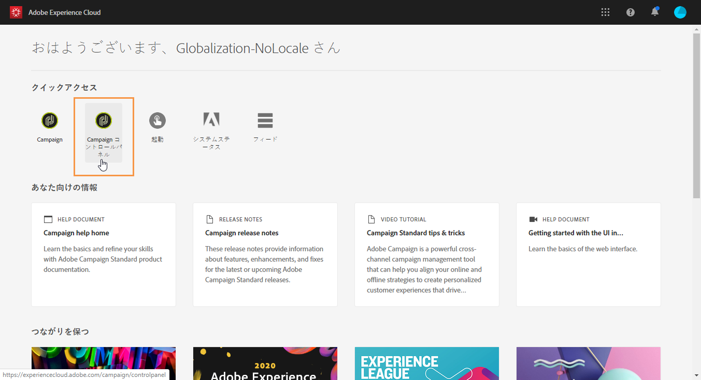
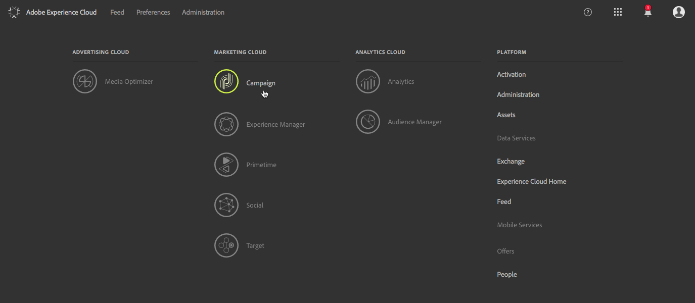
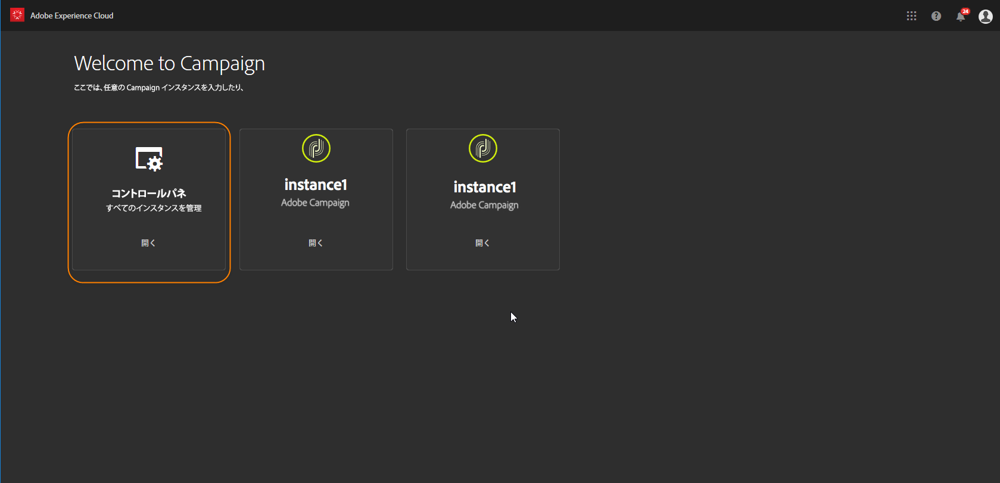

# コントロールパネルへのアクセス {#accessing-control-panel}

Campaign コントロールパネルには、Experience Cloud から直接アクセスすることも、製品自体からアクセスすることもできます。

アクセスできるのは、**管理者ユーザー**&#x200B;のみです。ユーザーを管理者グループに割り当てる方法について詳しくは、[この節](../../discover/using/managing-permissions.md)を参照してください。

## Experience Cloud Platform からのアクセス{#access-experience-cloud-platform}

Experience Cloud Platform から Campaign コントロールパネルにアクセスするには、[Experience Cloud Platform ホームページ](https://experiencecloud.adobe.com/)に移動し、「**クイックアクセス**」セクションの専用リンクをクリックします 。

Campaign コントロールパネルには、Experience Cloud Platform **ソリューションピッカー**&#x200B;からもアクセスできます。

1. [Adobe Experience Cloud](https://experiencecloud.adobe.com/) に移動して、ソリューションピッカーから **Campaign** を選択します。

   

1. Campaign インスタンスのリストが表示されます。**コントロールパネル**&#x200B;カードをクリックして起動します。

   

## 製品からのアクセス {#access-product}

>[!NOTE]
>
>製品内からのアクセスは、Campaign Standard でのみ可能です。

1. Campaign Standard 製品を開き、**[!UICONTROL ナビゲーション]**&#x200B;パネルの&#x200B;**[!UICONTROL 管理]**&#x200B;メニューを選択します。

   

1. **[!UICONTROL コントロールパネル]**&#x200B;アイコンをクリックします。

   
