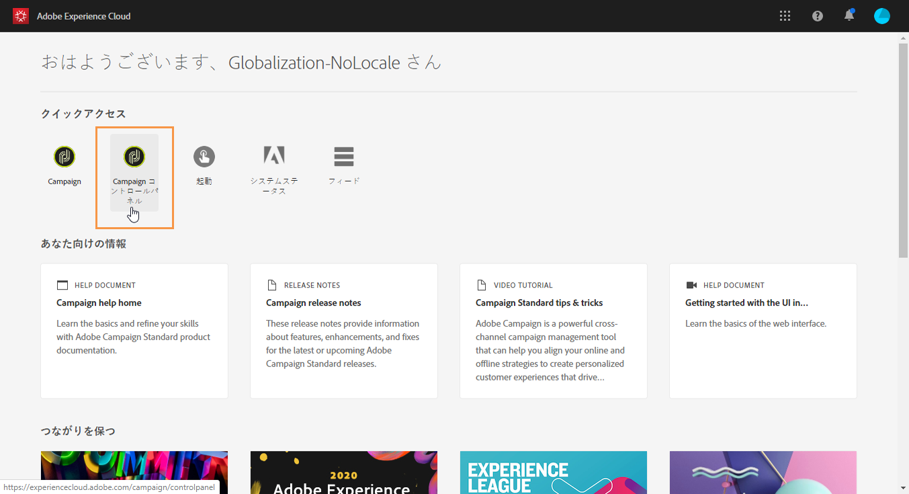
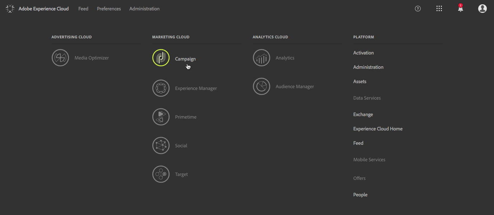
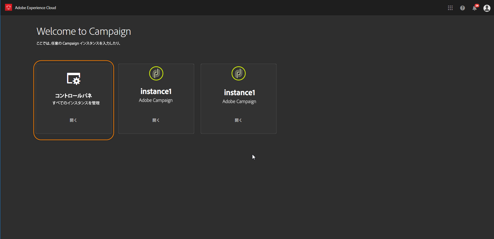
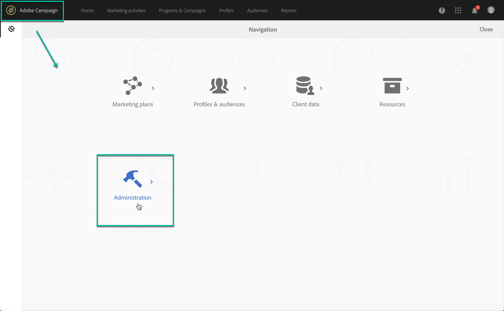

# コントロールパネルへのアクセス {#accessing-control-panel}

コントロールパネルには、Experience Cloud から直接アクセスすることも、製品自体からアクセスすることもできます。

## 前提条件 {#prerequisites}

Campaign v7／v8 の場合は、インスタンスを Amazon Web Services（AWS）でホストし、最新の [Campaign 安定ビルド](https://experienceleague.adobe.com/docs/campaign-classic/using/release-notes/rn-overview.html?lang=ja#rn-statuses)またはビルド 9032 以降にアップグレードする必要があります。 バージョンを確認する方法については、[この節](https://experienceleague.adobe.com/docs/campaign-classic/using/getting-started/starting-with-adobe-campaign/launching-adobe-campaign.html?lang=ja#getting-your-campaign-version)を参照してください。 インスタンスが AWS でホストされているかどうかを確認するには、[このページ](../../faq.md#hosted-aws)で詳しく説明されている手順に従ってください。

また、Microsoft Azure でホストされる Campaign v8 インスタンスは、コントロールパネル機能のサブセット（[インスタンス アクセス用の IP 許可リストへの登録](../../instances-settings/using/ip-allow-listing-instance-access.md)、[SFTP サーバー用の IP 許可リストへの登録](../../sftp/using/ip-range-allow-listing.md)、[お客様が管理する SSL 証明書の管理](../../subdomains-certificates/using/renewing-subdomain-certificate.md)）にもアクセスできます。

>[!IMPORTANT]
>
>デフォルトでは、コントロールパネルは、「Administrators」製品プロファイルに属する管理者ユーザーがアクセスできます。 組織の設定に応じて、製品プロファイルに異なる名前を付けることができます（「admin」、「admins」、「approval admin」など）。 **名前に「admin」という単語が含まれる製品プロファイルには、コントロールパネルへのアクセス権が自動的に付与されます**。製品プロファイルの命名を慎重に確認し、認証されたユーザーのみがコントロールパネルにアクセスできるようにします。 [コントロールパネルに対する権限の管理方法の詳細情報](../../discover/using/managing-permissions.md)。

## Experience Cloud Platform からのアクセス {#access-experience-cloud-platform}

Adobe Experience Cloud Platform からコントロールパネルにアクセスするには、次の手順に従います。

1. [Experience Cloud ホームページ](https://experiencecloud.adobe.com/){target="_blank"}に移動します。

1. 「**クイックアクセス**」セクションの専用リンクをクリックします。

   

コントロールパネルには、Experience Cloud Platform の&#x200B;**ソリューションピッカー**&#x200B;からもアクセスできます。

1. [Adobe Experience Cloud ホームページ](https://experiencecloud.adobe.com/){target="_blank"}で、「**クイックアクセス**」セクションまたは右側の上部メニューから「**Campaign**」を選択します。

   

1. Campaign インスタンスのリストが表示されます。 **コントロールパネル**&#x200B;カードをクリックして起動します。

   

## 製品からのアクセス {#access-product}

>[!NOTE]
>
>製品内からのアクセスは、[Campaign Standard](https://experienceleague.adobe.com/docs/campaign-standard/using/campaign-standard-home.html?lang=ja){target="_blank"} でのみ可能です。

1. Campaign Standard 製品を起動します。

1. **ナビゲーション**&#x200B;ペインから&#x200B;**[!UICONTROL 管理]**&#x200B;メニューを選択します。

   

1. 「**[!UICONTROL コントロールパネル]**」アイコンをクリックします。

   
