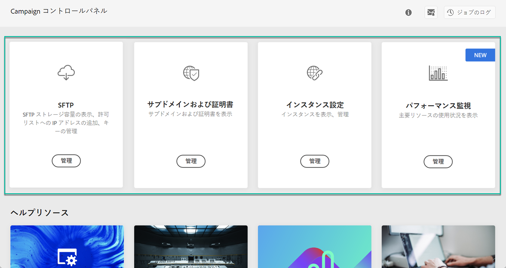
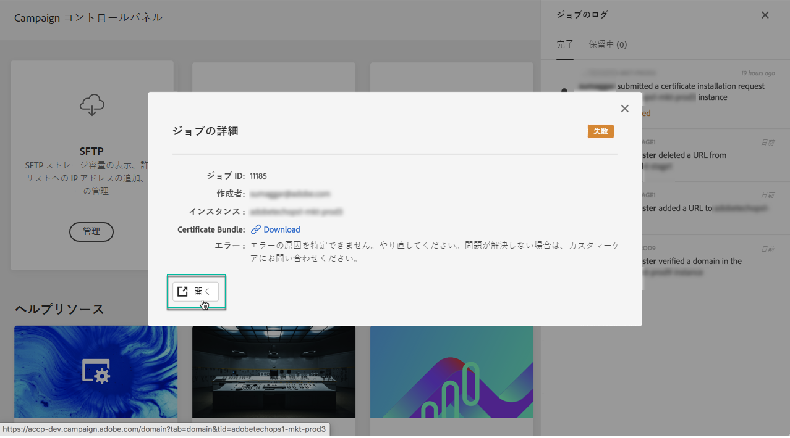

# コントロールパネルのインターフェイスの概要 {#discovering-interface}

コントロールパネルのホームページから、Campaign インスタンスに対して実行できるすべてのアクションにアクセスできます。

アクションは、**パフォーマンス監視**&#x200B;などといったトピック別に整理されたカードで表されます。

<!--With upcoming Campaign releases, more topics and cards will be made available.-->

## ジョブのログ {#job-logs}

右上隅の「**[!UICONTROL ジョブのログ]**」ボタンを使用すると、組織のユーザーがおこなったすべての変更に対する監査を実施できます。

リストの項目をクリックすると、詳細が表示されます。

「**[!UICONTROL 開く]**」ボタンを使用すると、変更が加えられたコントロールパネルタブに直接アクセスできます。

## ヘルプリソース {#help-resources}

**[!UICONTROL ヘルプリソース]**&#x200B;の節では、コントロールパネルおよび Campaign 製品の使用に役立つ便利な資料を提供しています。ぜひ活用してください。

