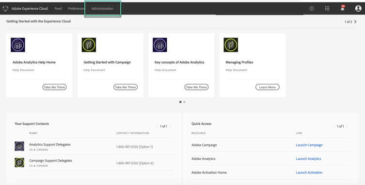

# コントロールパネルに対する権限の管理 {#managing-permissions-control-panel}

コントロールパネルは、Campaign インスタンスのすべての管理者ユーザーが利用できます。ユーザーを管理者グループに割り当てて、コントロールパネルへのアクセス権を付与するには、以下の手順に従います。

1. [Adobe Experience Cloud](https://experiencecloud.adobe.com/) に移動して、「**[!UICONTROL 管理]**」タブを選択します。

   

   >[!NOTE]
   >
   >「<b>管理</b>」タブが表示されない場合は、組織の管理者権限がないことを意味します。組織の管理者に問い合わせて、管理者と共に手順を実行してください。

1. 表示されたリンクをクリックして、**Admin Console** を起動します。

   

1. 目的の Campaign 製品を選択します。

   

   >[!NOTE]
   >
   >製品が表示されない場合は、組織の管理者に問い合わせて、アクセス権の付与を依頼します。

1. Campaign 製品のインスタンスのリストが表示されます。管理者ユーザーを追加するインスタンスを選択します。

   

   >[!NOTE]
   >
   >Campaign インスタンスごとに異なる管理者ユーザーを追加できます。その場合、管理者ユーザーは自分が属するインスタンスのコントロールパネルにのみアクセスします。

1. 選択したインスタンスの製品プロファイルのリストが表示されます。製品プロファイル「**[!UICONTROL 管理者]**」をクリックして、管理者ユーザーのリストにアクセスします。

   

   >[!NOTE]
   >
   >デフォルトでは、管理者ユーザーは製品プロファイル「管理者」に属しています。組織の設定に応じて、製品プロファイルに異なる名前を付けることができます（「admin」、「admins」など）。

1. 管理者ユーザーのリストが表示されます。「**[!UICONTROL ユーザーを追加]**」ボタンをクリックして、目的のユーザーを追加します。

   
