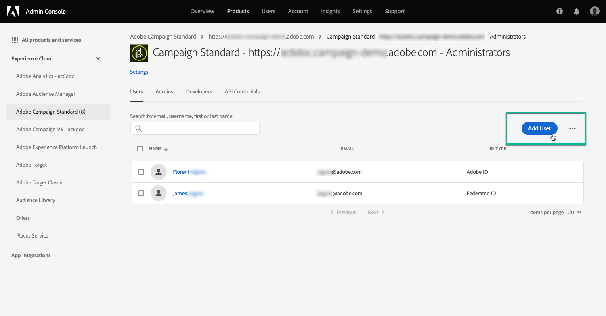

# コントロールパネルに対する権限の管理 {#managing-permissions-control-panel}

コントロールパネルは、Campaign インスタンスのすべての管理者ユーザーが利用できます。 ユーザーを管理者グループに割り当てて、コントロールパネルへのアクセス権を付与するには、以下の手順に従います。

[ ビデオでこの機能を確認する](../../discover/using/managing-permissions.md#video)

1. [Adobe Experience Cloud ホームページ](https://experiencecloud.adobe.com/){target="_blank"}に移動します。

1. 「**クイックアクセス**」セクションまたは右上のメニューで選択可能なリンクをクリックして、**Admin Console** を起動します。

   

   >[!NOTE]
   >
   >**Admin Console** リンクが表示されない場合は、組織の管理者権限を与えられていないことを意味します。 組織の管理者に問い合わせて、管理者と共に手順を実行してください。

1. **Admin Console** の「**[!UICONTROL 製品とサービス]**」リストから目的の Campaign 製品を選択します。

   

   >[!NOTE]
   >
   >製品が表示されない場合は、組織の管理者に問い合わせて、アクセス権の付与を依頼します。

1. Campaign 製品のインスタンスのリストが表示されます。 管理者ユーザーを追加するインスタンスを選択します。

   

   >[!NOTE]
   >
   >Campaign インスタンスごとに異なる管理者ユーザーを追加できます。 管理者ユーザーは、自分が属しているインスタンスのコントロールパネルにのみアクセスできます。

1. 選択したインスタンスの&#x200B;**[!UICONTROL 製品プロファイル]**&#x200B;のリストが表示されます。 製品プロファイル「**[!UICONTROL 管理者]**」をクリックして、管理者ユーザーのリストにアクセスします。

   

   >[!IMPORTANT]
   >
   >デフォルトでは、コントロールパネルは、「Administrators」製品プロファイルに属する管理者ユーザーがアクセスできます。 組織の設定に応じて、製品プロファイルに異なる名前を付けることができます（「admin」、「admins」、「approval admin」など）。 **名前に「admin」という単語が含まれる製品プロファイルには、コントロールパネルへのアクセス権が自動的に付与されます。**
   >
   >コントロールパネルでは Campaign インスタンスに大幅な変更を行うことができるので、Admin Console で製品プロファイルの命名規則を慎重に確認し、認証されたユーザーのみがコントロールパネルにアクセスできるようにします。

1. 管理者ユーザーのリストが表示されます。 「**[!UICONTROL ユーザーを追加]**」ボタンをクリックして、目的のユーザーを追加します。

   

>[!NOTE]
>
>アクセスを設定したら、コントロールパネルにアクセスするために、Adobe Experience Cloud からログアウトして、ログインし直す必要があります。

## チュートリアルビデオ {#video}

>[!VIDEO](https://video.tv.adobe.com/v/35055?captions=jpn&quality=12)
