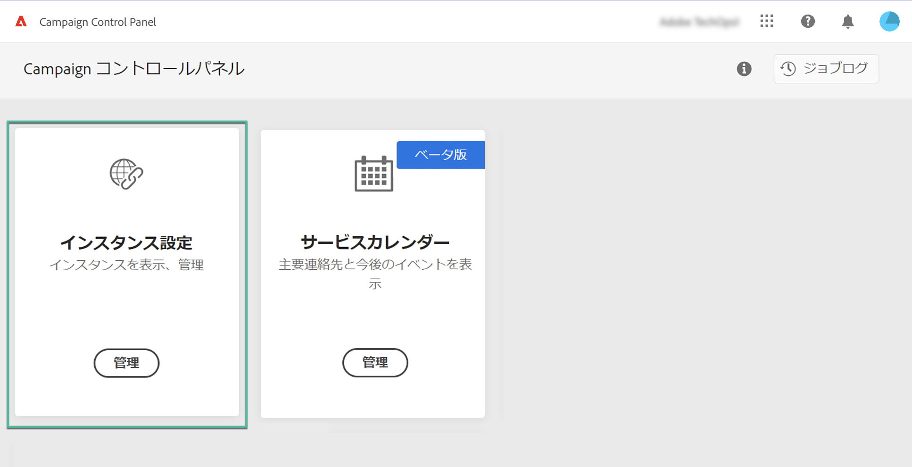
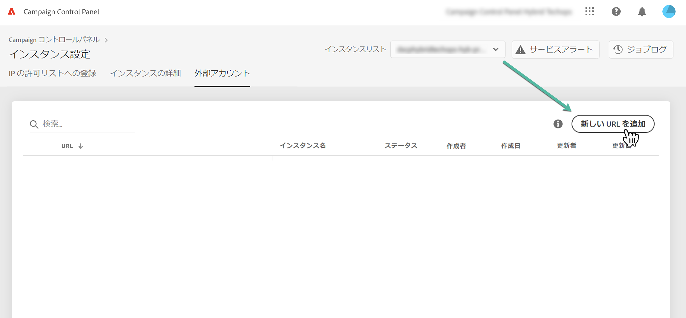
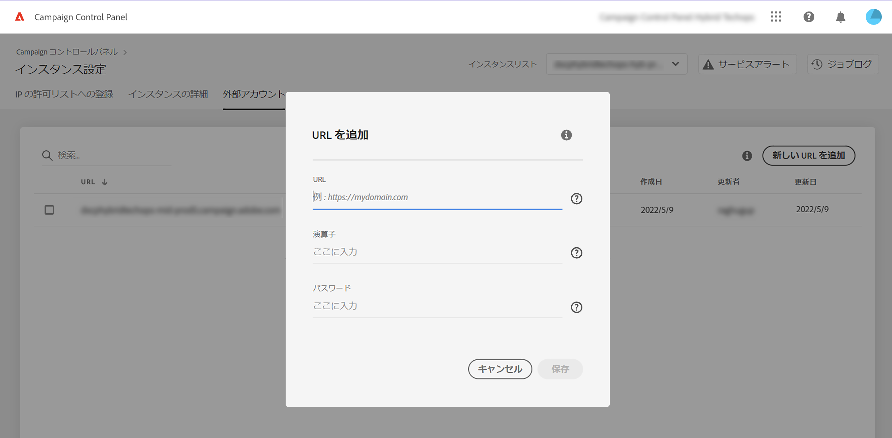
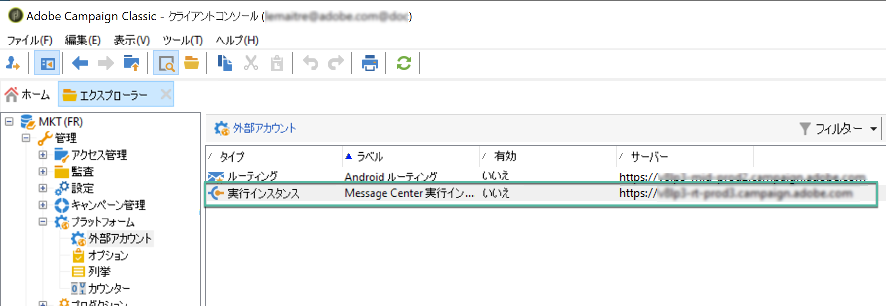
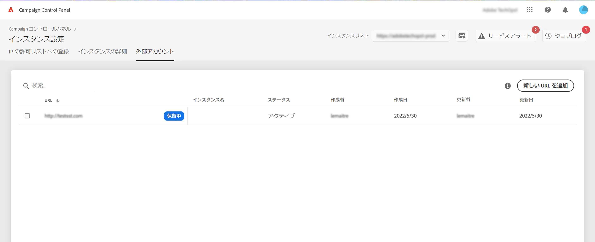
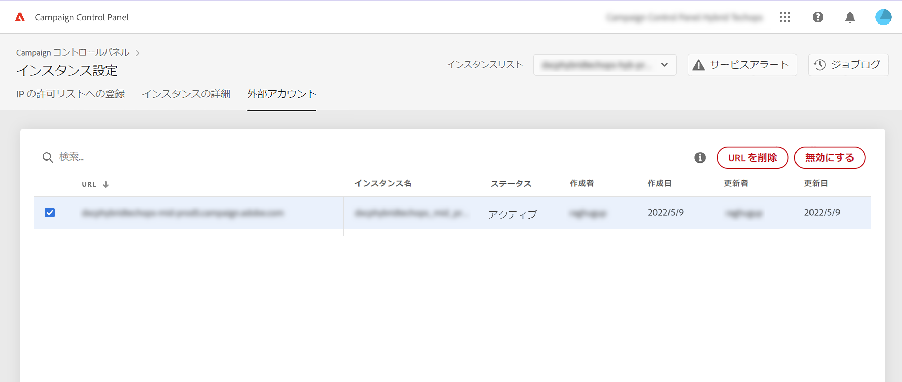
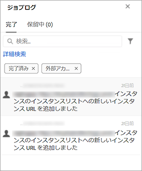

# MID／RT インスタンスの追加（ハイブリッドモデル）{#add-mid-rt-instances-hybrid-model}

>[!CONTEXTUALHELP]
>id="cp_externalaccounts"
>title="外部アカウント"
>abstract="この画面で、ハイブリッドホスティングモデルを使用するお客様は、コントロールパネル機能を活用するために、コントロールパネルのマーケティングインスタンスで設定された MID／RT インスタンス URL を指定できます。"

コントロールパネルでは、ハイブリッドホスティングモデルを使用するお客様は、特定のコントロールパネル機能を利用できます。これを行うには、コントロールパネルでマーケティングインスタンスに設定した MID／RT インスタンス URL を指定する必要があります。

モデルのホスティングについて詳しくは、[Campaign Classic ドキュメント](https://experienceleague.adobe.com/docs/campaign-classic/using/installing-campaign-classic/architecture-and-hosting-models/hosting-models-lp/hosting-models.html?lang=ja)を参照してください。

## MID／RT インスタンスの追加 {#add}

>[!CONTEXTUALHELP]
>id="cp_externalaccounts_url"
>title="URL"
>abstract="インスタンスの URLは、Campaign クライアントコンソールの管理／プラットフォーム／外部アカウントメニューにあります。"

>[!CONTEXTUALHELP]
>id="cp_externalaccounts_operator"
>title="演算子"
>abstract="アドビ管理者によって初期プロビジョニング後に提供されたオペレーターの ID。"

>[!CONTEXTUALHELP]
>id="cp_externalaccounts_password"
>title="パスワード"
>abstract="アドビ管理者によって初期プロビジョニング後に提供されたオペレーターのパスワード。"

ハイブリッドのお客様は、Experience Cloud を通じてコントロールパネルに接続する必要があります。初めてコントロールパネルにアクセスする場合、ホームページには 2 枚のカードのみが表示されます。

>[!NOTE]
>
>コントロールパネルにアクセスする際に問題が発生した場合は、マーケティングインスタンスがまだ[組織 ID](https://experienceleague.adobe.com/docs/core-services/interface/administration/organizations.html?lang=ja) にマッピングされていない可能性があります。 この設定を完了して先に進むには、カスタマーケアにお問い合わせください。接続に成功すると、コントロールパネルのホームページが表示されます。

コントロールパネルの機能を利用するには、MID／RT インスタンス情報を&#x200B;**[!UICONTROL インスタンス設定]**&#x200B;カードで指定する必要があります。それには、次の手順に従います。

1. **[!UICONTROL インスタンス設定]**&#x200B;カードで、「**[!UICONTROL 外部アカウント]**」タブを選択します。

1. ドロップダウンリストから目的のマーケティングインスタンスを選択して、「**[!UICONTROL 新しい URL を追加]**」をクリックします。

   

1. 追加する MID／RT インスタンスに関する情報を指定します。

   

   * **[!UICONTROL URL]**：インスタンスの URLは、Campaign クライアントコンソールの&#x200B;**[!UICONTROL 管理]**／**[!UICONTROL プラットフォーム]**／**[!UICONTROL 外部アカウント]**&#x200B;メニューにあります。

      

   * **[!UICONTROL オペレーター]**／**[!UICONTROL パスワード]**：アドビ管理者による初期プロビジョニング後に提供されたオペレーターの資格情報。

      >[!NOTE]
      >
      >これらの詳細が不明な場合は、カスタマーケアにお問い合わせください。

1. 「**[!UICONTROL 保存]**」をクリックして確定します。

MID／RT URL を追加する際は、非同期プロセスがトリガーされて、URL が正確かどうかが検証されます。この処理には、数分かかる場合があります。MID／RT インスタンス URL が検証されるまで、ジョブは保留になります。検証が完了した場合にのみ、コントロールパネルの主な機能を利用できます。

リストから選択することで、MID／RT インスタンス URL をいつでも削除または無効化できます。

なお、MID／RT インスタンス URL の「**[!UICONTROL 外部アカウント]**」タブで実行されるアクションはすべて&#x200B;**[!UICONTROL ジョブのログ]**&#x200B;で監視できます。

## ハイブリッドのお客様が使用できる機能 {#capabilities}

MID／RT インスタンスがコントロールパネルに追加されると、以下の機能を利用できます。

* [主要連絡先とイベントの監視](../../service-events/service-events.md)
* [インスタンスの詳細の表示](../../instances-settings/using/instance-details.md)、
* [許可リストへの IP アドレスの追加](../../instances-settings/using/ip-allow-listing-instance-access.md) （RT インスタンスの場合）、
* [新しいサブドメインの設定](../../subdomains-certificates/using/setting-up-new-subdomain.md)、
* [サブドメインの SSL 証明書の更新](../../subdomains-certificates/using/renewing-subdomain-certificate.md)
