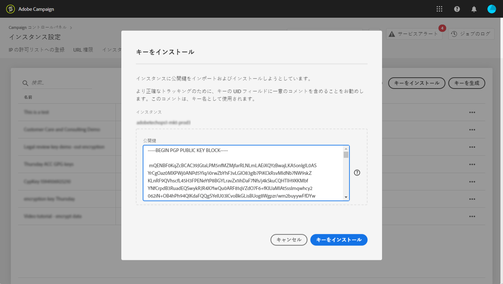

# GPG キー管理 {#gpg-keys-management}

>[!CONTEXTUALHELP]
>id="cp_instancesettings_gpg_management"
>title="GPG キーについて"
>abstract="このタブでは、Campaign から送信されるデータの暗号化と受信データの復号化のために、マーケティングインスタンスに GPG キーをインストールしたり生成したりすることができます。"
>additional-url="https://experienceleague.adobe.com/docs/control-panel/using/performance-monitoring/about-performance-monitoring.html?lang=ja" text="パフォーマンス監視について"

## GPG 暗号化について {#about-gpg-encryption}

GPG 暗号化を使用すると、[OpenPGP](https://www.openpgp.org/about/standard/) の仕様に従った公開鍵と秘密鍵のペアのシステムを使用してデータを保護できます。

実装すると、有効な一致するキーペアがないユーザーがデータにアクセスできないようにするために、転送がおこなわれる前に、受信データを復号化したり送信データを暗号化したりできます。

Campaign を使用して GPG 暗号化を実装するには、管理者ユーザーがコントロールパネルから直接、マーケティングインスタンスに GPG キーをインストール／生成する必要があります。

次のことが可能になります。

* **送信データを暗号化**：Adobe Campaign は、インストールされた公開鍵でデータを暗号化してから送信します。

* **受信データを復号化**：Adobe Campaign は、コントロールパネルからダウンロードした公開鍵を使用して、外部システムから暗号化されたデータを受信します。Adobe Campaign は、コントロールパネルから生成された秘密鍵を使用して、データを復号化します。

## データの暗号化 {#encrypting-data}

コントロールパネルでは、Adobe Campaign インスタンスから送信されるデータを暗号化できます。

これをおこなうには、PGP 暗号化ツールから GPG キーペアを生成し、公開鍵をコントロールパネルにインストールする必要があります。その後、インスタンスからデータを送信する前に、データを暗号化できます。それには、次の手順に従います。

>[!NOTE]
>
>コントロールパネルでは最大 60 個の GPG キーをインストールできます。

[ ビデオでこの機能を確認する](#video)

1. [OpenPGP の仕様](https://www.openpgp.org/about/standard/)に従った PGP 暗号化ツールを使用して公開鍵と秘密鍵のペアを生成します。これをおこなうには、GPG ユーティリティまたは GNuGP ソフトウェアをインストールします。

   >[!NOTE]
   >
   >キーを生成するオープンソースのフリーソフトウェアを使用できます。ただし、組織のガイドラインに従っていることと、IT／セキュリティ組織が推奨する GPG ユーティリティを使用していることを確認してください。

1. ユーティリティがインストールされたら、Mac ターミナルまたは Windows コマンドで次のコマンドを実行します。

   `gpg --full-generate-key`

1. プロンプトが表示されたら、キーに対して目的のパラメーターを指定します。次に必要なパラメーターを示します。

   * **key type**（キーのタイプ）：RSA
   * **key length**（キーの長さ）：3072 ～ 4096 ビット
   * **real name**（実名）および **email address**（E メールアドレス）：キーペアの作成者をトラッキングできます。組織または部門にリンクされた名前および E メールアドレスを入力します。
   * **comment**：コメントフィールドにラベルを追加すると、データの暗号化に使用するキーを容易に識別できます。

      >[!IMPORTANT]
      >
      >このフィールドを空のままにせず、コメントを入力する必要があります。

   * **expiration**（有効期限）：日付。有効期限なしの場合は「0」。
   * **passphrase**（パスフレーズ）

   

1. 確認したら、スクリプトは、ファイルに書き出したりコントロールパネルに直接貼り付けたりできるキーと、それに関連するフィンガープリントを生成します。ファイルを書き出すには、このコマンドを実行し、生成したキーのフィンガープリントを実行します。

   `gpg -a --export <fingerprint>`

1. 公開鍵をコントロールパネルにインストールするには、「**[!UICONTROL インスタンス設定]**」カードを開いて「**[!UICONTROL GPG キー]**」タブを選択し、目的のインスタンスを選択します。

1. 「**[!UICONTROL キーをインストール]**」ボタンをクリックします。

   

1. PGP 暗号化ツールから生成された公開鍵を貼り付けます。また、書き出した公開鍵ファイルを直接ドラッグ＆ドロップすることもできます。

   >[!NOTE]
   >
   >公開鍵は OpenPGP 形式である必要があります。

   

1. 「**[!UICONTROL キーをインストール]**」ボタンをクリックします。

公開鍵がインストールされると、リストに表示されます。**...** ボタンを使用して、公開鍵をダウンロードしたり、そのフィンガープリントをコピーしたりできます。

その後、キーは Adobe Campaign ワークフローで使用できます。データ抽出アクティビティを使用する場合は、このキーを使用してデータを暗号化できます。

[ ビデオでこの機能を確認する](#video)

このトピックについて詳しくは、次の Adobe Campaign ドキュメントを参照してください。

**Campaign v7/v8：**

* [ファイルの圧縮または暗号化](https://experienceleague.adobe.com/docs/campaign-classic/using/getting-started/importing-and-exporting-data/managing-data-encryption-compression/zip-encrypt.html?lang=ja)
* [使用例：コントロールパネルにインストールされたキーを使用したデータの暗号化および書き出し](https://experienceleague.adobe.com/docs/campaign-standard/using/managing-processes-and-data/importing-and-exporting-data/managing-encrypted-data.html?lang=ja#use-case-gpg-encrypt)

**Campaign Standard：**

* [暗号化されたデータの管理](https://experienceleague.adobe.com/docs/campaign-standard/using/managing-processes-and-data/importing-and-exporting-data/managing-encrypted-data.html?lang=ja)
* [使用例：コントロールパネルにインストールされたキーを使用したデータの暗号化および書き出し](https://experienceleague.adobe.com/docs/campaign-classic/using/getting-started/importing-and-exporting-data/managing-data-encryption-compression/zip-encrypt.html?lang=ja#use-case-gpg-encrypt)

## データの復号化 {#decrypting-data}

コントロールパネルでは、Adobe Campaign インスタンスで受信する外部データを復号化できます。

これをおこなうには、コントロールパネルから直接 GPG キーペアを生成する必要があります。

* **公開鍵**&#x200B;は外部システムと共有され、外部システムはこのキーを使用して Campaign に送信するデータを暗号化します。
* **秘密鍵**&#x200B;は、受信する暗号化されたデータを復号化するために Campaign で使用されます。

[ ビデオでこの機能を確認する](#video)

コントロールパネルでキーペアを生成するには、次の手順に従います。

1. 「**[!UICONTROL インスタンス設定]**」カードを開いて「**[!UICONTROL GPG キー]**」タブを選択し、目的の Adobe Campaign インスタンスを選択します。

1. 「**[!UICONTROL キーを生成]**」ボタンをクリックします。

   

1. キーの名前を指定して、「**[!UICONTROL キーを生成]**」をクリックします。この名前は、Campaign ワークフローでの復号化に使用するキーの識別に役立ちます。

   

キーペアが生成されると、公開鍵がリストに表示されます。復号化キーペアは有効期限なしで生成されます。

**...** ボタンを使用して、公開鍵をダウンロードしたり、そのフィンガープリントをコピーしたりできます。

その後、公開鍵は、外部システムと共有できるようになります。Adobe Campaign では、データの読み込みアクティビティで秘密鍵を使用でき、公開鍵で暗号化されたデータを復号化できるようになります。

詳しくは、次の Adobe Campaign ドキュメントを参照してください。

**Campaign v7 および v8：**

* [処理前のファイルの解凍と復号化](https://experienceleague.adobe.com/docs/campaign-classic/using/getting-started/importing-and-exporting-data/managing-data-encryption-compression/unzip-decrypt.html?lang=ja)
* [使用例：コントロールパネルで生成されたキーを使用して暗号化されたデータの読み込み](https://experienceleague.adobe.com/docs/campaign-classic/using/getting-started/importing-and-exporting-data/managing-data-encryption-compression/unzip-decrypt.html?lang=ja#use-case-gpg-decrypt)

**Campaign Standard：**

* [暗号化されたデータの管理](https://experienceleague.adobe.com/docs/campaign-standard/using/managing-processes-and-data/importing-and-exporting-data/managing-encrypted-data.html?lang=ja)
* [使用例：コントロールパネルで生成されたキーを使用して暗号化されたデータの読み込み](https://experienceleague.adobe.com/docs/campaign-standard/using/managing-processes-and-data/importing-and-exporting-data/managing-encrypted-data.html?lang=ja#use-case-gpg-decrypt)

## GPG キーの監視

インスタンス用にインストールおよび生成された GPG キーにアクセスするには、**[!UICONTROL インスタンス設定]**&#x200B;カードを開いて、「**[!UICONTROL GPG キー]**」タブを選択します。

リストには、インスタンスに対してインストールおよび生成されたすべての暗号化および復号化 GPG キーが、各キーに関する詳細情報と共に表示されます。

* **[!UICONTROL 名前]**：キーをインストールまたは生成する際に定義された名前。
* **[!UICONTROL 使用例]**：この列は、キーの使用例を指定します。

   ：キーはデータ暗号化用にインストールされています。

   ：データの復号化を可能にするためにキーが生成されています。

* **[!UICONTROL フィンガープリント]**：キーのフィンガープリント。
* **[!UICONTROL 有効期限]**：キーの有効期限。コントロールパネルでは、キーの有効期限が近づくと視覚的に示されます。

   * 30 日前には至急（赤）が表示されます。
   * 60 日前には警告（黄色）が表示されます。
   * キーの有効期限が切れると、「期限切れ」の赤いバナーが表示されます。

   >[!NOTE]
   >
   >コントロールパネルから E メール通知は送信されないことに注意してください。

ベストプラクティスとして、不要になったキーは削除することをお勧めします。これをおこなうには、**...** ボタンをクリックしてから「**[!UICONTROL キーを削除]」を選択します。**

>[!IMPORTANT]
>
>Adobe Campaign ワークフローが失敗するのを防ぐために、キーを削除する前に、ワークフローでキーが使用されていないことを確認してください。

## チュートリアルビデオ {#video}

次のビデオでは、データ暗号化用の GPG キーを生成してインストールする方法を説明します。

GPG キー管理に関する追加のハウツービデオが [Campaign v7/v8](https://experienceleague.adobe.com/docs/campaign-standard-learn/control-panel/instance-settings/gpg-key-management/gpg-key-management-overview.html?lang=ja#instance-settings) と [Campaign Standard](https://experienceleague.adobe.com/docs/campaign-classic-learn/control-panel/instance-settings/gpg-key-management/gpg-key-management-overview.html?lang=ja#instance-settings) のチュートリアルページで参照できます。

>[!VIDEO](https://video.tv.adobe.com/v/36386?quality=12)
