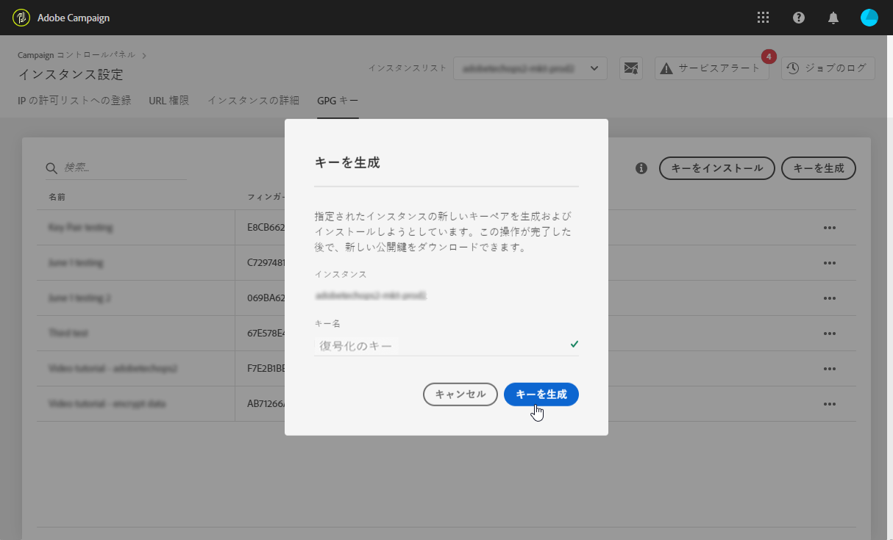

# GPG鍵管理 {#gpg-keys-management}

## GPG暗号化について {#about-gpg-encryption}

GPG暗号化を使用すると、OpenPGPの [仕様に従う公開鍵と秘密鍵のペアのシステムを使用してデータを保護できます](https://www.openpgp.org/about/standard/) 。

実装したデータは、転送が行われる前に暗号化して、受信データと復号化および送信データを取得し、有効な一致キーのペアがないと、誰もデータにアクセスできないようにすることができます。

キャンペーンを使用してGPG暗号化を実装するには、管理者ユーザーがコントロールパネルから直接、GPGキーをマーケティングインスタンスにインストールまたは生成する必要があります。

統合すると、次のことが可能になります。

* **送信データを暗号化**: Adobe Campaignは、インストールされた公開鍵で暗号化した後、データを送信します。

* **受信データを復号化**: Adobe Campaignは、コントロールパネルからダウンロードした公開鍵を使用して、外部システムから暗号化されたデータを受信します。 Adobe Campaignは、コントロールパネルから生成された秘密鍵を使用してデータを復号化します。

## GPGキーの監視

インスタンス用にインストールおよび生成されたGPGキーにアクセスするには、 **[!UICONTROL インスタンス設定]** カードを開き、「 **[!UICONTROL GPGキー]** 」タブを選択します。

リストには、インスタンスに対してインストールされ、生成されたすべての暗号化および復号化GPGキーが、各キーに関する詳細情報と共に表示されます。

* **[!UICONTROL 名前]**: キーをインストールまたは生成する際に定義された名前。
* **[!UICONTROL 使用例]**: この列は、キーの使用例を指定します。

   : キーがデータ暗号化用にインストールされました。

   : データの復号化を可能にするために鍵が生成されました。

* **[!UICONTROL 指紋]**: 鍵の指紋。
* **[!UICONTROL 有効期限]**: キーの有効期限。 コントロールパネルでは、鍵が有効期限に近づくと視覚的な表示が表示されます。

   * 緊急（赤）が30日前に表示されます。
   * 60日前に警告（黄色）が表示されます。
   * キーの有効期限が切れると、「有効期限切れ」の赤いバナーが表示されます。
   >[!NOTE]
   >
   >コントロールパネルからは電子メール通知は送信されません。

ベストプラクティスとして、不要になったキーは削除することをお勧めします。 これを行うには、「。..」 **ボタンをクリックし、「キーを** 削除 ****」を選択します。

>[!IMPORTANT]
>
>キーを削除する前に、キーが失敗を防ぐために、どのAdobe Campaignワークフローでも使用されていないことを確認してください。

## データの暗号化 {#encrypting-data}

コントロールパネルでは、Adobe Campaignインスタンスから出力されるデータを暗号化できます。

これを行うには、PGP暗号化ツールからGPGキーペアを生成し、公開鍵をコントロールパネルにインストールする必要があります。 その後、インスタンスからデータを送信する前に、データを暗号化できます。 それには、次の手順に従います。

1. OpenPGPの指定に従って、GPG暗号化ツールを使用して公開鍵と秘密鍵のペアを生成し [ます](https://www.openpgp.org/about/standard/)。 これを行うには、GPGユーティリティまたはGNuPGソフトウェアをインストールします。

   >[!NOTE]
   >
   >キーを生成するオープンソースのフリーソフトウェアを利用できます。 ただし、組織のガイドラインに従い、IT/セキュリティ組織が推奨するGPGユーティリティを使用していることを確認してください。

1. ユーティリティがインストールされたら、MacターミナルまたはWindowsコマンドで、次のコマンドを実行します。

   `gpg --full-generate-key`

1. プロンプトが表示されたら、キーに必要なパラメーターを指定します。 必要なパラメーターは次のとおりです。

   * **キーの種類**: RSA
   * **キーの長さ**: 1024 - 4096ビット
   * **実名** 、 **電子メールアドレス**: キーペアの作成者を追跡できます。 組織または部門にリンクされた名前と電子メールアドレスを入力します。
   * **comment**: コメントフィールドにラベルを追加すると、コントロールパネルのキーリストでキーを簡単に識別できます。
   * **expiration**: 日付。有効期限なしの場合は「0」。
   * **passphere**
   

1. 確認が完了すると、スクリプトは、ファイルに書き出すか、コントロールパネルに直接貼り付けることができるキーを生成します。 ファイルを書き出すには、このコマンドを実行し、生成したキーの指紋を実行します。

   `gpg -a --export <fingerprint>`

1. 公開鍵をコントロールパネルにインストールするには、「 **[!UICONTROL GPGキー]** 」タブにアクセスし、目的のインスタンスを選択します。

1. 「 **[!UICONTROL Install Key]** 」ボタンをクリックします。

   

1. PGP暗号化ツールから生成された公開鍵を貼り付けます。 公開鍵ファイルを直接ドラッグ&amp;ドロップすることもできます。

   >[!NOTE]
   >
   >公開鍵はOpenPGP形式にする必要があります。

   

1. 「 **!UICONTROL Install Key]**」ボタンをクリックします。

公開鍵がインストールされると、リストに表示されます。 ... **** ボタンを使用して、ダウンロードまたは指先のコピーを行うことができます。

その後、キーをAdobe Campaignワークフローで使用できます。 データ抽出アクティビティを使用する場合は、この変数を使用してデータを暗号化できます。

詳しくは、次のAdobe Campaignドキュメントを参照してください。

| Campaign Classic | Campaign Standard |
---------|----------
| [ファイルの圧縮または暗号化](https://docs.adobe.com/content/help/en/campaign-classic/using/automating-with-workflows/general-operation/how-to-use-workflow-data.html#zipping-or-encrypting-a-file) | [暗号化されたデータの管理](https://docs.adobe.com/content/help/en/campaign-standard/using/managing-processes-and-data/workflow-general-operation/importing-data.html#managing-encrypted-data) |
| [データ抽出（ファイル）アクティビティ](https://docs.adobe.com/content/help/en/campaign-classic/using/automating-with-workflows/action-activities/extraction--file-.html) | [「Extract file」アクティビティ](https://docs.adobe.com/content/help/en/campaign-standard/using/managing-processes-and-data/data-management-activities/extract-file.html) |

## データの復号化 {#decrypting-data}

コントロールパネルでは、Adobe Campaignインスタンスに入ってくる外部データを復号化できます。

これを行うには、コントロールパネルから直接GPGキーペアを生成する必要があります。

* **公開鍵は外部システムと共有され** 、外部システムはこのキーを使用してキャンペーンに送信するデータを暗号化します。
* キャンペーンは、 **秘密鍵** 、受信する暗号化されたデータを復号化するために使用します。

コントロールパネルでキーペアを生成するには、次の手順に従います。

1. 「 **[!UICONTROL GPGキー]** 」タブにアクセスし、目的のAdobe Campaignインスタンスを選択します。

1. 「キーを **[!UICONTROL 生成]** 」ボタンをクリックします。

   

1. キーの名前を指定し、「キーを **!UICONTROL 生成」をクリックします&#x200B;**。 この名前は、キャンペーンワークフローでの復号化に使用するキーの特定に役立ちます

   

キーペアが生成されると、公開鍵がリストに表示されます。 復号化キーのペアは有効期限なしで生成されます。

公開鍵をダウンロードしたり、 **指紋をコピーしたりするには、...** ボタンを使用します。

公開鍵は、外部システムと共有できるようになります。 Adobe Campaignは、データの読み込みアクティビティで秘密鍵を使用して、公開鍵で暗号化されたデータを復号化できます。

詳しくは、次のAdobe Campaignドキュメントを参照してください。

| Campaign Classic | Campaign Standard |
---------|----------
| [処理前のファイルの解凍または復号化](https://docs.adobe.com/content/help/en/campaign-classic/using/automating-with-workflows/general-operation/importing-data.html#unzipping-or-decrypting-a-file-before-processing) | [暗号化されたデータの管理](https://docs.adobe.com/content/help/en/campaign-standard/using/managing-processes-and-data/workflow-general-operation/importing-data.html#managing-encrypted-data) |
| [データ読み込み（ファイル）アクティビティ](https://docs.adobe.com/content/help/en/campaign-classic/using/automating-with-workflows/action-activities/data-loading--file-.html) | [ファイルの読み込みアクティビティ](https://docs.adobe.com/content/help/en/campaign-standard/using/managing-processes-and-data/data-management-activities/load-file.html) |
