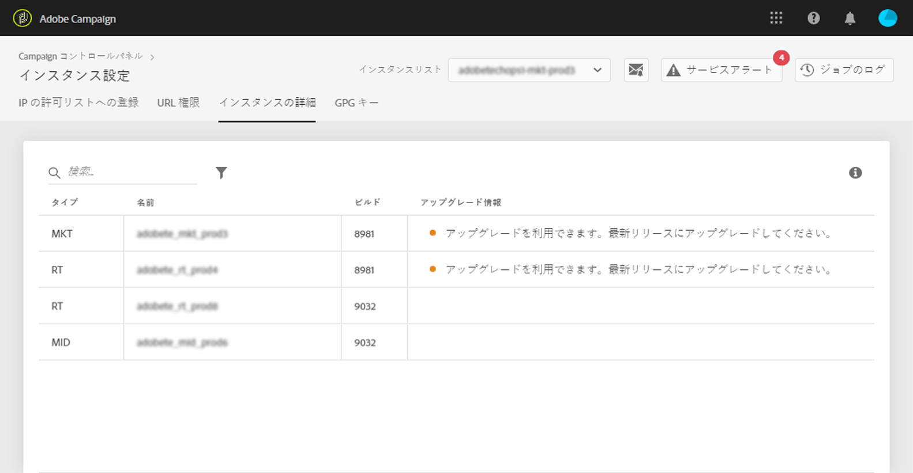

# インスタンスの詳細 {#instance-details}

>[!CAUTION]
>
>この機能は、Campaign Classicインスタンスでのみ使用できます。

## インスタンスの詳細について {#about-instance-details}

Adobe Campaign Classic インスタンスアーキテクチャには複数のサーバーを含めることができるので、柔軟なマーケティング活動が可能になります。例えば、マーケティングサーバー、リアルタイム（Message Center）サーバー、ミッドソーシングサーバーでインスタンスをサポートすることができます。

「インスタンスの詳細」機能を利用すると、インスタンスのフラットアーキテクチャを表示できます。サーバー情報が得られるほか、インスタンスのビルドが最新かどうかもわかります。さらに、必要に応じてアップグレードも提案されます。

>[!NOTE]
>
>パフォーマンスの低下を避け、Adobe Campaign Classic から提供される最新の機能や修正を活用できるようにするため、少なくとも年に 1 回はインスタンスをアップグレードすることをお勧めします。

**関連トピック：**

* [ビルドアップグレードの実行](https://docs.campaign.adobe.com/doc/AC/getting_started/EN/buildUpgrade.html)
* [Adobe Campaign の更新](https://docs.campaign.adobe.com/doc/AC/en/PRO_Updating_Adobe_Campaign_Introduction.html)

## インスタンスに関する情報の取得 {#retrieving-information-about-instances}

インスタンスに接続されているサーバーの情報を取得するには、次の手順に従います。

1. 「**[!UICONTROL インスタンス設定]**」カードを開き、「**[!UICONTROL インスタンスの詳細]**」タブにアクセスします。

   >[!NOTE]
   >
   >インスタンス設定カードが、コントロールパネルのホームページに表示されない場合、お使いの IMS ORG ID は、Adobe Campaign Classic インスタンスに関連付けられていません。

1. 左側のパネルから目的の Campaign Classic インスタンスを選択します。

   >[!NOTE]
   >
   >左側のパネルのリストには、すべての Campaign インスタンスが表示されます。インスタンスの詳細機能はCampaign Classicインスタンス専用なので、Campaign Standardインスタンスを選択した場合は、「該当しないインスタンス」というメッセージが表示されます。

1. インスタンスに接続しているサーバーが表示されます。

   

入手できる情報は次のとおりです。

* **[!UICONTROL タイプ]**：サーバーのタイプ。値は MKT（マーケティング）、MID（ミッドソーシング）、RT（Message Center／リアルタイムメッセージング）のいずれかです。
* **[!UICONTROL 名前]**：サーバーの名前。
* **[!UICONTROL ビルド：]**&#x200B;サーバーにインストールされているビルドバージョン。
* **[!UICONTROL アップグレード情報]**：サーバーの更新が必要かどうかを示します。
   * 緑：サーバーが最新の状態です。アップグレードは必要ありません。
   * 黄色：アップグレードを検討する必要があります。 最新の機能や修正を見逃しています。
   * 赤：できるだけ早くアップグレードします。 最新の機能を見逃しているほか、サーバーのパフォーマンスが最適でない可能性があります。

If one of your servers requires to be upgraded, refer to [this documentation](https://docs.campaign.adobe.com/doc/AC/getting_started/EN/buildUpgrade.html) for more details on how to proceed.

## 一般的な質問 {#common-questions}

**インスタンスアーキテクチャに MID サーバーが表示されないのですが、これは、インスタンスが正常に機能していないということですか？今日できないことがあれば、それをおこなうために RT インスタンスが必要ですか？**

インスタンスの表示は、大幅に異なる場合があります。すべてのタイプのサーバーが含まれていないこともあれば、同じタイプのサーバーが複数含まれていることもあります。いずれかのタイプのサーバーが含まれていないからと言って、リアルタイムメッセージ送信などのアクティビティを実行できないわけではありません。サーバー処理能力の増強を依頼することも可能です。ただし、追加料金がかかります。

確かに一部のサーバーが「インスタンスの詳細」ページに表示されていないようでしたら、カスタマーサポートにお問い合わせください。その際には、具体的なインスタンス URL をメッセージに必ずメモしてください。
