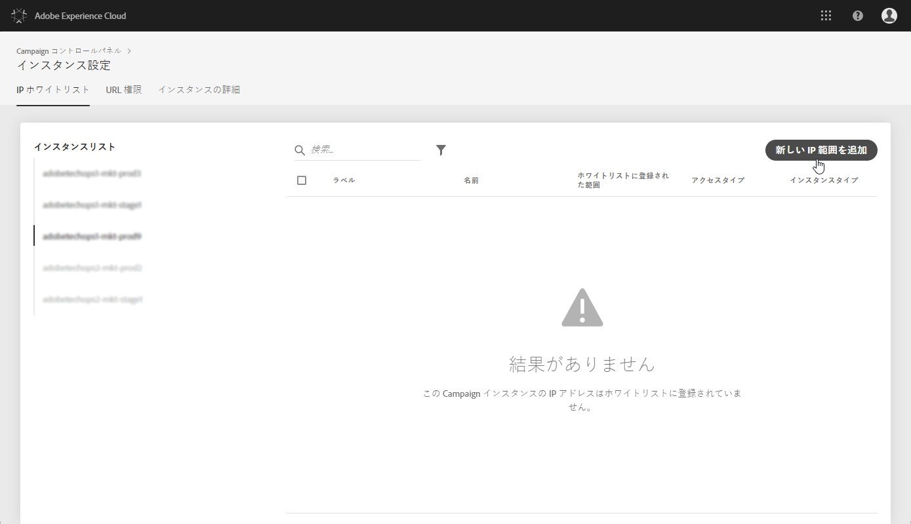
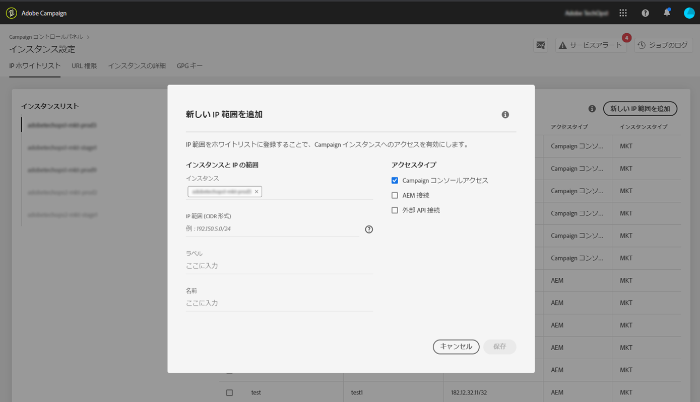
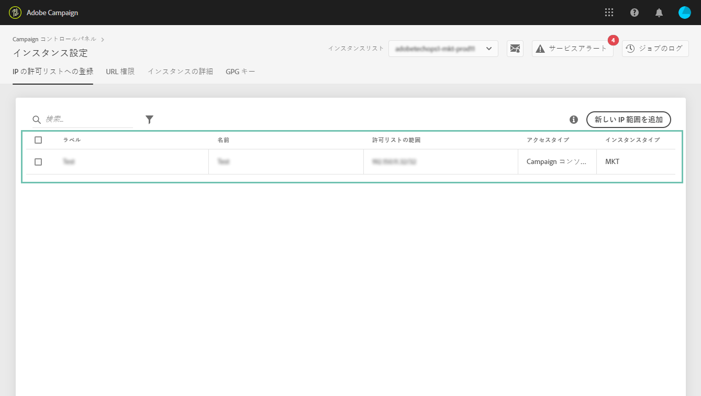

# IP 許可リストへの登録{#ip-allow-listing}

>[!CONTEXTUALHELP]
>id="cp_instancesettings_iprange"
>title="IP 許可リストへの登録について"
>abstract="IP アドレスを許可リストに追加して、インスタンスにアクセスします。"
>additional-url="https://images-tv.adobe.com/mpcv3/045cac99-f948-478e-ae04-f8c161dcb9e2_1568132508.1920x1080at3000_h264.mp4" text="デモビデオを見る"

## IP 許可リストへの登録について{#about-ip-allow-listing}

>[!IMPORTANT]
>
>この機能は、Campaign Classic インスタンスでのみ使用できます。

デフォルトでは、様々な IP アドレスから Adobe Campaign Classic インスタンスにアクセスできるわけではありません。

お使いの IP アドレスが許可リストに登録されていない場合は、そのアドレスからインスタンスにログインすることはできません。同様に、お使いの Message Center インスタンスまたはマーケティングインスタンスの許可リストに IP アドレスが明示的に登録されていない場合、そのインスタンスに API を接続できません。

コントロールパネルでは、IP アドレスの範囲を許可リストに登録することで、インスタンスへの新しい接続をセットアップできます。それには、次の手順に従います。

IP アドレスがいったん許可リストに登録されれば、Campaign オペレーターを作成して IP アドレスにリンクできます。その結果、ユーザーがインスタンスにアクセスできるようになります。

 [動画でこの機能を確認する](https://experienceleague.adobe.com/docs/campaign-classic-learn/control-panel/instance-settings/ip-allow-listing.html?lang=ja#instance-settings)

## ベストプラクティス{#best-practices}

コントロールパネルで IP アドレスを許可リストに登録する場合は、必ず以下の推奨事項と制限に従ってください。

* RT サーバーまたは AEM セキュリティゾーンに接続する予定のない IP アドレスでは、**すべてのアクセスタイプへの IP アクセスを有効にしないでください**。
* **IP アドレスからのインスタンスへのアクセスを一時的に有効にした場合**、インスタンスへ接続する必要がなくなり次第、許可リストに登録されている IP アドレスからその IP アドレスを必ず削除します。
* **公共の場所の IP アドレスを許可リストに追加することはお勧めしません**（空港、ホテルなど）。インスタンスのセキュリティを常に確保するには、会社の VPN アドレスを使用してください。

## インスタンスアクセス用の許可リストへの IP アドレスの追加 {#adding-ip-addresses-allow-list}

>[!CONTEXTUALHELP]
>id="cp_instancesettings_iprange_add"
>title="新しい IP 範囲の追加"
>abstract="インスタンスに接続するための許可リストに追加する IP 範囲を定義します。"

許可リストに IP アドレスを追加するには、次の手順に従います。

1. **[!UICONTROL 「インスタンス設定」カード]**&#x200B;を開いて「IP 許可リスト」タブにアクセスし、「**[!UICONTROL 新しい IP 範囲を追加]**」をクリックします。

   >[!NOTE]
   >
   >「インスタンス設定」カードがコントロールパネルのホームページに表示されない場合、お使いの IMS 組織 ID は、Adobe Campaign Classic インスタンスに関連付けられていません。

   

1. 許可リストに登録する IP 範囲の情報を次のように入力します。

   

   * **[!UICONTROL インスタンス]**：IP アドレスから接続できるインスタンス。複数のインスタンスを同時に操作できます。例えば、プロダクションインスタンスとステージインスタンスの IP 許可リスト登録を同じ手順で実行できます。
   * **[!UICONTROL IP 範囲]**：許可リストに追加する IP 範囲（CIDR 形式）。IP 範囲は、許可リスト上の既存の範囲と重複することはできません。重複する場合は、まず、重複している IP を含む範囲を削除してください。

   >[!NOTE]
   >
   >CIDR（Classless Inter-Domain Routing）は、コントロールパネルのインターフェイスで IP 範囲を追加する際にサポートされる形式です。構文は、IP アドレスとそれに続く「/」（スラッシュ記号）および 10 進数で構成されます。形式とその構文について詳しくは、[この記事](https://whatismyipaddress.com/cidr)を参照してください。
   >
   >管理している IP 範囲を CIDR 形式に変換するのに役立つ無料のオンラインツールをインターネットで検索できます。

   * **[!UICONTROL ラベル]**：許可リストに登録されている IP アドレスのリストに表示されるラベル。
   * **[!UICONTROL 名前]**：アクセスタイプ、インスタンス（外部 API 接続の場合）および IP アドレスで一意になる名前が必要です。

1. IP アドレスに許可するアクセスのタイプを指定します。

   * **[!UICONTROL Campaign コンソールアクセス]**：IP アドレスから Campaign Classic コンソールに接続できるようになります。なお、コンソールアクセスはマーケティングインスタンスの場合にのみ有効です。MID および RT インスタンスへのアクセスは許可されないので、無効です。
   * **[!UICONTROL AEM 接続]**：指定された AEM IP アドレスからマーケティングインスタンスに接続できるようになります。
   * **[!UICONTROL 外部 API 接続]**：指定された IP アドレスを持つ外部 API からマーケティングインスタンスや Message Center（RT）インスタンスに接続できるようになります。なお、RT インスタンスのコンソールへの接続は無効です。

   

1. 「**[!UICONTROL 保存]**」ボタンをクリックします。IP 範囲が許可リストに追加されます。

   

許可リストから IP 範囲を削除するには、IP 範囲を選択して、**[!UICONTROL 「IP 範囲を削除]**」ボタンをクリックします。

**関連トピック：**

* [セキュリティゾーンとオペレーターとのリンク](https://docs.campaign.adobe.com/doc/AC/en/INS_Additional_configurations_Configuring_Campaign_server.html#Linking_a_security_zone_to_an_operator)
