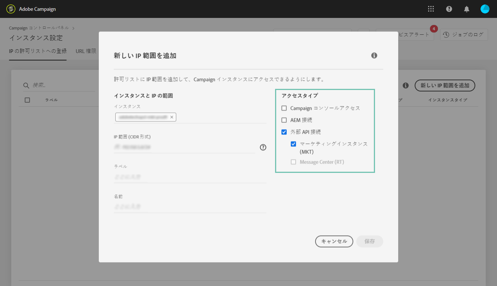

# IP のホワイトリスト登録{#ip-whitelisting}

>[!CAUTION]
>
>この機能は、Campaign Classic インスタンスでのみ使用できます。

## IP のホワイトリスト登録について{#about-ip-whitelisting}

デフォルトでは、様々な IP アドレスからAdobe Campaign Classic インスタンスにアクセスできるわけではありません。

お使いの IP アドレスがホワイトリストに登録されていない場合は、そのアドレスからインスタンスにログインすることはできません。同様に、お使いの Message Center インスタンスまたはマーケティングインスタンスのホワイトリストに IP アドレスが明示的に登録されていない場合、そのインスタンスに API を接続できません。

コントロールパネルでは、IP アドレスの範囲をホワイトリストに登録することで、インスタンスへの新しい接続をセットアップできます。それには、次の手順に従います。

IP アドレスがいったんホワイトリストに登録されれば、Campaign オペレーターを作成して IP アドレスにリンクできます。その結果、ユーザーがインスタンスにアクセスできるようになります。

## ベストプラクティス{#best-practices}

コントロールパネルで IP アドレスをホワイトリストに登録する場合は、必ず以下の推奨事項と制限に従ってください。

* RT サーバーまたは AEM セキュリティゾーンに接続する予定のない IP アドレスでは、**すべてのアクセスタイプへの IP アクセスを有効にしないでください**。
* **IP アドレスからのインスタンスへのアクセスを一時的に有効にした場合**、インスタンスへ接続する必要がなくなり次第、ホワイトリストに登録されている IP アドレスからその IP アドレスを必ず削除します。
* **公共の場所（空港やホテルなど）の IP アドレスをホワイトリストに登録することはお勧めしません**。インスタンスのセキュリティを常に確保するには、会社の VPN アドレスを使用してください。

## インスタンスにアクセスするための IP アドレスのホワイトリスト登録{#whistelisting-ip-addresses}

IP アドレスをホワイトリストに登録するには、次の手順に従います。

1. **[!UICONTROL 「インスタンス設定」カード]**を開いて「IP ホワイトリスト」タブにアクセスし、「**[!UICONTROL &#x200B;新しい IP 範囲を追加]**」をクリックします。

   >[!NOTE]
   >
   >「インスタンス設定」カードがコントロールパネルのホームページに表示されない場合、お使いの IMS ORG ID は、Adobe Campaign Classic インスタンスに関連付けられていません。

   

1. ホワイトリストに登録する IP 範囲の情報を次のように入力します。

   

   * **[!UICONTROL インスタンス]**：IP アドレスから接続できるインスタンス。複数のインスタンスを同時に操作できます。例えば、プロダクションインスタンスとステージインスタンスの IP ホワイトリスト登録を同じ手順で実行できます。
   * **[!UICONTROL IP 範囲]**：ホワイトリストに登録する IP 範囲（CIDR 形式）。なお、IP 範囲は、既存のホワイトリストに登録された範囲と重複できません。重複する場合は、まず、重複している IP を含む範囲を削除してください。
   >[!NOTE]
   >
   >CIDR（Classless Inter-Domain Routing）は、コントロールパネルのインターフェイスで IP 範囲を追加する際にサポートされる形式です。構文は、IP アドレスとそれに続く「/」（スラッシュ記号）および 10 進数で構成されます。形式とその構文について詳しくは、[この記事](https://whatismyipaddress.com/cidr)を参照してください。
   >
   >管理している IP 範囲を CIDR 形式に変換するのに役立つ無料のオンラインツールをインターネットで検索できます。

   * **[!UICONTROL ラベル]**：ホワイトリストに登録されている IP アドレスのリストに表示されるラベル。
   * **[!UICONTROL 名前]**：アクセスタイプ、インスタンス（外部 API 接続の場合）および IP アドレスで一意になる名前が必要です。

1. IP アドレスに許可するアクセスのタイプを指定します。

   * **[!UICONTROL Campaign コンソールアクセス]**：IP アドレスから Campaign Classic コンソールに接続できるようになります。なお、コンソールアクセスはマーケティングインスタンスの場合にのみ有効です。MID および RT インスタンスへのアクセスは許可されないので、無効です。
   * **[!UICONTROL AEM 接続]**：指定された AEM IP アドレスからマーケティングインスタンスに接続できるようになります。
   * **[!UICONTROL 外部 API 接続]**：指定された IP アドレスを持つ外部 API からマーケティングインスタンスや Message Center（RT）インスタンスに接続できるようになります。なお、RT インスタンスのコンソールへの接続は無効です。
   

1. 「**[!UICONTROL 保存]**」ボタンをクリックします。指定の IP 範囲がホワイトリストに登録された IP アドレスのリストに追加されます。

   

ホワイトリストに登録されている IP 範囲を削除するには、IP 範囲を選択してから、「**[!UICONTROL IP 範囲を削除]**」ボタンをクリックします。

**関連トピック：**
* [IP ホワイトリスト登録（チュートリアルビデオ）](https://docs.adobe.com/content/help/en/campaign-learn/campaign-classic-tutorials/administrating/control-panel-acc/ip-whitelisting.html)
* [セキュリティゾーンとオペレーターとのリンク](https://docs.campaign.adobe.com/doc/AC/en/INS_Additional_configurations_Configuring_Campaign_server.html#Linking_a_security_zone_to_an_operator)
