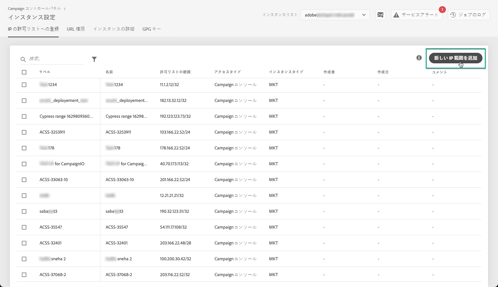
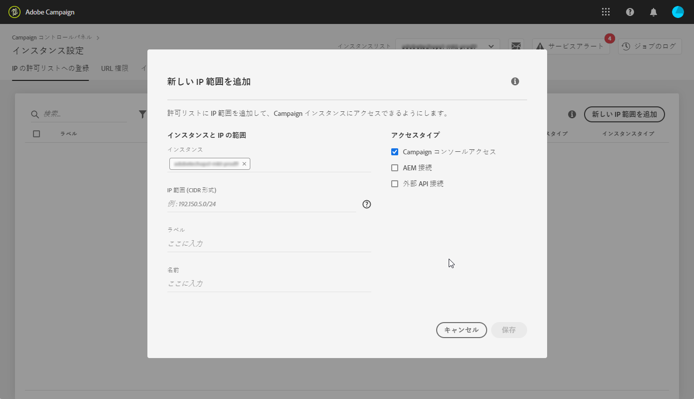

# IP許可一覧 {#ip-whitelisting}

>[!CONTEXTUALHELP]
>id="cp_instancesettings_iprange"
>title="IP許可一覧について"
>abstract="許可リストの追加IPアドレスを指定して、インスタンスにアクセスします。"
>additional-url="https://images-tv.adobe.com/mpcv3/045cac99-f948-478e-ae04-f8c161dcb9e2_1568132508.1920x1080at3000_h264.mp4" text="デモビデオを見る"

>[!IMPORTANT]
>
>この機能は、Campaign Classic インスタンスでのみ使用できます。

## IP許可一覧について {#about-ip-whitelisting}

デフォルトでは、様々な IP アドレスからAdobe Campaign Classic インスタンスにアクセスできるわけではありません。

IPアドレスが許可リストに追加されていない場合は、このアドレスからインスタンスにログインできません。 同様に、IPアドレスがインスタンスとの許可リストに明示的に追加されていない場合、APIをMessage Centerまたはマーケティングインスタンスに接続できない可能性があります。

コントロールパネルでは、許可リストにIPアドレスの範囲を追加することで、インスタンスへの新しい接続を設定できます。 それには、次の手順に従います。

IPアドレスが許可リスト上に配置されたら、キャンペーン演算子を作成してそれらにリンクし、ユーザーがインスタンスにアクセスできるようにすることができます。

## ベストプラクティス{#best-practices}

コントロールパネルで許可リストにIPアドレスを追加する場合は、次の推奨事項と制限事項に従ってください。

* RT サーバーまたは AEM セキュリティゾーンに接続する予定のない IP アドレスでは、**すべてのアクセスタイプへの IP アクセスを有効にしないでください**。
* **IPアドレスのインスタンスへのアクセスを一時的に有効にした場合**、インスタンスに接続する必要がなくなったら、許可リストからIPアドレスを削除してください。
* **許可リスト** （空港、ホテルなど）に公共の場所のIPアドレスを追加することはお勧めしません。 インスタンスのセキュリティを常に確保するには、会社の VPN アドレスを使用してください。

## インスタンスアクセス用に許可リストにIPアドレスを追加する {#whistelisting-ip-addresses}

>[!CONTEXTUALHELP]
>id="cp_instancesettings_iprange_add"
>title="追加新しいIp範囲"
>abstract="インスタンスに接続する許可リストに追加するIP範囲を定義します。"

許可リストにIPアドレスを追加するには、次の手順に従います。

1. Open the **[!UICONTROL Instances Settings card]** to access the IP allow listing tab, then click **[!UICONTROL Add new IP Range]**.

   >[!NOTE]
   >
   >「インスタンス設定」カードがコントロールパネルのホームページに表示されない場合、お使いの IMS ORG ID は、Adobe Campaign Classic インスタンスに関連付けられていません。

   

1. 以下の説明に従って、許可リストに追加するIP範囲の情報を入力します。

   

   * **[!UICONTROL インスタンス]**：IP アドレスから接続できるインスタンス。複数のインスタンスを同時に操作できます。例えば、IP許可の一覧表示は、実稼働インスタンスとステージインスタンスの両方で、同じ手順を使用して実行できます。
   * **[!UICONTROL IP範囲]**: 許可リストに追加するIP範囲（CIDR形式）。 IP範囲は、許可リスト上の既存の範囲と重複することはできません。 重複する場合は、まず、重複している IP を含む範囲を削除してください。

   >[!NOTE]
   >
   >CIDR（Classless Inter-Domain Routing）は、コントロールパネルのインターフェイスで IP 範囲を追加する際にサポートされる形式です。構文は、IP アドレスとそれに続く「/」（スラッシュ記号）および 10 進数で構成されます。形式とその構文について詳しくは、[この記事](https://whatismyipaddress.com/cidr)を参照してください。
   >
   >管理している IP 範囲を CIDR 形式に変換するのに役立つ無料のオンラインツールをインターネットで検索できます。

   * **[!UICONTROL ラベル]**: 許可リストに表示するラベル。
   * **[!UICONTROL 名前]**：アクセスタイプ、インスタンス（外部 API 接続の場合）および IP アドレスで一意になる名前が必要です。

1. IP アドレスに許可するアクセスのタイプを指定します。

   * **[!UICONTROL Campaign コンソールアクセス]**：IP アドレスから Campaign Classic コンソールに接続できるようになります。なお、コンソールアクセスはマーケティングインスタンスの場合にのみ有効です。MID および RT インスタンスへのアクセスは許可されないので、無効です。
   * **[!UICONTROL AEM 接続]**：指定された AEM IP アドレスからマーケティングインスタンスに接続できるようになります。
   * **[!UICONTROL 外部 API 接続]**：指定された IP アドレスを持つ外部 API からマーケティングインスタンスや Message Center（RT）インスタンスに接続できるようになります。なお、RT インスタンスのコンソールへの接続は無効です。

   

1. 「**[!UICONTROL 保存]**」ボタンをクリックします。IP範囲が許可リストに追加されます。

   

許可リストからIP範囲を削除するには、IP範囲を選択して、 **[!UICONTROL 「IP範囲を]** 削除」ボタンをクリックします。

**関連トピック：**
* [IP許可一覧（チュートリアルのビデオ）](https://docs.adobe.com/content/help/en/campaign-learn/campaign-classic-tutorials/administrating/control-panel-acc/ip-allow-listing.html)
* [セキュリティゾーンとオペレーターとのリンク](https://docs.campaign.adobe.com/doc/AC/en/INS_Additional_configurations_Configuring_Campaign_server.html#Linking_a_security_zone_to_an_operator)
