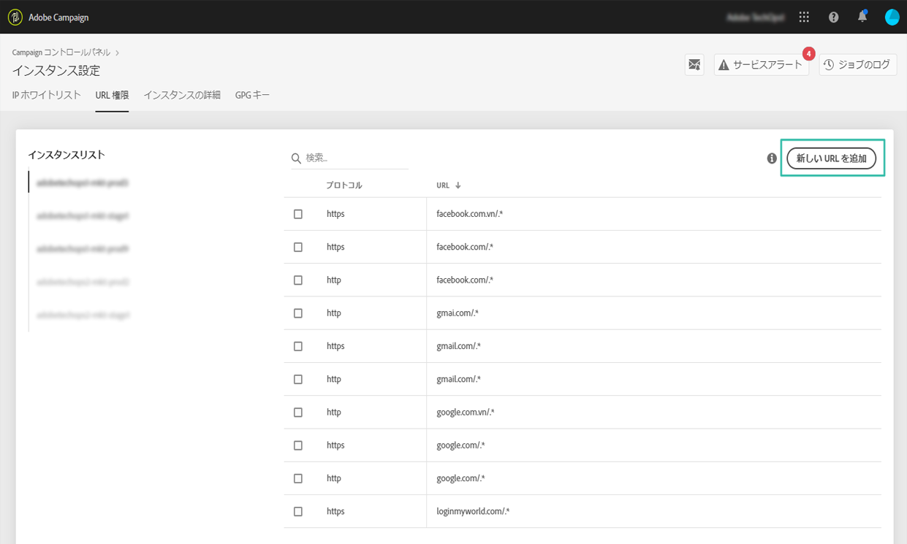
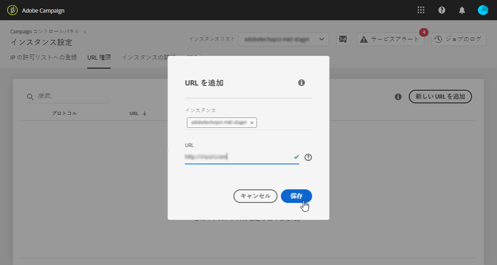

# URL へのアクセス権限 {#url-permissions}

>[!CONTEXTUALHELP]
>id="cp_instancesettings_urlpermissions"
>title="URL へのアクセス権限について"
>abstract="Adobe Campaign インスタンスが接続できる URL を管理します。"
>additional-url="https://images-tv.adobe.com/mpcv3/91206a19-d9af-4b6a-8197-0d2810a78941_1563488165.1920x1080at3000_h264.mp4" text="デモビデオを見る"

## URL へのアクセス権限について {#about-url-permissions}

>[!IMPORTANT]
>
>この機能は、Campaign v8およびCampaign Classicv7インスタンス（ビルド8850以降）でのみ使用できます。 以前のビルドを使用している場合、この機能を使用するにはアップグレードする必要があります。

Campaign Classic インスタンスの JavaScript コード（ワークフローなど）で呼び出すことができる URL のデフォルトリストは、制限されている。 リストに記載されている URL を使用すれば、インスタンスは正常に機能します。

デフォルトでは、インスタンスは外部の URL にアクセスできないようになっています。コントロールパネルを使用すると、外部の URL を承認済み URL リストに追加して、インスタンスがアクセスできるように設定できます。これにより、Campaign インスタンスを SFTP サーバーや web サイトなどの外部システムと接続して、ファイルやデータの転送が可能になります。

URL を追加すると、該当するインスタンスの設定ファイル（serverConf.xml）で参照されます。

 [動画でこの機能を確認する](https://experienceleague.adobe.com/docs/campaign-classic-learn/control-panel/instance-settings/adding-url-permissions.html?lang=ja#instance-settings)

**関連トピック：**

* [Campaign サーバーの設定](https://experienceleague.adobe.com/docs/campaign-classic/using/installing-campaign-classic/additional-configurations/configuring-campaign-server.html?lang=ja#installing-campaign-classic)
* [発信接続の保護](https://experienceleague.adobe.com/docs/campaign-classic/using/installing-campaign-classic/security-privacy/server-configuration.html?lang=ja#outgoing-connection-protection)

## ベストプラクティス {#best-practices}

* Campaign インスタンスを、接続する意図のない Web サイトやサーバーに接続しないでください。
* 不要になった URL は削除してください。ただし、URL を削除すると、社内の他の部門も該当する URL に接続できなくなります。
* コントロールパネルは、**http**、**https**、および **sftp** プロトコルに対応しています。無効な URL またはプロトコルを入力すると、エラーが返されます。

## URL へのアクセス権限の管理 {#managing-url-permissions}

>[!CONTEXTUALHELP]
>id="cp_instancesettings_url_add"
>title="新しい URL を追加"
>abstract="Campaign インスタンスへの接続を許可するための URL を追加します。"

インスタンスがアクセスできる URL を追加するには、次の手順に従います。

1. 「**[!UICONTROL インスタンス設定]**」カードを開き、「**[!UICONTROL URL 権限]**」タブにアクセスします。

   >[!NOTE]
   >
   >「インスタンス設定」カードがコントロールパネルのホームページに表示されない場合、お使いの IMS 組織 ID は、Adobe Campaign インスタンスに関連付けられていません。
   >
   >「<b>URL 権限</b>」タブには、インスタンスがアクセスできる外部 URL の一覧が表示されます。このリストには、Campaign が動作するのに必要な URL（インフラストラクチャ間の接続など）は含まれません。

1. 左側のパネルから目的のインスタンスを選択し、「**[!UICONTROL 新しい URL を追加]**」ボタンをクリックします。

   

   >[!NOTE]
   >
   >左側のパネルのリストには、すべての Campaign インスタンスが表示されます。
   >
   >URL へのアクセス権限の管理は、Campaign Classic インスタンスのみに適用されます。Campaign Standard インスタンスを選択すると、「適用外のインスタンス」というメッセージが表示されます。

1. 承認したい URL とその関連プロトコルを入力します（http、https、または sftp）。

   >[!NOTE]
   >
   >複数のインスタンスによる URL へのアクセスを承認できます。そのためには、「インスタンス」フィールドにインスタンスの最初の文字を入力して、直接インスタンスを追加します。

   

1. URL がリストに追加されると、その URL に接続できるようになります。

   >[!NOTE]
   >
   >入力した URL の検証が完了すると、URL の末尾に「/.*」文字が自動的に追加され、入力したページのすべてのサブページが対象になります。

   

URL を選択して「**[!UICONTROL URL を削除]**」ボタンをクリックすれば、URL はいつでも削除できます。

URL を削除すると、インスタンスはその URL を呼び出すことができなくなります。

## よくある質問 {#common-questions}

**新規 URL を追加しましたが、インスタンスは依然 URL に接続できません。これはなぜですか？**

接続しようとしている URL に許可リストへの登録、パスワードの入力、または別の認証方法が必要となる場合があります。コントロールパネルでは、その他の認証を管理できません。
