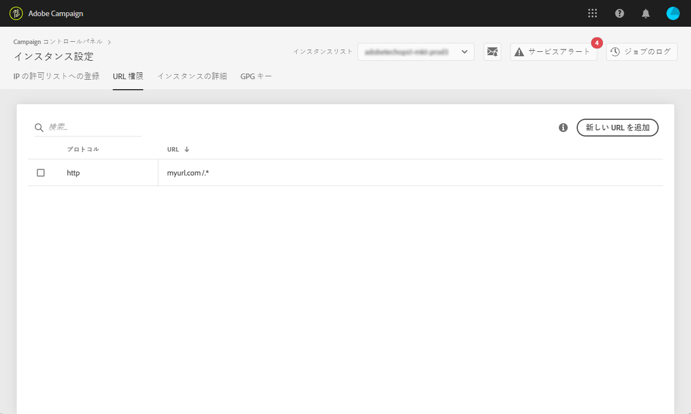

# URL へのアクセス権限 {#url-permissions}

>[!CAUTION]
>
>この機能は、Campaign Classicインスタンスでのみ使用できます。

## URL へのアクセス権限について {#about-url-permissions}

Campaign Classic の JavaScript コード（ワークフローなど）で呼び出すことができる URL のデフォルトリストは、制限されています。リストに記載されている URL を使用すれば、インスタンスは正常に機能します。

デフォルトでは、インスタンスは外部の URL にアクセスできないようになっています。コントロールパネルを使用すると、外部の URL を承認済み URL リストに追加して、インスタンスがアクセスできるように設定できます。これにより、Campaign インスタンスを SFTP サーバーや Web サイトなどの外部システムと接続して、ファイルやデータの転送が可能になります。

URL を追加すると、該当するインスタンスの設定ファイル（serverConf.xml）で参照されます。

**関連トピック：**

* [キャンペーンサーバーの設定](https://docs.campaign.adobe.com/doc/AC/en/INS_Additional_configurations_Configuring_Campaign_server.html)
* [発信接続の保護](https://docs.campaign.adobe.com/doc/AC/en/INS_Additional_configurations_Configuring_Campaign_server.html#Outgoing_connection_protection)
* [URL へのアクセス権限（チュートリアルビデオ）](https://docs.adobe.com/content/help/en/campaign-learn/campaign-classic-tutorials/administrating/control-panel-acc/adding-url-permissions.html)

## ベストプラクティス {#best-practices}

* Campaign インスタンスを、接続する意図のない Web サイトやサーバーに接続しないでください。
* 不要になった URL は削除してください。ただし、URL を削除すると、社内の他の部門も該当する URL に接続できなくなります。
* The Control Panel supports **http**, **https**, and **sftp** protocols. 無効な URL またはプロトコルを入力すると、エラーが返されます。

## URL へのアクセス権限の管理 {#managing-url-permissions}

インスタンスが接続できるURLを追加するには、次の手順に従います。

1. 「**[!UICONTROL インスタンス設定]**」カードを開き、「**[!UICONTROL URL 権限]**」タブにアクセスします。

   >[!NOTE]
   >
   >インスタンス設定カードが、コントロールパネルのホームページに表示されない場合、お使いの IMS ORG ID は、Adobe Campaign Classic インスタンスに関連付けられていません。
   >
   >The <b>URL permissions</b> tab lists all outside URLs that your instance can connect to. このリストには、Campaign で操作が必要な URL（インフラストラクチャ間の接続など）は含まれません。

1. 左側のパネルから任意のインスタンスを選択し、「**[!UICONTROL 新規 URL を追加]」ボタンをクリックします。**

   

   >[!NOTE]
   >
   >左側のパネルのリストには、すべての Campaign インスタンスが表示されます。
   >
   >URL権限管理はCampaign Classicインスタンス専用なので、Campaign Standardインスタンスを選択した場合は、「該当しないインスタンス」というメッセージが表示されます。

1. 承認したい URL とその関連プロトコルを入力します（http、https、または sftp）。

   >[!NOTE]
   >
   >複数のインスタンスによる URL へのアクセスを承認できます。そのためには、「インスタンス」フィールドにインスタンスの最初の文字を入力して、直接インスタンスを追加します。

   

1. URL がリストに追加されると、その URL に接続できるようになります。

   >[!NOTE]
   >
   >入力した URL の検証が完了すると、URL の末尾に「/.*」文字が自動的に追加され、入力したページのすべてのサブページを網羅します。

   

You can delete a URL at any time by selecting it and clicking the **[!UICONTROL Delete URL]** button.

URL を削除すると、インスタンスはその URL を呼び出すことができなくなります。

## 一般的な質問 {#common-questions}

**新規 URL を追加しましたが、インスタンスは URL に接続できません。これはなぜですか？**

接続しようとしている URL にホワイトリスト設定、パスワードの入力、または別の認証方法が必要となる場合があります。コントロールパネルでは、その他の認証を管理できません。
