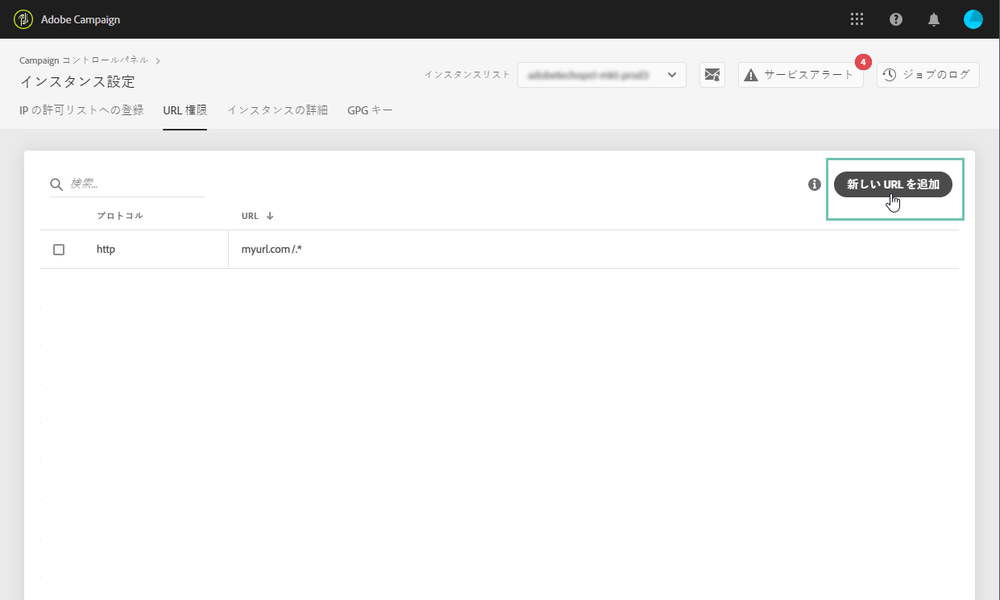

# URL へのアクセス権限 {#url-permissions}

>[!CONTEXTUALHELP]
>id=&quot;cp_instancesettings_urlpermissions&quot;
>title=&quot;URL 権限について&quot;
>abstract=&quot;Adobe Campaign インスタンスが接続できる URL を管理します。&quot;
>additional-url=&quot;https://images-tv.adobe.com/mpcv3/91206a19-d9af-4b6a-8197-0d2810a78941_1563488165.1920x1080at3000_h264.mp4&quot; text=&quot;デモビデオを見る&quot;

>[!IMPORTANT]
>
>この機能は、Campaign Classic インスタンスでのみ使用できます。

## URL へのアクセス権限について{#about-url-permissions}

Campaign Classic インスタンスの JavaScript コード（ワークフローなど）で呼び出すことができる URL のデフォルトリストは、制限されています。リストに記載されている URL を使用すれば、インスタンスは正常に機能します。

デフォルトでは、インスタンスは外部の URL にアクセスできないようになっています。コントロールパネルを使用すると、外部の URL を承認済み URL リストに追加して、インスタンスがアクセスできるように設定できます。これにより、Campaign インスタンスを SFTP サーバーや Web サイトなどの外部システムと接続して、ファイルやデータの転送が可能になります。

URL を追加すると、該当するインスタンスの設定ファイル（serverConf.xml）で参照されます。

**関連トピック：**

* [Campaign サーバーの設定](https://docs.campaign.adobe.com/doc/AC/en/INS_Additional_configurations_Configuring_Campaign_server.html)
* [発信接続の保護](https://docs.campaign.adobe.com/doc/AC/en/INS_Additional_configurations_Configuring_Campaign_server.html#Outgoing_connection_protection)
* [URL へのアクセス権限（チュートリアルビデオ）](https://docs.adobe.com/content/help/en/campaign-learn/campaign-classic-tutorials/administrating/control-panel-acc/adding-url-permissions.html)

## ベストプラクティス{#best-practices}

* Campaign インスタンスを、接続する意図のない Web サイトやサーバーに接続しないでください。
* 不要になった URL は削除してください。ただし、URL を削除すると、社内の他の部門も該当する URL に接続できなくなります。
* コントロールパネルは、**http**、**https**、および **sftp** プロトコルに対応しています。無効な URL またはプロトコルを入力すると、エラーが返されます。

## URL へのアクセス権限の管理{#managing-url-permissions}

>[!CONTEXTUALHELP]
>id=&quot;cp_instancesettings_url_add&quot;
>title=&quot;新しい URL の追加&quot;
>abstract=&quot;Campaign インスタンスへの接続を許可するための URL を追加します。&quot;

インスタンスがアクセスできる URL を追加するには、次の手順に従います。

1. カードを開 **[!UICONTROL Instances Settings]** いてタブにアクセス **[!UICONTROL URL Permissions]** します。

   >[!NOTE]
   >
   >「インスタンス設定」カードがコントロールパネルのホームページに表示されない場合、お使いの IMS ORG ID は、Adobe Campaign Classic インスタンスに関連付けられていません。
   >
   >「<b>URL へのアクセス権限</b>」タブには、インスタンスがアクセスできる外部 URL の一覧が表示されます。このリストには、Campaign が動作するのに必要な URL（インフラストラクチャ間の接続など）は含まれません。

1. Select in the left pane the desired instance, then click the **[!UICONTROL Add new URL]** button.

   

   >[!NOTE]
   >
   >左側のパネルのリストには、すべての Campaign インスタンスが表示されます。
   >
   >URL へのアクセス権限の管理は、Campaign Classic インスタンスのみに適用されます。Campaign Standard インスタンスを選択すると、「適用外のインスタンス」というメッセージが表示されます。

1. 承認したい URL とその関連プロトコルを入力します（http、https、または sftp）。

   >[!NOTE]
   >
   >複数のインスタンスによる URL へのアクセスを承認できます。そのためには、「インスタンス」フィールドにインスタンスの最初の文字を入力して、直接インスタンスを追加します。

   

1. URL がリストに追加されると、その URL に接続できるようになります。

   >[!NOTE]
   >
   >入力した URL の検証が完了すると、URL の末尾に「/.*」文字が自動的に追加され、入力したページのすべてのサブページを網羅します。

   

You can delete a URL at any time by selecting it and clicking the **[!UICONTROL Delete URL]** button.

URL を削除すると、インスタンスはその URL を呼び出すことができなくなります。

## よくある質問{#common-questions}

**新規 URL を追加しましたが、インスタンスは依然 URL に接続できません。これはなぜですか？**

接続しようとしている URL にホワイトリスト設定、パスワードの入力、または別の認証方法が必要となる場合があります。コントロールパネルでは、その他の認証を管理できません。
