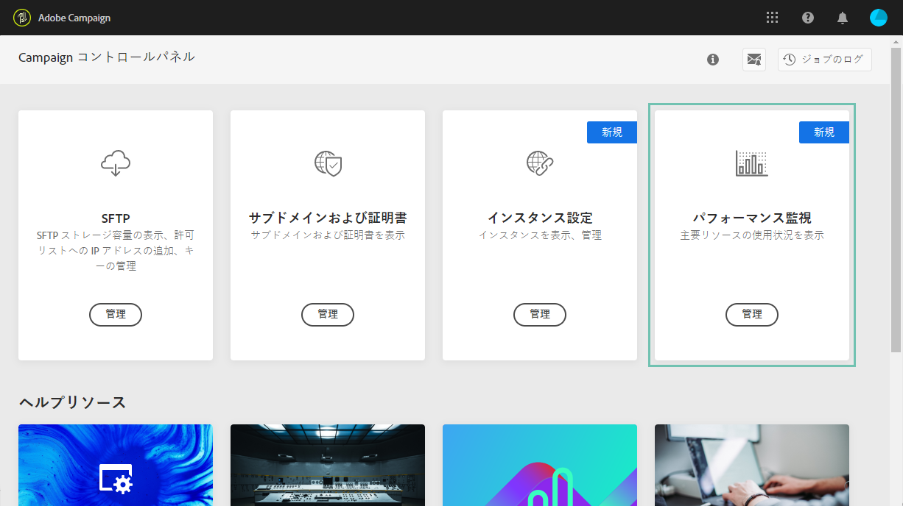

# パフォーマンス監視について {#about-performance-monitoring}

コントロールパネルには、インスタンスを監視し、最適なパフォーマンスを確保するのに役立つ機能がいくつか用意されています。

コント **[!UICONTROL Performance monitoring]** ロールパネルホームページのカードを使用すると、キャンペーンインスタンスの使用状況（データベース容量など）を監視できます。 詳しくは、[この節](../../performance-monitoring/using/database-monitoring.md)を参照してください。

>[!NOTE]
>
>今後のコントロールパネルのリリースでは、このカードで追加の監視機能が使用できるようになります。

また、コントロールパネルでは、サインアップして、いずれかのインスタンスで問題が検出されるたびに電子メール通知を受け取ることができます。 詳しくは、[この節](../../performance-monitoring/using/email-alerting.md)を参照してください。
