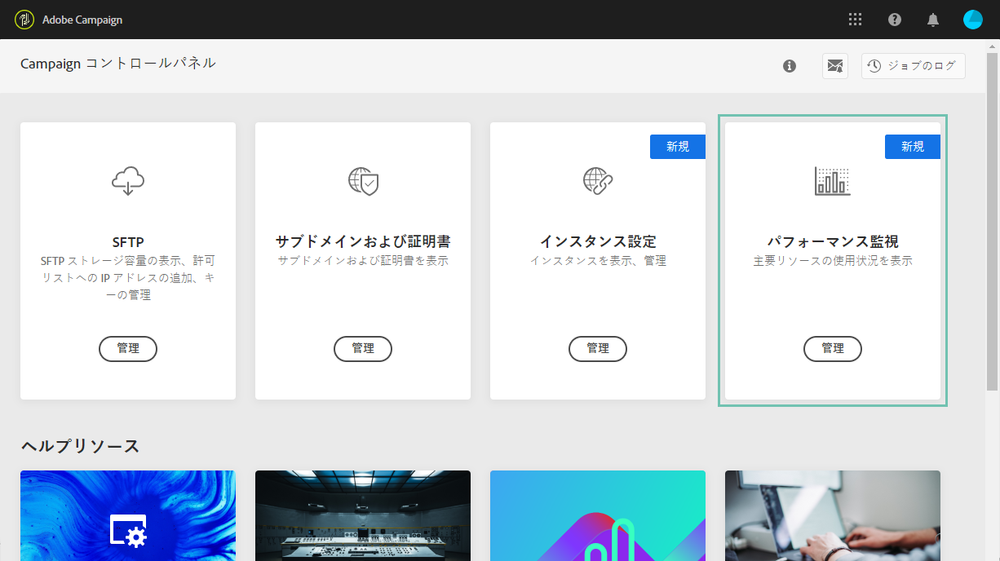

# パフォーマンス監視について {#about-performance-monitoring}

コントロールパネルには、インスタンスを監視し、最適なパフォーマンスを確保するのに役立つ機能がいくつか用意されています。

コントロールパネルホームページの「**[!UICONTROL パフォーマンス監視]**」カードを使用すると、データベース容量など、Campaign インスタンスの使用状況を監視できます。 詳しくは、[この節](../../performance-monitoring/using/database-monitoring.md)を参照してください。

>[!NOTE]
>
>今後の コントロールパネルのリリースでは、このカードで追加の監視機能が使用できるようになります。

