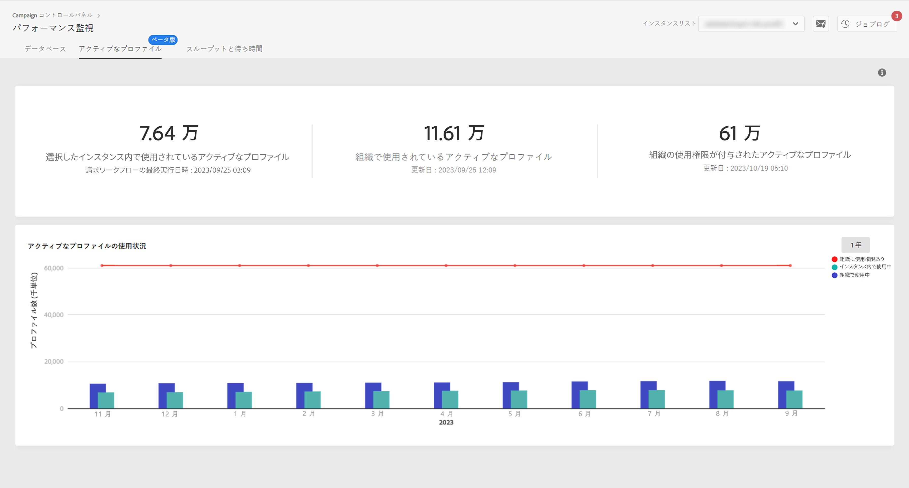

# アクティブなプロファイルの監視 {#active-profiles-monitoring}

## アクティブなプロファイルについて {#about-active-profiles}

>[!IMPORTANT]
>
>コントロールパネルから使用できるアクティブなプロファイルの監視は、ベータ版です。通知なしに頻繁に更新および変更される可能性があります。Campaign Standard10368ビルドから利用できます。

各キャンペーンインスタンスには、契約に従って特定数のアクティブなプロファイルがプロビジョニングされ、課金のためその数がカウントされます。購入したアクティブなプロファイルの数については、最新の契約書を参照してください。

「プロファイル」とは、エンドユーザー、見込み客またはリードを表している情報のレコード（例：nmsRecipient テーブル内のレコードや、cookie ID、顧客 ID、モバイル ID、または特定のチャネルに関連するその他の情報が含まれている外部テーブル内のレコード）のことです。

過去 12 ヶ月間にいずれかのチャネルを介してターゲット設定されたまたは通信を受けたプロファイルが、アクティブなプロファイルと見なされます。

>[!NOTE]
>
>ただし、Facebook および Twitter チャネルは考慮されません。

アクティブなプロファイルについて詳しくは、[Campaign Standard](https://docs.adobe.com/content/help/ja-JP/campaign-standard/using/profiles-and-audiences/managing-profiles/active-profiles.html) および [Campaign Classic](https://docs.adobe.com/content/help/ja-JP/campaign-classic/using/getting-started/profile-management/about-profiles.html#active-profiles) のドキュメントを参照してください。

## アクティブなプロファイルの監視 {#monitoring-active-profiles}

Campaign コントロールパネルでは、各キャンペーンインスタンスのアクティブなプロファイルの使用状況を監視できます。

それには、次の手順に従います。

1. 「**[!UICONTROL パフォーマンス監視]**」カードを開き、「**[!UICONTROL アクティブなプロファイル]**」タブを選択します。

1. **[!UICONTROL インスタンスリスト]**&#x200B;から目的のインスタンスを選択します。

1. インスタンスが使用するアクティブなプロファイルの数および最後に請求ワークフローがインスタンスで実行された時間が表示されます。

>[!NOTE]
>
>アクティブなプロファイルは、インスタンスで毎日実行される専用のテクニカルワークフローに基づいてカウントされます。
>
>* Campaign Standard の[「請求」](https://docs.adobe.com/help/ja-JP/campaign-standard/using/administrating/application-settings/technical-workflows.html)ワークフロー、
>* Campaign Classic の[「アクティブな請求プロファイルの数」](https://experienceleague.adobe.com/docs/campaign-classic/using/automating-with-workflows/advanced-management/about-technical-workflows.html)ワークフロー。

下部には、過去 30 日間のアクティブなプロファイルの使用状況がグラフで表示されます。右上隅にあるフィルターを使用すると、表示される期間を 1 年に変更できます。

グラフのバーの 1 つにカーソルを合わせると、選択した期間に使用されたアクティブなプロファイルの正確な数を取得できます。
