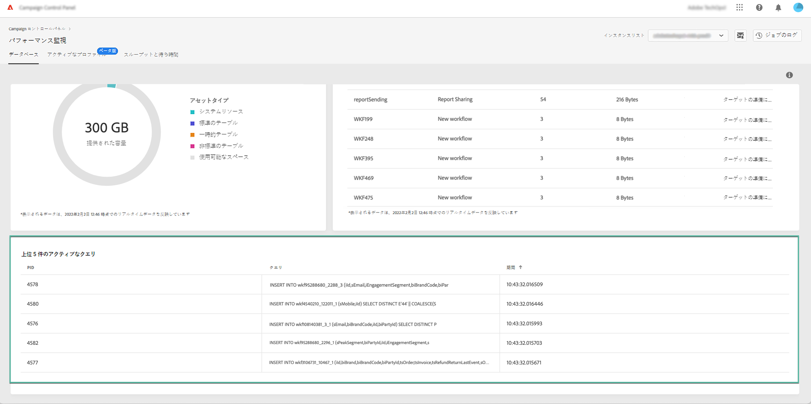

# アクティブなクエリの監視 {#long-running-queries}

「**[!UICONTROL データベース]**」タブの「**[!UICONTROL アクティブなクエリ]**」領域には、選択したインスタンスで最も長く実行されている 5 つのクエリが一覧表示されます。

「**[!UICONTROL 期間]**」列は、クエリがインスタンス上で実行されている期間を示します。期間は `hh:mm:ss.ms` の形式で表示されます。

>[!IMPORTANT]
>
>いずれかのクエリが 24 時間以上アクティブな場合は、カスタマーケアに問い合わせて、問題を特定し解決してもらってください。クエリの一意の識別子である **[!UICONTROL PID]** 列の値を伝える必要があります。
