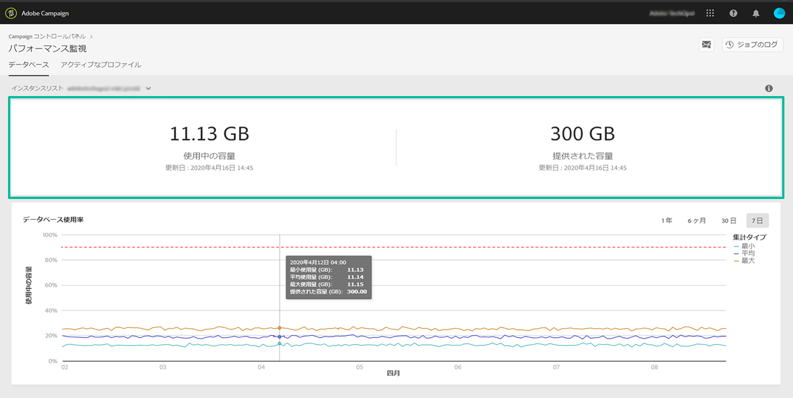
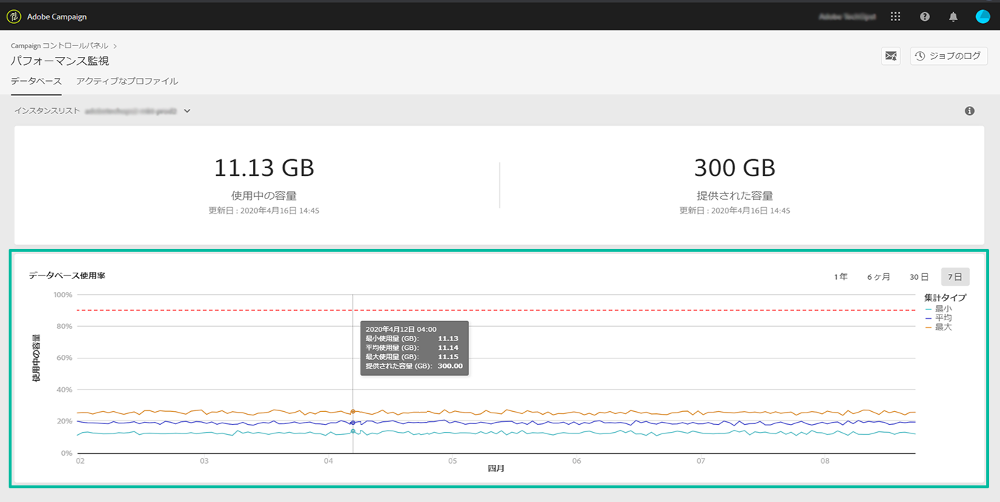
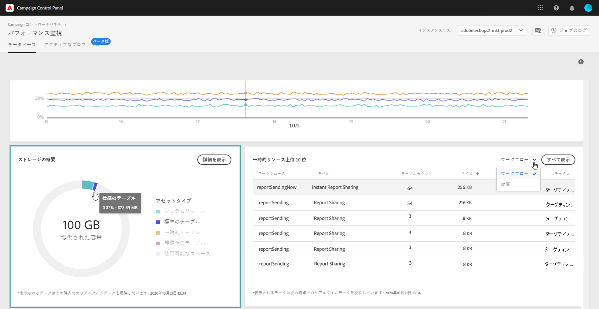
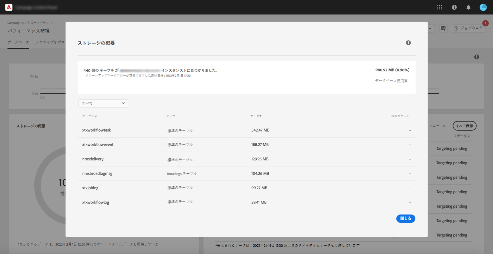
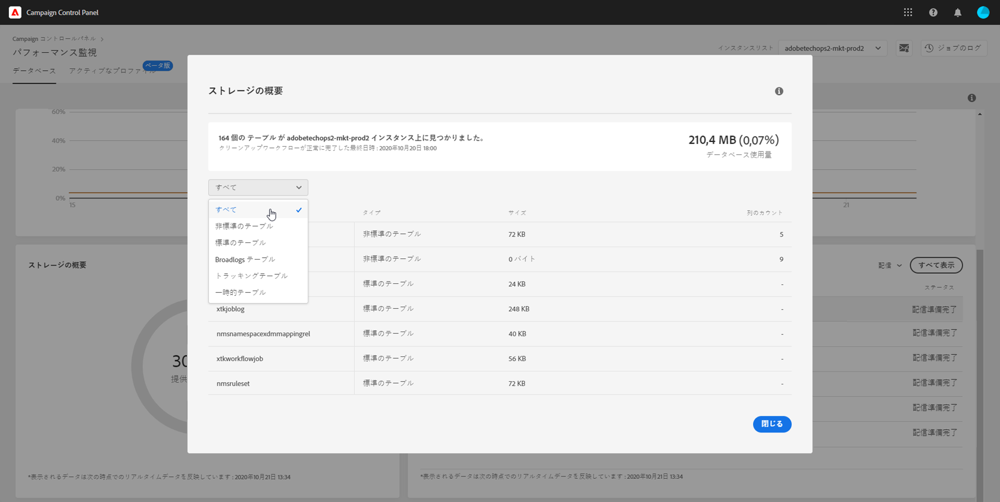
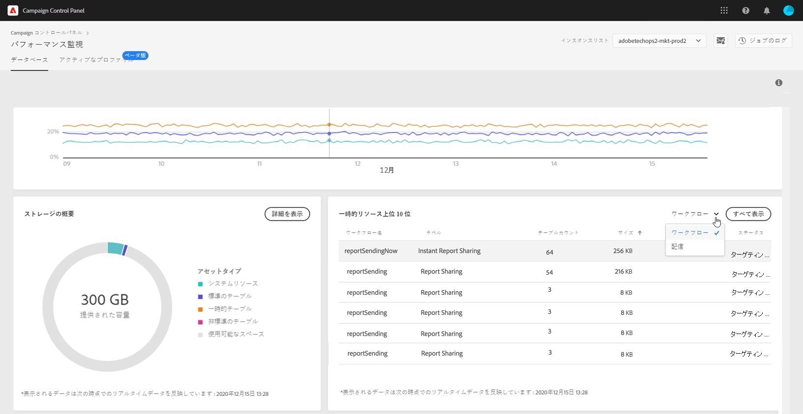
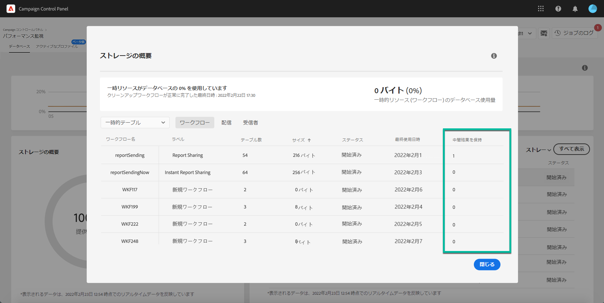

# データベース監視 {#database-monitoring}

## インスタンスデータベースについて {#about-instances-databases}

各 Campaign インスタンスには、契約に従って特定の容量のデータベースがプロビジョニングされます。

データベースには、Adobe Campaign に保存されるすべての&#x200B;**アセット**、**ワークフロー**、**データ**&#x200B;が含まれます。

特に、格納されたリソースがインスタンスからまったく削除されていない場合や、一時停止状態のワークフローが多数ある場合には、時間の経過と共に、データベースが最大容量に達してしまう可能性があります。

インスタンスデータベースの容量が足りなくなると、複数の問題（ログインや E メール送信ができないなど）が発生する可能性があります。したがって、最適なパフォーマンスを確保するには、インスタンスのデータベースを監視する必要があります。

>[!NOTE]
>
>Campaign コントロールパネルに示されている利用可能なデータベース容量が、契約で指定されている容量を反映していない場合は、カスタマーケアにお問い合わせください。

## データベース使用量の監視 {#monitoring-instances-database}

 [Campaign Classic](https://experienceleague.adobe.com/docs/campaign-classic-learn/control-panel/performance-monitoring/monitoring-databases.html?lang=ja#performance-monitoring) または [Campaign Standard ](https://experienceleague.adobe.com/docs/campaign-standard-learn/control-panel/performance-monitoring/monitoring-databases.html?lang=ja#performance-monitoring) を使用してこの機能をビデオで確認する

Campaign コントロールパネルでは、各 Campaign インスタンスのデータベース使用量を監視できます。これをおこなうには、「**[!UICONTROL パフォーマンス監視]**」カードを開き、「**[!UICONTROL データベース]**」タブを選択します。

「**[!UICONTROL インスタンスリスト]**」から目的のインスタンスを選択し、インスタンスのデータベース容量と使用中の容量に関する情報を表示します。

>[!NOTE]
>
>このダッシュボードのデータは、Campaign インスタンスで実行される&#x200B;**[!UICONTROL データベースクリーンアップテクニカルワークフロー]**（[Campaign Standard](https://docs.adobe.com/help/ja-JP/campaign-standard/using/administrating/application-settings/technical-workflows.html#list-of-technical-workflows) および [Campaign Classic](https://docs.adobe.com/help/ja-JP/campaign-classic/using/monitoring-campaign-classic/data-processing/database-cleanup-workflow.html) のドキュメントを参照）に基づいて更新されます。
>
>さらに、**[!UICONTROL 使用中の容量]**&#x200B;指標と&#x200B;**[!UICONTROL 提供された容量]**&#x200B;指標で、ワークフローの前回の実行時にデータベースの 1 つが c に達した場合、通知を受け取ることができます。 ワークフローが 3 日を超えて実行されていない場合は、アドビカスタマーケアに連絡して、ワークフローが実行されていない理由を調査することをお勧めします。

このダッシュボードでは、以下で説明する、インスタンスのデータベースの使用状況を分析するのに役立つ追加の指標を利用できます。

### データベース使用率 {#database-utilization}

**[!UICONTROL データベース使用率]**&#x200B;領域では、過去 7 日間のデータベースの最小使用率、平均使用率、最大使用率のグラフが表示され、データベース使用率 90% のしきい値が赤い点線の曲線で示されます。

期間を変更するには、グラフの右上隅にあるフィルターを使用します。

グラフ内の 1 つまたは複数の曲線をハイライト表示して、読みやすくすることもできます。これをおこなうには、「**[!UICONTROL 集計タイプ]**」の凡例から曲線を選択します。

特定の期間の詳細を表示するには、グラフの上にマウスポインターを置いて、その期間中のデータベース使用量に関する情報を表示します。

### ストレージの概要 {#storage-overview}

**[!UICONTROL ストレージの概要]**&#x200B;領域には、以下が占める容量のグラフが表示されます。

* **[!UICONTROL システムリソース]**

   システムリソースがデータベース容量の大部分を消費している場合は、カスタマーケアに連絡することをお勧めします。

* デフォルトで Campaign インスタンスに付属している&#x200B;**[!UICONTROL 標準のテーブル]**
* ワークフローと配信によって作成される&#x200B;**[!UICONTROL 一時的テーブル]**
* カスタムリソースの作成後に生成される&#x200B;**[!UICONTROL 非標準のテーブル]**

データベース容量を消費している様々なアセットの詳細を表示するには、「**[!UICONTROL 詳細を表示]**」ボタンをクリックします。

フィルターを使用して検索を絞り込み、特定のアセットタイプのテーブルのみを表示できます。

### 一時的リソース上位 10 位 {#top-10}

**[!UICONTROL 一時的リソース上位 10 位]**&#x200B;領域には、ワークフローと配信によって生成された 10 個の最大の一時的リソースがリストされます。

大きな一時的リソースを作成しているワークフローや配信を監視することは、データベースを監視するための重要な手順です。一時的リソースがデータベース容量を消費しすぎる場合は、このワークフローまたは配信が必要であることを確認し、最終的にインスタンスに移動して停止します。

>[!IMPORTANT]
>
>一般的に、非標準リソースが **40 列を超えない**&#x200B;ようにすることが推奨されます。

>[!NOTE]
>
>ワークフローに多数のテーブルが存在するまたはデータベースサイズが大きい場合は、ワークフローを確認して、大量のデータが生成される理由を調べることをお勧めします。
>
>また、このページの最後には、データベース容量超過を防ぐための Campaign Standard および Campaign Classic のリソースが提供されています。

「**[!UICONTROL すべて表示]**」ボタンを使用すると、これらの一時的リソースの詳細情報にアクセスできます。

「**[!UICONTROL 中間結果を保持]**」列の値は、Campaign でこのオプションが有効（「1」）と無効（「0」）のどちらであるかを示します。このオプションを使用すると、ワークフローの様々なアクティビティ間のトランジションの結果を保存できます（[Campaign Standard](https://https://docs.adobe.com/content/help/ja-JP/campaign-standard/using/managing-processes-and-data/executing-a-workflow/managing-execution-options.translate.html) および [Campaign Classic](https://docs.adobe.com/content/help/ja-JP/campaign-classic/using/automating-with-workflows/general-operation/workflow-best-practices.html#logs) のドキュメントを参照）。

>[!IMPORTANT]
>
>このオプションは、本番ワークフローでは絶対にオンにしないでください。これは結果の分析に使用され、テスト目的でのみ設計されているので、開発環境またはステージング環境に限定して使用する必要があります。
>
>コントロールパネルの値が、ワークフローの 1 つに対してこのオプションが有効になっていることを示している場合は、Campaign でこのオプションをオフにすることを強くお勧めします。

## データベース容量超過の防止 {#preventing-database-overload}

Campaign Standard および Campaign Classic では、様々な方法でデータベースのディスク容量の過剰消費を防ぐことができます。

以下の節では、データベース使用の最適化に役立つ Campaign ドキュメントのリソースを示します。

**ワークフローの監視**

* [ワークフローのベストプラクティス](https://docs.adobe.com/content/help/ja-JP/campaign-standard/using/managing-processes-and-data/workflow-general-operation/best-practices-workflows.html)（Campaign Standard）
* [監視ワークフローの実行](https://docs.adobe.com/help/ja-JP/campaign-classic/using/automating-with-workflows/monitoring-workflows/monitoring-workflow-execution.html)（Campaign Classic）

**データベースのメンテナンス**

* データベースクリーンアップテクニカルワークフロー（[Campaign Standard](https://docs.adobe.com/help/ja-JP/campaign-standard/using/administrating/application-settings/technical-workflows.html#list-of-technical-workflows)／[Campaign Classic](https://docs.adobe.com/help/ja-JP/campaign-classic/using/monitoring-campaign-classic/data-processing/database-cleanup-workflow.html)）
* [データベースメンテナンスガイド](https://docs.adobe.com/content/help/ja-JP/campaign-classic/using/monitoring-campaign-classic/database-maintenance/recommendations.html)（Campaign Classic）
* [データベースパフォーマンスのトラブルシューティング](https://experienceleague.adobe.com/docs/campaign-classic/using/monitoring-campaign-classic/troubleshooting-toc/database-issues-toc/database-performances.html?lang=ja)（Campaign Classic）
* [データベース関連オプション](https://docs.adobe.com/help/ja-JP/campaign-classic/using/installing-campaign-classic/appendices/configuring-campaign-options.html#database)（Campaign Classic）
* データ保持（[Campaign Standard](https://docs.adobe.com/help/ja-JP/campaign-standard/using/administrating/application-settings/data-retention.translate.html)／[Campaign Classic](https://docs.adobe.com/help/ja-JP/campaign-classic/using/configuring-campaign-classic/data-model/data-model-best-practices.translate.html#data-retention)）

>[!NOTE]
>
>また、データベースの 1 つが最大容量に近づいた場合に通知を受け取ることもできます。これをおこなうには、[E メールアラート](../../performance-monitoring/using/email-alerting.md)を購読します。
