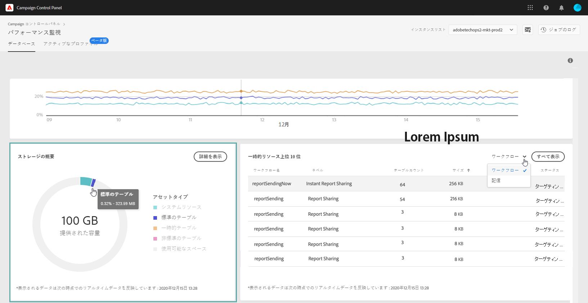

# データベース監視 {#database-monitoring}

## インスタンスデータベースについて {#about-instances-databases}

各 Campaign インスタンスには、契約に従って特定の容量のデータベースがプロビジョニングされます。

データベースには、Adobe Campaign に保存されるすべての&#x200B;**アセット**、**ワークフロー**、**データ**&#x200B;が含まれます。

特に、格納されたリソースがインスタンスからまったく削除されていない場合や、一時停止状態のワークフローが多数ある場合には、時間の経過と共に、データベースが最大容量に達してしまう可能性があります。

インスタンスデータベースの容量が足りなくなると、複数の問題（ログインや E メール送信ができないなど）が発生する可能性があります。したがって、最適なパフォーマンスを確保するには、インスタンスのデータベースを監視する必要があります。

>[!NOTE]
>
>Campaign コントロールパネルに示すデータベース領域の空き容量が、契約で指定した容量を反映していない場合は、カスタマーケアにお問い合わせください。

## データベース使用状況の監視 {#monitoring-instances-database}

Campaign コントロールパネルでは、各 Campaign インスタンスのデータベースの使用状況を監視できます。To do this, open the **[!UICONTROL Performance Monitoring]** card, then select the **[!UICONTROL Databases]** tab.

「 **[!UICONTROL インスタンス」リストから目的のインスタンスを選択し]** 、インスタンスのデータベース容量と使用領域に関する情報を表示します。

>[!NOTE]
>
>このダッシュボードのデータは、キャンペーンインスタンスで実行される **[!UICONTROL Database cleanup technical workflow]** ( [Campaign Standard](https://docs.adobe.com/help/ja-JP/campaign-standard/using/administrating/application-settings/technical-workflows.html#list-of-technical-workflows) および  Campaign Classicのドキュメントを参照)に基づいて更新されます。
>
>最後にワークフローが **[!UICONTROL 使用済みスペース]** と **** 指定済みスペースの指標の下に実行された時間を確認できます。 ワークフローが3日を超えて実行されていない場合は、Adobeカスタマーケアに連絡して、ワークフローが実行されない理由を調べることをお勧めします。

このダッシュボードでは、インスタンスのデータベースの使用状況を分析する際に役立つ追加の指標を示します。以下に説明します。

* [データベース使用率](../../performance-monitoring/using/database-monitoring.md#database-utilization)
* [ストレージの概要](../../performance-monitoring/using/database-monitoring.md#storage-overview)
* [一時的リソース上位 10 位](../../performance-monitoring/using/database-monitoring.md#top-10)

### Database utilization {#database-utilization}

The **[!UICONTROL Database utilization]** area provides a graphical representation of the minimum, average and maximum database utilization over the last 7 days as well as the 90% database utilization threshold represented by a red dotted curve.

期間を変更するには、グラフの右上隅にあるフィルターを使用します。

グラフ内の 1 つまたは複数の曲線をハイライト表示して、読みやすくすることもできます。これをおこなうには、「**[!UICONTROL 集計タイプ]**」の凡例から曲線を選択します。

特定の期間の詳細を表示するには、グラフの上にマウスポインターを置いて、その時点で行われたデータベースの使用状況に関する情報を表示します。

### ストレージの概要 {#storage-overview}

[ **[!UICONTROL ストレージの概要]** ]領域には、次の領域が占めるスペースがグラフィカルに表示されます。

* **[!UICONTROL システムリソース]**

   システムリソースがデータベース領域の大部分を消費している場合は、カスタマーケアにお問い合わせすることをお勧めします。

* **[!UICONTROL デフォルトでキャンペーンインスタンスに付属している]** 、すぐに使用できるテーブル、
* **[!UICONTROL ワークフローと配信によって作成された一時テーブル]** 、
* **[!UICONTROL カスタムリソースの作成後に生成される、あらかじめ用意されていないテーブル]** 。

データベース領域を消費している様々なアセットの詳細を表示するには、 **[!UICONTROL 表示の詳細]** ボタンをクリックします。

このフィルタを使用して検索を絞り込み、特定のアセットタイプのテーブルのみを表示できます。

### 一時的リソース上位 10 位 {#top-10}

上 **[!UICONTROL 位10の一時リソース領域には]** 、ワークフローや配信が生成した10個の一時リソースがリストされます。

大きな一時リソースを作成しているワークフローや配信を監視することは、データベースを監視するための重要な手順です。 一時リソースがデータベース領域を消費しすぎる場合は、このワークフローまたは配信が必要であることを確認し、最終的にインスタンスに移動して停止します。

>[!IMPORTANT]
>
>一般的な推奨事項は、あらかじめ用意されているリソース以外に **40列を超えないようにすることです** 。

>[!NOTE]
>
>ワークフローに大量のテーブル数やデータベースサイズが存在する場合は、ワークフローを見直して、大量のデータが生成される理由を調べることをお勧めします。
>
>Campaign Standardおよびクラシックのリソースは、データベースの過負荷を防ぐために、このページの最後にも提供されています。

[ **[!UICONTROL 表示ー — すべて]** ]ボタンを使用すると、これらの一時リソースの詳細情報にアクセスできます。

>[!NOTE]
>
>「 **[!UICONTROL 中間結果を保持]** 」列の値は、キャンペーンでこのオプションが有効(「1」)か無効(「0」)かを示します。 「 **[!UICONTROL 中間結果を保持]** 」オプションは、ワークフローのプロパティでアクセスできます。 ワークフローの様々なアクティビティ間でトランジションの結果を保存できます( [Campaign Standard](https://docs.adobe.com/content/help/en/campaign-standard/using/managing-processes-and-data/executing-a-workflow/managing-execution-options.html) および [Campaign Classicのドキュメントを参照](https://docs.adobe.com/content/help/en/campaign-classic/using/automating-with-workflows/general-operation/workflow-best-practices.html#logs) )。
>
>ワークフローの1つに対してこのオプションが有効になっている場合、データベースのクリーンアップワークフローは、中間結果で消費された領域を再利用できません。 したがって、ワークフローを確認して、このオプションをオフにできるかどうかを確認することをお勧めします。

## データベース容量超過の防止 {#preventing-database-overload}

Campaign Standard および Campaign Classic では、様々な方法でデータベースのディスク容量の過剰消費を防ぐことができます。

以下の節では、データベース使用の最適化に役立つ Campaign ドキュメントのリソースを示します。

**ワークフローの監視**

* [ワークフローのベストプラクティス](https://docs.adobe.com/content/help/ja-JP/campaign-standard/using/managing-processes-and-data/workflow-general-operation/best-practices-workflows.html)（Campaign Standard）
* [監視ワークフローの実行](https://docs.adobe.com/help/ja-JP/campaign-classic/using/automating-with-workflows/monitoring-workflows/monitoring-workflow-execution.html)（Campaign Classic）

**データベースのメンテナンス**

* Database cleanup technical workflow ([Campaign Standard](https://docs.adobe.com/help/ja-JP/campaign-standard/using/administrating/application-settings/technical-workflows.html#list-of-technical-workflows) / [Campaign Classic](https://docs.adobe.com/help/ja-JP/campaign-classic/using/monitoring-campaign-classic/data-processing/database-cleanup-workflow.html))
* [データベースメンテナンスガイド](https://docs.adobe.com/content/help/ja-JP/campaign-classic/using/monitoring-campaign-classic/database-maintenance/recommendations.html)（Campaign Classic）
* [データベースパフォーマンスのトラブルシューティング](https://docs.adobe.com/content/help/ja-JP/campaign-classic/using/monitoring-campaign-classic/troubleshooting/database-performances.html)（Campaign Classic）
* [データベース関連オプション](https://docs.adobe.com/help/ja-JP/campaign-classic/using/installing-campaign-classic/appendices/configuring-campaign-options.html#database)（Campaign Classic）
* データ保持([Campaign Standard](https://docs.adobe.com/help/en/campaign-standard/using/administrating/application-settings/data-retention.html) / [Campaign Classic](https://docs.adobe.com/help/en/campaign-classic/using/configuring-campaign-classic/data-model/data-model-best-practices.html#data-retention))

>[!NOTE]
>
>また、データベースの1つが容量に達した場合に通知を受け取ることもできます。 To do this, subscribe to [email alerts](../../performance-monitoring/using/email-alerting.md).
