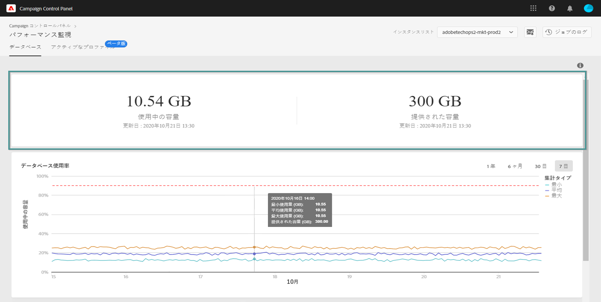

# データベースの監視 {#database-monitoring}

## インスタンスデータベースについて {#about-instances-databases}

契約に従って、各データベースインスタンスには、キャンペーンの特定の容量のデータベースがプロビジョニングされます。

データベースには、Adobe Campaignに保 **存されている****ワークフロー****** 、アセット、データ、データがすべて含まれます。

データベースの最大容量に達するまで時間がかかります。特に、格納されたリソースがインスタンスから削除されない場合や、一時停止状態のワークフローが多い場合には、データベースが最大容量に達します。

インスタンスデータベースをオーバーフローすると、いくつかの問題（ログインできない、電子メールの送信など）が発生する可能性があります。 したがって、最適なパフォーマンスを確保するには、インスタンスのデータベースを監視する必要があります。

>[!NOTE]
>
>コントロールパネルに表示されるデータベース領域の量は、契約で指定されたデータベース領域の量を反映していない場合があります。 ほとんどの場合、システムのパフォーマンスを確保するために、大きなデータベース領域が一時的に提供されます。

## データベースの使用状況の監視 {#monitoring-instances-database}

コントロールパネルでは、各データベースインスタンスのデータベースの使用状況をキャンペーンできます。 それには、次の手順に従います。

1. カードを **[!UICONTROL Performance Monitoring]** 開き、タブを選択し **[!UICONTROL Databases]** ます。

1. から目的のインスタンスを選択しま **[!UICONTROL Instance List]**&#x200B;す。

   上の領域は、インスタンスのデータベース容量と使用領域に関する情報を提供します。

   

   下の領域には、過去7日間のデータベースの使用率が図式的に表示されます。 右上隅の使用可能なフィルターを使用して、表示期間を変更できます。

   グラフの上にマウスポインターを置くと、選択した期間の詳細情報を取得できます。

   

>[!NOTE]
>
>また、データベースの1つが容量に達した場合に通知を受け取ることもできます。 これを行うには、電子メールアラートを [登録します](../../performance-monitoring/using/email-alerting.md)

## データベースの過負荷の防止 {#preventing-database-overload}

Campaign Standardと従来のオファーでは、データベースのディスク領域の過剰消費を防ぐ様々な方法を使用します。

以下の節では、データベースの使用を最適化するのに役立つキャンペーンドキュメントのリソースを示します。

**ワークフロー監視**

* [ワークフローのベストプラクティス](https://docs.adobe.com/content/help/en/campaign-standard/using/managing-processes-and-data/workflow-general-operation/best-practices-workflows.html) (Campaign Standard)
* [監視ワークフローの実行](https://docs.adobe.com/help/en/campaign-classic/using/automating-with-workflows/monitoring-workflows/monitoring-workflow-execution.html) (Campaign Classic)

**データベースメンテナンス**

* データベースのクリーンアップ技術ワ[ークフ](https://docs.adobe.com/help/en/campaign-standard/using/administrating/application-settings/technical-workflows.html#list-of-technical-workflows) ロー [(](https://docs.adobe.com/help/en/campaign-classic/using/monitoring-campaign-classic/data-processing/database-cleanup-workflow.html)Campaign Standard/Campaign Classic)
* [データベースメンテナンスガイド](https://docs.adobe.com/content/help/en/campaign-classic/using/monitoring-campaign-classic/database-maintenance/recommendations.html) (Campaign Classic)
* [データベースのパフォーマンスのトラブルシューティング](https://docs.adobe.com/content/help/en/campaign-classic/using/monitoring-campaign-classic/troubleshooting/database-performances.html) (Campaign Classic)
* [データベース関連のオプション](https://docs.adobe.com/help/en/campaign-classic/using/installing-campaign-classic/appendices/configuring-campaign-options.html#database) (Campaign Classic)
