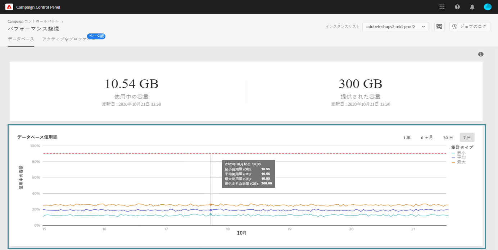

# データベース使用率 {#database-utilization}

**[!UICONTROL データベース使用率]**&#x200B;領域では、過去 7 日間のデータベースの最小使用率、平均使用率、最大使用率のグラフが表示され、データベース使用率 90% のしきい値が赤い点線の曲線で示されます。

期間を変更するには、グラフの右上隅にあるフィルターを使用します。

グラフ内の 1 つまたは複数の曲線をハイライト表示して、読みやすくすることもできます。これをおこなうには、「**[!UICONTROL 集計タイプ]**」の凡例から曲線を選択します。

特定の期間の詳細を表示するには、グラフの上にマウスポインターを置いて、その期間中のデータベース使用量に関する情報を表示します。

