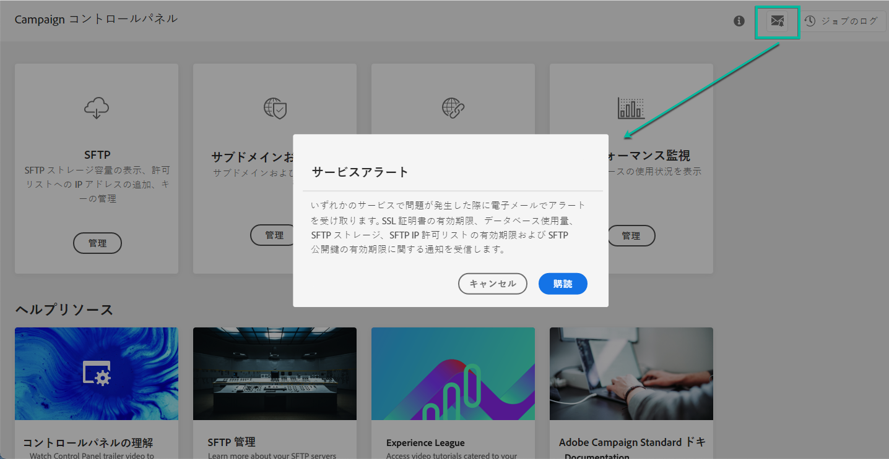
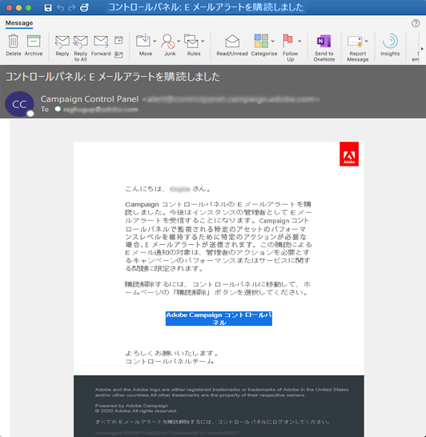
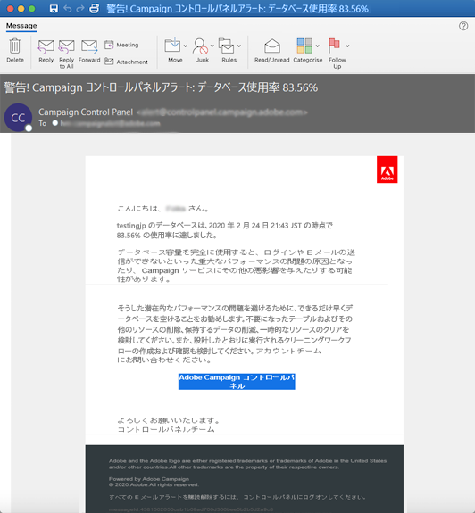

# メールアラート {#email-alerting}

作業を柔軟に行えるように、コントロールパネルにはリアルタイムのメールアラート機能が備わっています。

## アラートのリスト {#list}

アラートのリストを次に示します。

* **SFTP ストレージの使用**：1 台の SFTP サーバーの容量が 80％以上に到達しました。[SFTP ストレージの管理](../../sftp/using/sftp-storage-management.md)を参照してください。

* **データベース使用量**：1 台のインスタンスデータベースの容量が 80％以上に到達しました。[データベース監視](../../performance-monitoring/using/database-monitoring.md)を参照してください。

* **SFTP IP 許可リストの有効期限**：定義した IP 範囲のいずれかが期限切れになっているか、10 日以内に期限切れになります。[IP 範囲許可リストへの登録](../../sftp/using/ip-range-allow-listing.md)を参照してください。

* **SFTP 公開鍵の有効期限**：定義した公開鍵のいずれかが期限切れになったか、10 日以内に期限切れになります。[鍵の管理](../../sftp/using/key-management.md)を参照してください。

* **SSL 証明書の有効期限**：サブドメインの SSL 証明書の 1 つが期限切れになったか、30 日以内に期限切れになります。[サブドメインの SSL 証明書の監視](../../subdomains-certificates/using/monitoring-ssl-certificates.md)を参照してください。

<!--* **Long running Queries**: A query has been running for more than 24 hours on one of your instances. See [Monitoring active queries](database-active-queries.md).-->

>[!NOTE]
>
>また、コントロールパネルでは、**リマインダーを設定**&#x200B;し、インスタンス（リリースとサービスのレビュー）でイベントが発生する前にメールで通知を受け取ることが可能です。
>
>これを行うには、メールアラートを購読し、今後の目的のイベントに対してリマインダーを設定しておく必要があります。[今後のイベントのリマインダーを設定する方法を学ぶ](../../service-events/service-events.md#reminders)

## アラートの配信を登録 {#subscribe}

これらのアラートを購読するには、次の手順に従います。

1. コントロールパネルの任意の場所で「**[!UICONTROL アラート通知]**」ボタンをクリックし、「**[!UICONTROL 購読]**」をクリックします。

   

1. 購読を確認する電子メールが送信されます。

   

1. 購読すると、コントロールパネルによってシステムの問題に関する通知が送信され、実行すべきアクションが推奨されます。メールアラートは、管理者となっている&#x200B;**すべてのインスタンス**&#x200B;について登録したすべてのユーザーに送信されます。

   
