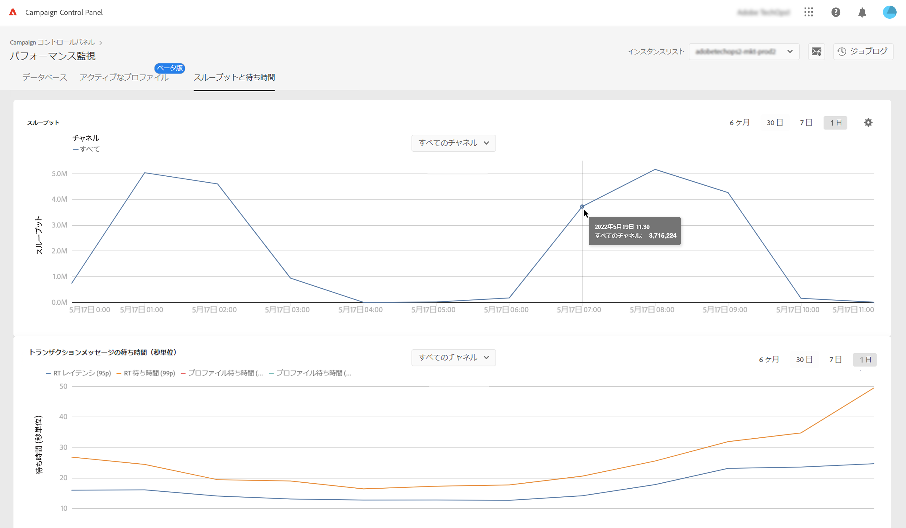
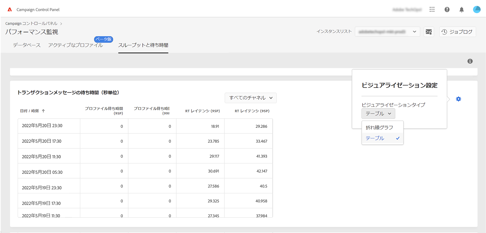

# スループットと待ち時間の監視 {#throughputs-latency-monitoring}

>[!CONTEXTUALHELP]
>id="cp_performancemonitoring_throughputslatencies"
>title="スループットと待ち時間の監視について "
>abstract="このタブでは、インスタンスでの配信スループットと待ち時間の一定期間にわたるトレンドを監視できます。"

インスタンスの使用状況を把握し、良好なパフォーマンスを確保するには、一定期間にわたって配信スループットと待ち時間のトレンドを監視することが不可欠です。

この情報は、 **[!UICONTROL パフォーマンス監視]** カード **[!UICONTROL スループットと遅延]** タブに表示されます (Campaign コントロールパネルは図を表示するのに最大 1 時間かかる場合があります )。

* **[!UICONTROL スループット]**&#x200B;領域には、使用資格のあるすべての通信チャネルについて、選択した Campaign インスタンスから 1 時間に送信されるメッセージの数に関する情報が表示されます。

* **[!UICONTROL 待ち時間]**&#x200B;領域には、リアルタイムトランザクション通信の送信時に、選択したインスタンスで発生した待ち時間に関する情報が表示されます。待ち時間は 95 と 99 のパーセンタイルでキャプチャおよび視覚化されます。つまり、リクエストの 95％と 99％は、指定された待ち時間よりも高速である必要があります。

>[!NOTE]
>
>この領域に示されているすべての数値は概算であり、情報提供のみを目的としています。

デフォルトでは、現在の日付のデータが表示されます。表示期間は、「**[!UICONTROL 6 か月]**」、「**[!UICONTROL 30 日]**」、「**[!UICONTROL 7 日]**」のボタンを使用して変更できます。

また、グラフではなく、並べ替え可能な列を含む表形式で情報を視覚化できます。 これを行うには、「**[!UICONTROL ビジュアライゼーション設定]**」ボタンをクリックし、「**[!UICONTROL テーブル]**」を選択します。

