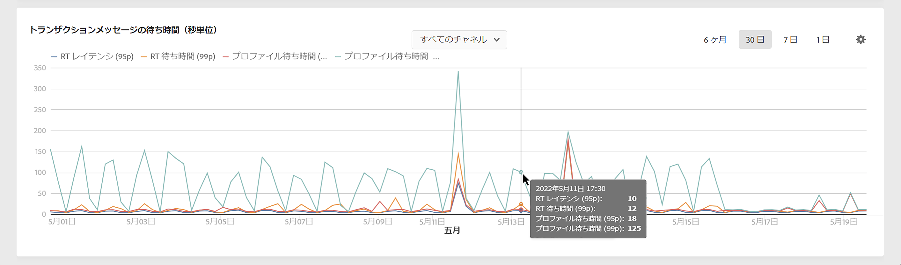

# スループットと待ち時間の監視 {#throughputs-latency-monitoring}

>[!CONTEXTUALHELP]
>id="cp_performancemonitoring_throughputslatencies"
>title="スループットと待ち時間の監視について "
>abstract="このタブでは、インスタンスでの配信スループットと待ち時間の一定期間にわたるトレンドを監視できます。スループットに貢献する配信について詳しくは、表形式表示に切り替えてください。"

コントロールパネルでは、各インスタンスの配信スループットと待ち時間を監視できます。

>[!IMPORTANT]
>
>この機能は、すべての Campaign Standard および v8 のお客様と、ビルド番号 9032、9330、9346、または 9349 で[スタンドアロン](https://experienceleague.adobe.com/docs/campaign-classic/using/installing-campaign-classic/deployment-types-/standalone-deployment.html?lang=ja)デプロイメント（ミッドインスタンスなし）の Campaign V7 のお客様が利用できます。

インスタンスの使用状況を把握し、良好なパフォーマンスを確保するには、一定期間にわたって配信スループットと待ち時間のトレンドを監視することが不可欠です。

この情報は、**[!UICONTROL パフォーマンス監視]**&#x200B;カード、「**[!UICONTROL スループットと待ち時間]**」タブにある各 Campaign インスタンスのコントロールパネルに表示されます（コントロールパネルは図を表示するのに最大 1 時間かかる場合があります）。

>[!NOTE]
>
>この領域に示されているすべての数値は概算であり、情報提供のみを目的としています。

デフォルトでは、現在の日付のデータが表示されます。表示期間は、「**[!UICONTROL 6 か月]**」、「**[!UICONTROL 30 日]**」、「**[!UICONTROL 7 日]**」のボタンを使用して変更できます。データは次のように表示されます。
* 1 日ごとと 7 日間の表示
* 30 日間表示の場合は 1 時間 6 回
* 毎日 6 か月表示。

グラフではなく並べ替え可能な列を持つ表形式で、情報を視覚化することもできます。これを行うには、「**[!UICONTROL ビジュアライゼーション設定]**」ボタンをクリックし、「**[!UICONTROL テーブル]**」を選択します。

## 考え方を監視する {#throughput}

**[!UICONTROL スループット]**&#x200B;領域には、使用資格のあるすべての通信チャネルについて、選択した Campaign インスタンスから 1 時間に送信されるメッセージの数に関する情報が表示されます。

>[!NOTE]
>
>Campaign v7／v8 の場合、表示されるスループット数は、MID（ミッドソーシング）インスタンスから達成されたスループットです。スタンドアロンマーケティング（MKT）デプロイメント（MID インスタンスなし）では、代わりに MKT インスタンスからのスループットが表示されます。

さらに、Campaign コントロールパネルを使用すると、選択した期間のスループットに貢献した上位 5 件の配信の ID を特定できます。 この情報は、表形式表示でのみ使用できます。

## 待ち時間の監視 {#latency}

**[!UICONTROL 待ち時間]**&#x200B;領域には、リアルタイムトランザクション通信の送信時に、選択したインスタンスで発生した待ち時間に関する情報が表示されます。

>[!NOTE]
>
>なお、 **プロファイルの遅延** は、 [!DNL Campaign Standard] インスタンスのみ。

待ち時間は 95 と 99 のパーセンタイルでキャプチャおよび視覚化されます。つまり、リクエストの 95％と 99％は、指定された待ち時間よりも高速である必要があります。

デフォルトでは、すべてのチャネルに遅延が表示されます。 ドロップダウンリストを使用して、特定のチャネルの待ち時間を視覚化できます。

>[!NOTE]
>
>チャネルフィルターは、Campaign Classicv7/v8 インスタンスでのみ使用できます。
