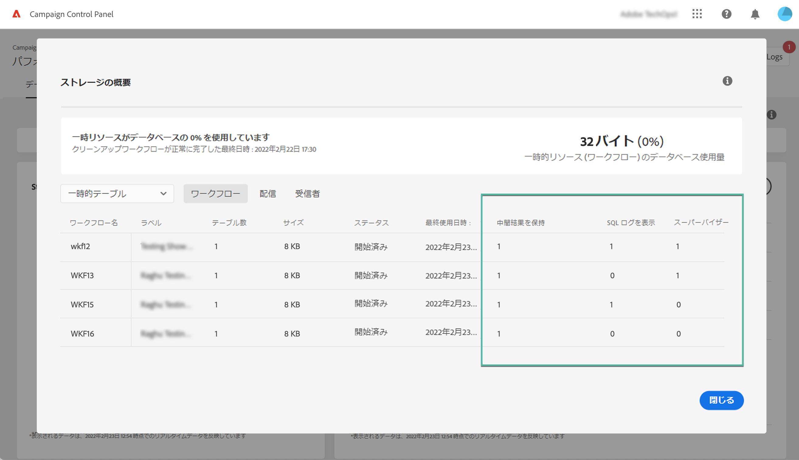
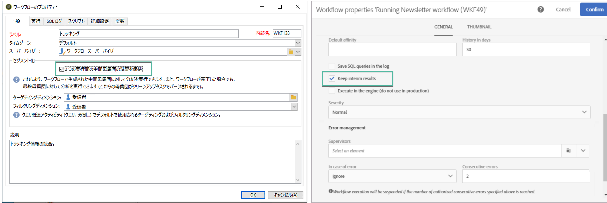
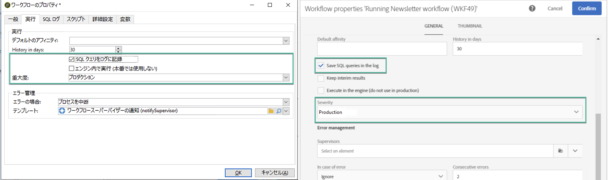
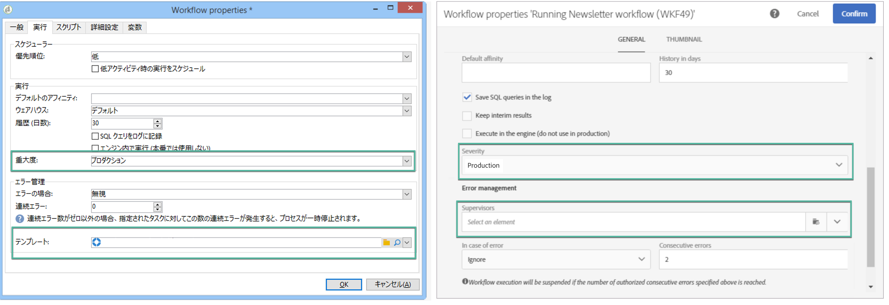

# ワークフローの監視 {#monitor-workflows}

<!-- Clean paused and completed workflows

When [!DNL Adobe Campaign] workflows are paused or completed, they leave temporary tables on your instances database that consume space and can lead to performance issues.

Control Panel allows you to identify those workflows and clean the temporary resources generated on your instances.

>[!NOTE]
>
>Technically, this operation executes the **[!UICONTROL Database cleanup technical workflow]** that runs on your Campaign instance everyday (see [Campaign Standard](https://experienceleague.adobe.com/docs/campaign-standard/using/administrating/application-settings/technical-workflows.html#list-of-technical-workflows) and [Campaign Classic](https://experienceleague.adobe.com/docs/campaign-classic/using/monitoring-campaign-classic/data-processing/database-cleanup-workflow.html) documentation). 

To clean paused and completed workflows, follow these steps:

1. Navigate to the **[!UICONTROL Performance monitoring]** card.

1. In the **[!UICONTROL Databases]** tab, select the instance where you want to perform the operation.

1. Access the **[!UICONTROL Storage overview]** details, then filter the list on **[!UICONTROL Temporary tables]**. Learn more on **[!UICONTROL Storage overview]** in [this page](database-storage-overview.md).

    

1. All temporary tables generated on your instances by workflows and deliveries display. Click the **[!UICONTROL Clean now]** button to delete the resources generated by paused and completed workflows.

    

1. Once the operation is confirmed, you can track the estimated remaining time in the **[!UICONTROL Storage overview]** list.

    

Monitor workflow parameters -->

Adobe Campaign では、インスタンスに関する問題を回避するために、一部のワークフローパラメーターに特に注意しなければならない場合があります。コントロールパネルの「**[!UICONTROL ストレージの概要]**」の詳細を使用すると、ワークフローでこれらのオプションのいずれかが有効になっているかどうかを確認できます。

## **[!UICONTROL 中間結果を保持]** {#keep-results}

有効（値「1」）にすると、このオプションによってワークフローの様々なアクティビティ間でトランジションの結果が保存されます。詳しくは、[Campaign Standard](https://experienceleague.adobe.com/docs/campaign-standard/using/managing-processes-and-data/executing-a-workflow/managing-execution-options.html?lang=ja) および [Campaign Classic](https://experienceleague.adobe.com/docs/campaign-classic/using/automating-with-workflows/introduction/workflow-best-practices.html?lang=ja#logs) ドキュメントを参照してください。

>[!IMPORTANT]
>
>このオプションは、実稼動ワークフローでは絶対にオンにしないでください。分析およびテストの目的で使用されるので、開発環境またはステージング環境でのみ使用する必要があります。Campaign ではオフにすることを強くお勧めします。

## **[!UICONTROL SQL ログを表示]** {#sql}

このオプションを有効にすると、ワークフローの実行中にデータベースに送信された SQL クエリが Adobe Campaign に表示されます。詳しくは、[Campaign Standard](https://experienceleague.adobe.com/docs/campaign-standard/using/managing-processes-and-data/executing-a-workflow/managing-execution-options.html?lang=ja) および [Campaign Classic](https://experienceleague.adobe.com/docs/campaign-classic/using/automating-with-workflows/advanced-management/workflow-properties.html?lang=ja#execution) ドキュメントを参照してください。

値「1」は、ワークフローで&#x200B;**重要度**&#x200B;フィールドが「実稼動」に設定され、SQL クエリログオプションが有効になっていることを示しています。

>[!IMPORTANT]
>
>このオプションを有効にすると、パフォーマンスに影響を与え、サーバー上のログファイルに記録される場合があります。分析および診断の目的でのみ使用します。

## **[!UICONTROL スーパーバイザー]** {#supervisors}

このフィールドを使用して、オペレーターをワークフローに割り当てることができます。 ワークフローが失敗した場合、関連するオペレーターに警告が表示されます。 詳しくは、[Campaign Standard](https://experienceleague.adobe.com/docs/campaign-standard/using/managing-processes-and-data/executing-a-workflow/monitoring-workflow-execution.html?lang=ja#error-management) および [Campaign Classic](https://experienceleague.adobe.com/docs/campaign-classic/using/automating-with-workflows/advanced-management/workflow-properties.html?lang=ja#error-management) ドキュメントを参照してください。

値「1」は、ワークフローで&#x200B;**重要度**&#x200B;フィールドが「実稼動」に設定され、スーパーバイザーグループがワークフローに割り当てられていない状態を示します。

