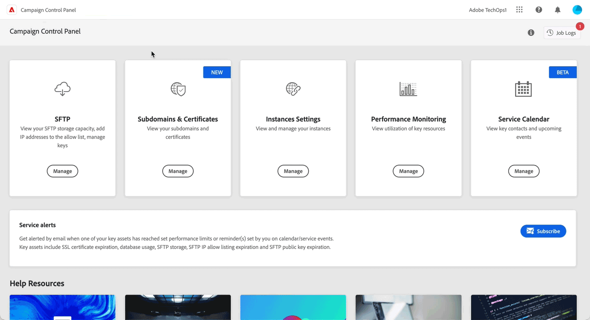

# 最新リリース {#control-panel-releases}

このページでは、コントロールパネルの新機能と改善点を一覧表示しています。

## 2023年2月 {#february-2023}

**アドビにデリゲートされたサブドメインのデリゲーションの削除**

アドビに完全にデリゲートされたサブドメインのデリゲーションを削除できるようになりました。[詳細情報](../subdomains-certificates/using/remove-delegated-subdomains.md)

>[!NOTE]
>
>現在、デリゲーションの削除は、CNAME を使用して設定されたサブドメインでは使用できません。

**サービスカレンダー**

お使いのインスタンスで発生する重要なイベントを追跡するためのカレンダー表示がサービスカレンダーに追加されました。さらに、コントロールパネルのアラートを購読しているユーザーに送信される通知に関する情報が追加されました。[詳細情報](../service-events/service-events.md)

