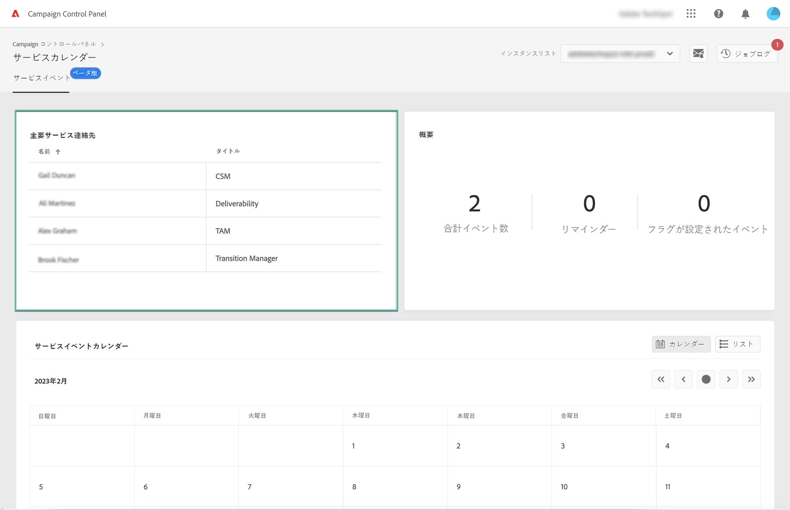
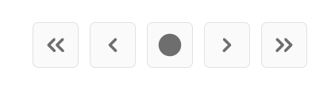

# 主要連絡先とイベントの特定 {#keycontacts-events}

>[!CONTEXTUALHELP]
>id="cp_servicecalendar_serviceevents"
>title="サービスカレンダー"
>abstract="「主要連絡先」セクションには、インスタンスに関するあらゆるリクエストや問題について連絡できるアドビの担当者が一覧表示されます。 「サービスイベントカレンダー」セクションでは、選択したインスタンスの過去/今後のリリースやアラートを識別し、特定のイベントのリマインダーを設定できます。"

>[!IMPORTANT]
>
>サービスカレンダーはベータ版であり、予告なく頻繁に更新や変更が行われる可能性があります。

Campaign インスタンスを効果的に監視するには、インスタンスに影響を与える可能性のある重要なイベントを追跡しておくことが重要です。 このCampaign コントロールパネルを使用すると、新しいリリース、アップグレード、パッチ、ホットフィックスなどのイベントを識別できます。 およびは、リクエストや問題に関する主要なAdobe連絡先のリストを提供します。

この情報には、 **[!UICONTROL サービスカレンダー]** カード (Campaign コントロールパネルのホームページ )

## 主要連絡先 {#key-contacts}

「**[!UICONTROL 主要連絡先]**」セクションには、インスタンスに関するあらゆるリクエストや問題について連絡できるアドビの担当者が一覧表示されます。

>[!NOTE]
>
>このセクションには、Managed Service アカウントの情報のみが表示されます。

主要連絡先には、次の役割が含まれています。

* **[!UICONTROL TAM]**：テクニカルアカウントマネージャー
* **[!UICONTROL CSM]**：カスタマーサクセスマネージャー
* **[!UICONTROL 配信品質]**：配信品質業務に関する連絡先
* **[!UICONTROL トランジションマネージャー]**：Managed Services のトランジションマネージャー（Managed Services アカウントのみ）
* **[!UICONTROL オンボーディングスペシャリスト]**：Campaign Classic へのオンボーディングを支援するためにアカウントに割り当てられたスペシャリスト（Managed Services アカウントのみ）

## 重要なイベントを追跡する {#events}

この **[!UICONTROL サービスイベントカレンダー]** 「 」セクションには、過去および今後のすべてのリリースと、Campaign コントロールパネルe メールアラートで購読しているアラートユーザーが表示されます。 また、Campaign コントロールパネルを使用すると、ユーザーはリマインダーを設定し、選択したインスタンスに関連するイベントにフラグを設定して、整理しやすく効率的に利用できます。

イベントは、カレンダーまたはリストに表示されます。 2 つのビューを切り替えるには、 **[!UICONTROL カレンダー]** および **[!UICONTROL リスト]** ボタンを使用して、セクションの右上隅に表示できます。

<table><tr style="border: 0;">
<td>
</td><td>カレンダー表示では、イベントを参照するのに役立つナビゲーションボタンが右上隅に表示されます。 以下を使用： <b>二重矢印</b> をクリックして、選択した月の前後に存在する最初のイベントに移動し、 <b>単一矢印</b> をクリックして、1 か月から別の月に移動します。 次をクリック： <b>円ボタン</b> 今日の景色に戻る</td>
</tr></table>

次の 3 種類のイベントが表示されます。

* **リマインダー** は、イベントが発生する前に通知を受け取るためにユーザーによって設定されます。 これらは、カレンダー表示では緑色で表示されます。 [リマインダーを設定する方法を説明します](#reminders)
* **アラート** は、ストレージの過負荷や SSL 証明書の有効期限など、インスタンスの問題をCampaign コントロールパネルに通知するために、ユーザーから電子メールで送信されます。 カレンダー表示では、オレンジ色で表示されます。 イベントの説明では、E メールアラートのサブスクリプションに応じて、アラートをログインしたユーザーに送信するかどうかを指定します。 [Campaign コントロールパネルE メールアラート機能の詳細](../performance-monitoring/using/email-alerting.md)

* **リリース** カレンダービューでそれぞれグレーと青で示される、インスタンスの過去のデプロイメントと今後のデプロイメントの両方を示します。 イベントの詳細で、各デプロイメントに関連付けられるリリースのタイプを指定します。

   * **[!UICONTROL 一般提供（GA）]**：入手可能な最新の安定ビルドです。
   * **[!UICONTROL 限定提供（LA）]**：オンデマンドデプロイメントのみ。
   * **[!UICONTROL リリース候補（RC）]**：エンジニアリング部門により検証済みです。本番環境での検証待ちです。
   * **[!UICONTROL プレリリース]**：お客様の特定のニーズに対応するための先行提供です。
   * **[!UICONTROL 使用できなくなりました]**：このビルドに重大な問題はありませんが、追加のバグ修正が含まれている新しいビルドが提供されています。アップグレードが必要です。
   * **[!UICONTROL 非推奨（廃止予定）]**：既知の不具合が含まれるビルドです。
このビルドのサポートは終了しています。アップグレードが必須です。

今後の 1 つまたは複数のイベントにフラグを割り当てて、それらのイベントを追跡することができます。 これをおこなうには、イベント名の横にある省略記号ボタンをクリックします。

## リマインダーの設定 {#reminders}

サービスカレンダーでは、イベントが発生する前にメールで通知を受け取れるよう、リマインダーを設定できます。

>[!NOTE]
>
>今後のイベントに関する通知を受け取るには、コントロールパネルでメールアラートの配信が設定されていることを確認します。 [詳細情報](../performance-monitoring/using/email-alerting.md)

イベントのアラートを設定するには、次の手順に従います。

1. 通知するイベントの上にマウスポインターを置くか、リスト表示で楕円形ボタンをクリックし、「 」を選択します。 **[!UICONTROL リマインダーを設定]**.

1. リマインダーのタイトルを指定し、イベントが発生する前に通知する日付を選択します。

   

   >[!NOTE]
   >
   >コントロールパネルのアラートの購読が設定されてない場合は、メッセージが表示され、メール通知を受信するよう登録できます。

1. これで、選択したイベントのリマインダーが設定されました。マウスカーソルを合わせることで、いつでもタイトルを表示できます。

   

   >[!NOTE]
   >
   >同じイベントに対して最大 2 件のリマインダーを設定できます。

1. リマインダーで指定した日付になると、今後のイベントについて通知するメールが送信され、そのリマインダーはサービスカレンダーメニューの「**[!UICONTROL リマインダー]**」カウントから自動的に削除されます。
