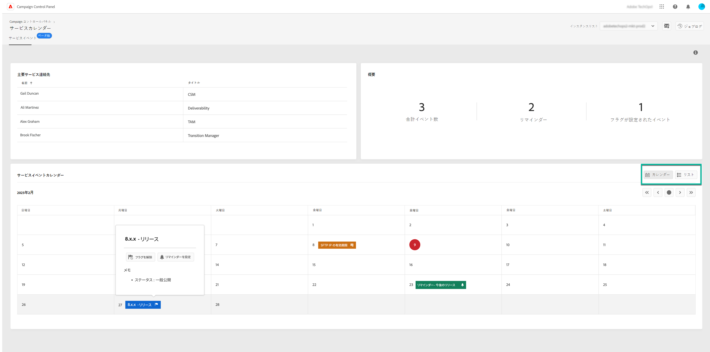

# 主要連絡先とイベントの監視 {#keycontacts-events}

>[!CONTEXTUALHELP]
>id="cp_servicecalendar_serviceevents"
>title="サービスカレンダー"
>abstract="「主要連絡先」セクションには、インスタンスに関するあらゆるリクエストや問題について連絡できるアドビの担当者が一覧表示されます。 「サービスイベントカレンダー」セクションでは、選択したインスタンスのリリースとサービスレビューを特定したり、今後のイベントのリマインダーを設定したりできます。"

>[!IMPORTANT]
>
>サービスカレンダーはベータ版であり、予告なく頻繁に更新や変更が行われる可能性があります。

Campaign インスタンスの監視では、インスタンスで予定されているイベントの特定が不可欠です。

コントロールパネルでは、インスタンスで行われるリリースやサービスレビューを監視したり、あらゆるリクエストや問題に関するアドビの主要連絡先の一覧にアクセスしたりできます。

これらの情報には、コントロールパネルのホームページにある&#x200B;**[!UICONTROL サービスカレンダー]**&#x200B;カードからアクセスできます。

## 主要連絡先 {#key-contacts}

「**[!UICONTROL 主要連絡先]**」セクションには、インスタンスに関するあらゆるリクエストや問題について連絡できるアドビの担当者が一覧表示されます。

>[!NOTE]
>
>このセクションには、Managed Service アカウントに関する情報のみが表示されます。

主要連絡先には、次の役割が含まれています。

* **[!UICONTROL TAM]**：テクニカルアカウントマネージャー
* **[!UICONTROL CSM]**：カスタマーサクセスマネージャー
* **[!UICONTROL 配信品質]**：配信品質業務に関する連絡先
* **[!UICONTROL トランジションマネージャー]**：Managed Services のトランジションマネージャー（Managed Services アカウントのみ）
* **[!UICONTROL オンボーディングスペシャリスト]**：Campaign Classic へのオンボーディングを支援するためにアカウントに割り当てられたスペシャリスト（Managed Services アカウントのみ）

## イベント {#events}

### イベントの監視 {#monitor-events}

「**[!UICONTROL サービスイベントカレンダー]**」セクションには、選択したインスタンスの過去および今後のすべてのリリースやサービスレビューが表示されます。

「**[!UICONTROL メモ]**」列には、各リリースのステータスに関する情報が表示されます。

* **[!UICONTROL 一般提供（GA）]**：入手可能な最新の安定ビルドです。
* **[!UICONTROL 限定提供（LA）]**：オンデマンドデプロイメントのみ。
* **[!UICONTROL リリース候補（RC）]**：エンジニアリング部門により検証済みです。本番環境での検証待ちです。
* **[!UICONTROL プレリリース]**：お客様の特定のニーズに対応するための先行提供です。
* **[!UICONTROL 使用できなくなりました]**：このビルドに重大な問題はありませんが、追加のバグ修正が含まれている新しいビルドが提供されています。アップグレードが必要です。
* **[!UICONTROL 非推奨（廃止予定）]**：既知の不具合が含まれるビルドです。
このビルドのサポートは終了しています。アップグレードが必須です。

今後の 1 つまたは複数のイベントにフラグを割り当てて、それらのイベントを追跡することができます。 それには、イベント名の横にある省略記号ボタンをクリックします。

### リマインダーの設定 {#reminders}

サービスカレンダーでは、イベントが発生する前にメールで通知を受け取れるよう、リマインダーを設定できます。

>[!NOTE]
>
>今後のイベントに関する通知を受け取るには、コントロールパネルでメールアラートの配信が設定されていることを確認します。 [詳細情報](../performance-monitoring/using/email-alerting.md)

イベントのアラートを設定するには、次の手順に従います。

1. リマインダーの受信を希望するイベントの隣にある省略記号ボタンをクリックしたあと、「**[!UICONTROL リマインダーを設定]**」を選択します。

1. リマインダーのタイトルを指定し、イベントが発生する前に通知してもらいたい日付を選択します。

   

   >[!NOTE]
   >
   >コントロールパネルのアラートの購読が設定されてない場合は、メッセージが表示され、メール通知の受信登録を行えます。

1. これで、選択したイベントのリマインダーが設定されました。マウスカーソルを合わせることで、いつでもタイトルを表示できます。

   

   >[!NOTE]
   >
   >同じイベントに対して最大 2 件のリマインダーを設定できます。

1. リマインダーで指定した日付になると、今後のイベントについて通知するメールが送信され、そのリマインダーはサービスカレンダーメニューの「**[!UICONTROL リマインダー]**」カウントから自動的に削除されます。
