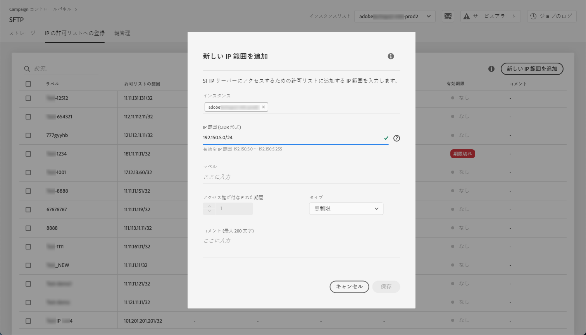
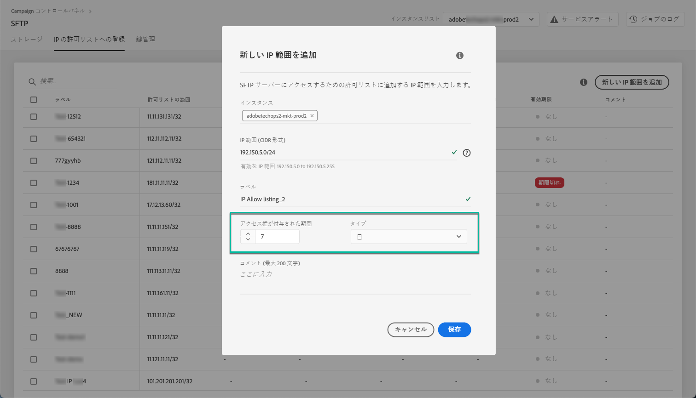
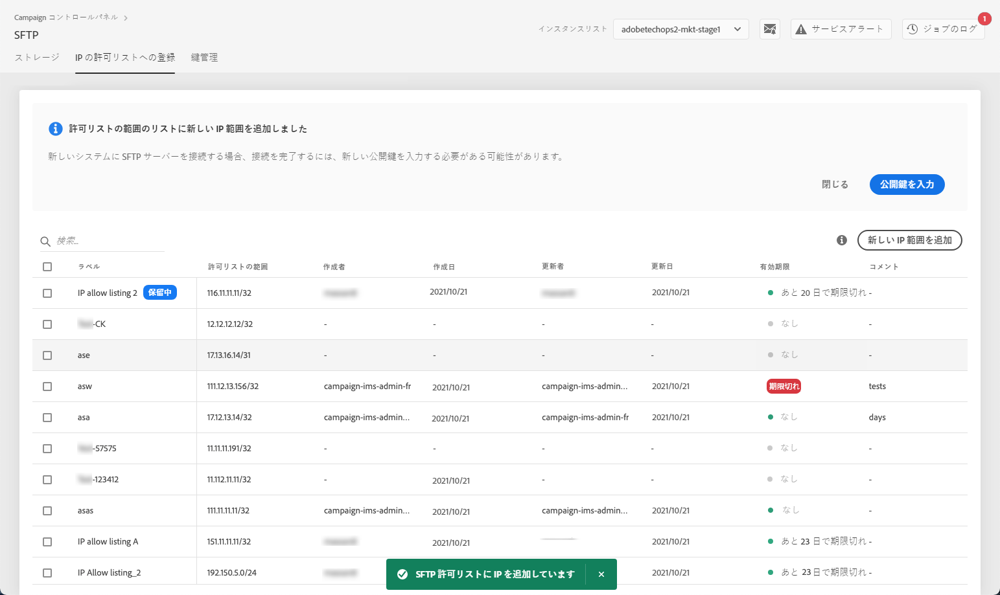
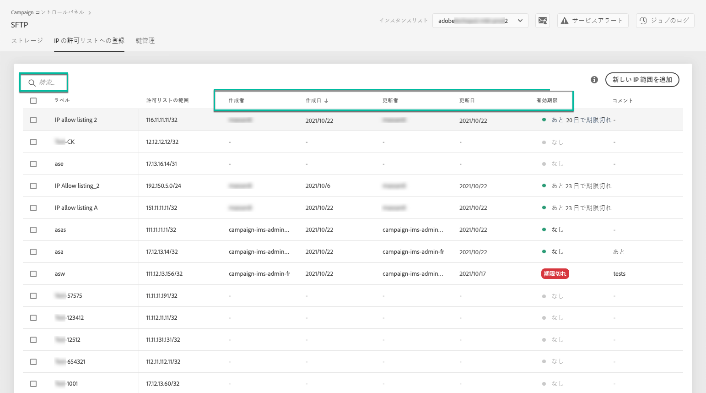
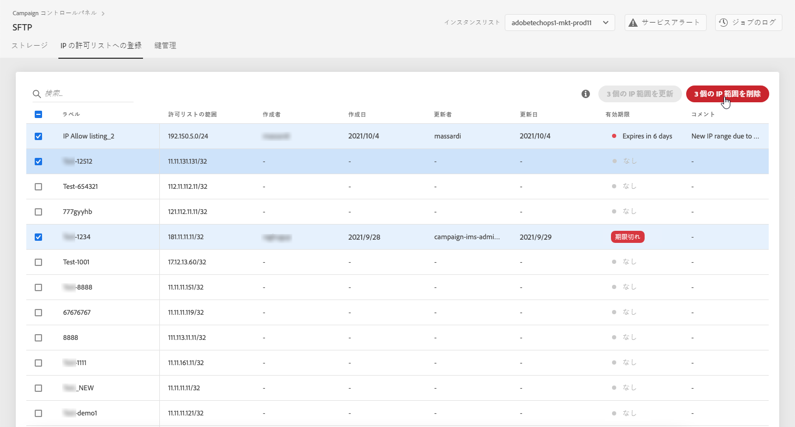
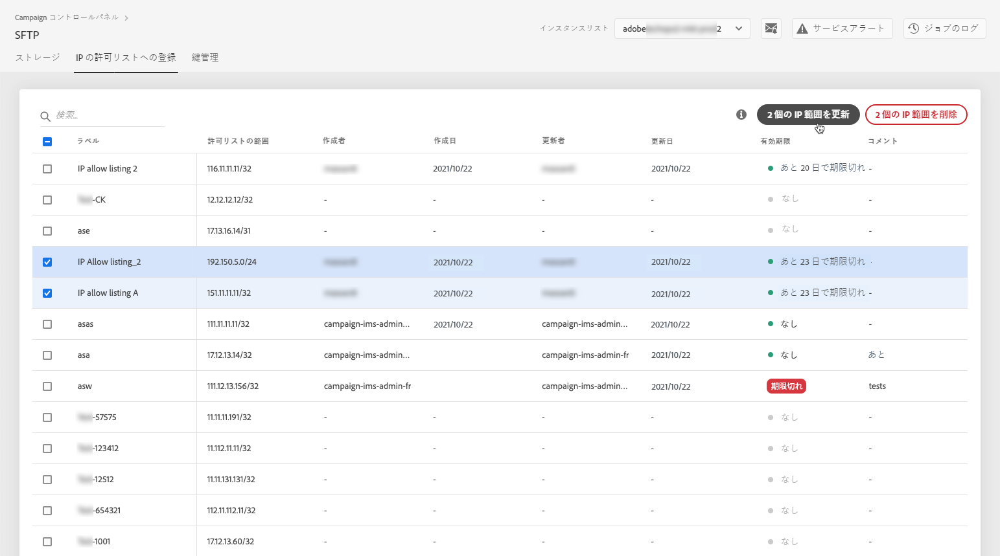
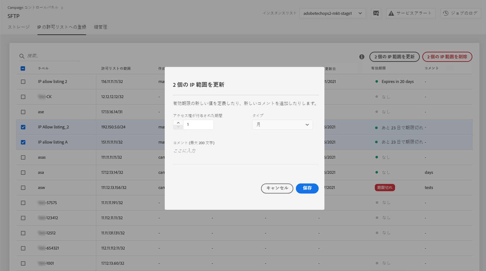

# IP 範囲許可リストへの登録 {#ip-range-allow-listing}

>[!CONTEXTUALHELP]
>id="cp_ip_whitelist"
>title="IP 許可リストへの登録について"
>abstract="このタブでは、SFTP サーバーへの接続を確立するために、IP 範囲を許可リストに追加できます。アクセス権のある SFTP サーバーのみがここに表示されます。他の SFTP サーバーへのアクセス権をリクエストするには、管理者にお問い合わせください。"
>additional-url="https://images-tv.adobe.com/mpcv3/8a977e03-d76c-44d3-853c-95d0b799c870_1560205338.1920x1080at3000_h264.mp4#t=98" text="デモビデオを見る"

SFTP サーバーは保護されているため、SFTP サーバーにアクセスしてファイルを表示したり新しいファイルを書き込んだりするには、サーバーにアクセスするシステムやクライアントのパブリック IP アドレスを許可リストに追加する必要があります。

[Campaign v7／v8](https://experienceleague.adobe.com/docs/campaign-classic-learn/control-panel/sftp-management/adding-ip-range-to-allow-list.html?lang=ja#sftp-management) または [Campaign Standard](https://experienceleague.adobe.com/docs/campaign-standard-learn/control-panel/sftp-management/adding-ip-range-to-allow-list.html?lang=ja#sftp-management) を使用して、ビデオでこの機能を確認

## CIDR 形式について {#about-cidr-format}

CIDR（Classless Inter-Domain Routing）は、コントロールパネルのインターフェイスで IP 範囲を追加する際に使用可能な形式です。

構文は、IP アドレスとそれに続く「/」（スラッシュ記号）および 10 進数で構成されます。形式とその構文について詳しくは、 [この記事](https://whatismyipaddress.com/cidr){target="_blank"}.

自分の管理下にある IP 範囲を CIDR 形式に変換するのに役立つ無料のオンラインツールをインターネットで検索できます。

## ベストプラクティス {#best-practices}

コントロールパネルで IP アドレスを許可リストに登録する場合は、必ず以下の推奨事項と制限事項に従ってください。

* 単一の IP アドレスではなく&#x200B;**IP 範囲を許可リストに追加**&#x200B;してください。単一の IP アドレスを許可リストに追加するには、その範囲が単一の IP のみを含むことを示すために「/32」を追加します。
* **許可リストにはあまり広い範囲を追加しないようにします**。例えば、265 個を超える IP アドレスなどです。/0 ～ /23 の間の CIDR 形式の範囲は拒否されます。
* 許可リストに追加できるのは&#x200B;**パブリック IP アドレス**&#x200B;のみです。
* 不要になった **IP アドレスは許可リストから定期的に削除**&#x200B;してください。

## 許可リストへの IP アドレスの追加 {#adding-ip-addresses-allow-list}

>[!CONTEXTUALHELP]
>id="cp_sftp_iprange_add"
>title="IP 範囲の設定"
>abstract="SFTP サーバーに接続するための許可リストに追加する IP 範囲を定義します。"

許可リストに IP 範囲を追加するには、次の手順に従います。

1. 「**[!UICONTROL SFTP]**」カードを開き、「**[!UICONTROL IP の許可リストへの登録]**」タブを選択します。
1. 許可リストに載っている IP アドレスのリストが各インスタンスごとに表示されます。左側のリストから目的のインスタンスを選択して、「**[!UICONTROL 新しい IP 範囲を追加]**」ボタンをクリックします。

   

1. 許可リストに追加する IP 範囲を定義します。 このフィールドには、*192.150.5.0/24* などの CIDR 形式の IP 範囲のみ入力できます。

   

   >[!IMPORTANT]
   >
   >IP 範囲を、許可リスト上の既存の範囲と重複させることはできません。重複する場合は、まず、重複している IP を含む範囲を削除してください。

1. 複数のインスタンスの許可リストに同じ範囲を追加できます。それには、下向き矢印キーを押すか目的のインスタンスの最初の文字を入力して、そのインスタンスを候補リストから選択します。

   

1. リストでこの IP 範囲に対して表示するラベルを指定します。

   

   >[!NOTE]
   >
   >「**[!UICONTROL ラベル]**」フィールドでは、以下の特殊文字を使用できます。
   > `. _ - : / ( ) # , @ [ ] + = & ; { } ! $`

1. IP 許可リストを管理しやすくするために、各 IP 範囲の有効期間を設定できます。 それには、「**[!UICONTROL タイプ]**」ドロップダウンリストで単位を選択し、該当するフィールドで期間を定義します。IP 範囲の有効期限について詳しくは、 [この節](#expiry)を参照してください。

   

   >[!NOTE]
   >
   >デフォルトでは、「**[!UICONTROL タイプ]**」フィールドは「**[!UICONTROL 無制限]**」に設定されています。これは、IP 範囲の有効期限がないことを意味します。

1. 「**[!UICONTROL コメント]**」フィールドに、この IP 範囲を許可する理由や対象ユーザーなどを入力できます。

1. 「**[!UICONTROL 保存]**」ボタンをクリックします。許可リストに IP 範囲を追加すると、リクエストが完全に処理されるまでは「**[!UICONTROL 保留]**」と表示されますが、処理は数秒で完了します。

   

>[!IMPORTANT]
>
>SFTP サーバーを新しいシステムに接続しようとして新しい IP 範囲を許可リストに追加する場合は、接続を確立するために新しい公開鍵を入力しなければならない可能性があります。 詳しくは、[この節](key-management.md)を参照してください。

## IP 範囲の管理 {#managing-ip-ranges}

作成した IP 範囲は「**[!UICONTROL IP の許可リストへの登録]**」タブに表示されます。

作成日、編集日、作成者、編集者および IP 範囲の有効期限に基づいて、項目を並べ替えることができます。 

また、ラベル、範囲、名前またはコメントを入力して IP 範囲を検索することもできます。

1 つ以上の IP 範囲を編集するには、 [この節](#editing-ip-ranges)を参照してください。

許可リストから 1 つ以上の IP 範囲を削除するには、対象の IP 範囲を選択してから「**[!UICONTROL IP 範囲を削除]**」ボタンをクリックします。

### 有効期限 {#expiry}

「**[!UICONTROL 有効期限]**」列には、IP 範囲が期限切れになるまでの残り日数が表示されます。

[メールアラート](../../performance-monitoring/using/email-alerting.md)を購読すると、IP 範囲の有効期限が切れる 10 日前、5 日前および当日に、メールで通知が届きます。 アラートを受け取ったら、[IP 範囲を編集](#editing-ip-ranges)して、必要に応じて有効期間を延長できます。

有効期限切れの IP 範囲は、7 日後に自動的に削除されます。この場合、「**[!UICONTROL 有効期限]**」列に「**[!UICONTROL 期限切れ]**」と表示されます。この 7 日間では、

* 期限切れの IP 範囲は、SFTP サーバーへのアクセスにはもう使用できません。

* 期限切れの範囲と重なる別の IP 範囲を作成することはできません。 新しい IP 範囲を作成するには、まず期限切れの IP 範囲を削除する必要があります。

* 期限切れの IP 範囲を[編集](#editing-ip-ranges)し有効期間を更新することで、再び使用できるようにすることが可能です。

* 許可リストから削除することができます。

## IP 範囲の編集 {#editing-ip-ranges}

>[!CONTEXTUALHELP]
>id="cp_sftp_iprange_update"
>title="IP 範囲を更新"
>abstract="選択した IP 範囲を更新して SFTP サーバーに接続できるようにします。"

IP 範囲を編集するには、次の手順に従います。

>[!NOTE]
>
>編集できる IP 範囲は、コントロールパネル 2021年10月リリース以降に作成したものだけです。

<!--Edition is not available for IP ranges that have been created before the Control Panel October 2021 release.-->

1. 「**[!UICONTROL IP の許可リストへの登録]**」リストから IP 範囲を 1 つ以上選択します。

1. 「**[!UICONTROL IP 範囲を更新]**」ボタンをクリックします。

   

1. 可能な操作は、IP 範囲の有効期限の編集や新しいコメントの追加のみです。

   >[!NOTE]
   >
   >CIDR 形式やそのラベルを変更したり、関連するインスタンスを編集したりするには、まず IP 範囲を削除し、新しい IP 範囲を必要に応じて作成する必要があります。

   

1. 変更内容を保存します。

## 変更内容の監視 {#monitoring-changes}

コントロールパネルのホームページにある&#x200B;**[!UICONTROL ジョブのログ]**&#x200B;を使用すると、許可リストの IP アドレスに加えられたすべての変更をトラッキングし監視できます。

コントロールパネルのインターフェイスについて詳しくは、[この節](../../discover/using/discovering-the-interface.md)を参照してください。

