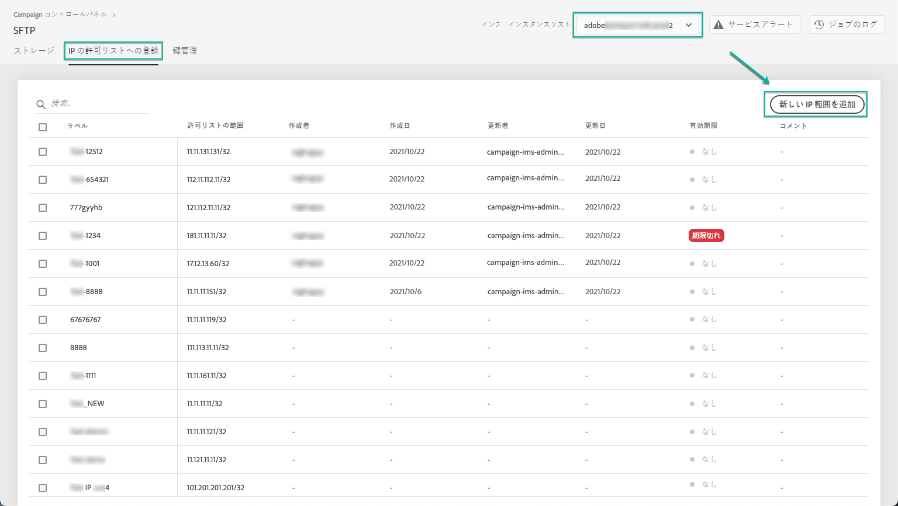

# IP 範囲許可リストへの登録 {#ip-range-allow-listing}

>[!CONTEXTUALHELP]
>id="cp_ip_whitelist"
>title="IP 許可リストへの登録について"
>abstract="このタブでは、SFTP サーバーへの接続を確立するために、IP 範囲を許可リストに追加できます。アクセス権のある SFTP サーバーのみがここに表示されます。他の SFTP サーバーへのアクセス権をリクエストするには、管理者にお問い合わせください。"
>additional-url="https://images-tv.adobe.com/mpcv3/8a977e03-d76c-44d3-853c-95d0b799c870_1560205338.1920x1080at3000_h264.mp4#t=98" text="デモビデオを見る"

SFTP サーバーは保護されているため、ファイルの表示や新しいファイルの書き込みを行うために IP アドレスにアクセスするには、許可リストにサーバーにアクセスするシステムまたはクライアントのパブリック IP アドレスを追加する必要があります。

 [Campaign Classic](https://experienceleague.adobe.com/docs/campaign-classic-learn/control-panel/sftp-management/adding-ip-range-to-allow-list.html#sftp-management) または [Campaign Standard ](https://experienceleague.adobe.com/docs/campaign-standard-learn/control-panel/sftp-management/adding-ip-range-to-allow-list.html#sftp-management) を使用してこの機能をビデオで確認する

## CIDR 形式について {#about-cidr-format}

CIDR（Classless Inter-Domain Routing）は、コントロールパネルのインターフェイスで IP 範囲を追加する際に使用可能な形式です。

構文は、IP アドレスとそれに続く「/」（スラッシュ記号）および 10 進数で構成されます。形式とその構文について詳しくは、[ この記事 ](https://whatismyipaddress.com/cidr){target=&quot;_blank&quot;} を参照してください。

インターネット上で、手元にある IP 範囲を CIDR 形式に変換するのに役立つ無料のオンラインツールを検索できます。

## ベストプラクティス {#best-practices}

コントロールパネルで IP アドレスを許可リストに登録する場合は、必ず以下の推奨事項と制限に従ってください。

* 単一の IP アドレスではなく&#x200B;**IP 範囲を許可リストに追加**&#x200B;してください。単一の IP アドレスを許可リストに追加するには、その範囲が単一の IP のみを含むことを示すために「/32」を追加します。
* **許可リストにはあまり広い範囲を追加しないようにします**。例えば、265 個を超える IP アドレスなどです。/0 ～ /23 の間の CIDR 形式の範囲は拒否されます。
* 許可リストに追加できるのは&#x200B;**パブリック IP アドレス**&#x200B;のみです。
* 必ず **定期的に IP アドレス** を削除し、許可リストから不要になったことを確認してください。

## 許可リストへの IP アドレスの追加 {#adding-ip-addresses-allow-list}

>[!CONTEXTUALHELP]
>id="cp_sftp_iprange_add"
>title="IP 範囲の設定"
>abstract="SFTP サーバーに接続するための許可リストに追加する IP 範囲を定義します。"

許可リストに IP 範囲を追加するには、次の手順に従います。

1. 「**[!UICONTROL SFTP]**」カードを開き、「**[!UICONTROL IP の許可リストへの登録]**」タブを選択します。
1. 許可リストに載っている IP アドレスのリストが各インスタンスごとに表示されます。左側のリストから目的のインスタンスを選択して、「**[!UICONTROL 新しい IP 範囲を追加]**」ボタンをクリックします。

   

1. 許可リストに追加する IP 範囲を定義します。 このフィールドは、*192.150.5.0/24* など、CIDR 形式の IP 範囲のみを受け入れます。

   

   >[!IMPORTANT]
   >
   >IP 範囲を、許可リスト上の既存の範囲と重複させることはできません。重複する場合は、まず、重複している IP を含む範囲を削除してください。

1. 複数のインスタンスの範囲を許可リストに追加できます。 それには、下向き矢印キーを押すか目的のインスタンスの最初の文字を入力して、候補リストから選択します。

   

1. リストでこの IP 範囲に対して表示するラベルを定義します。

   

   >[!NOTE]
   >
   >「**[!UICONTROL Label]**」フィールドでは、次の特殊文字を使用できます。
   > `. _ - : / ( ) # , @ [ ] + = & ; { } ! $`

1. IP許可リストの管理を強化するには、各 IP 範囲の可用性の期間を設定します。 それには、**[!UICONTROL タイプ]** ドロップダウンリストで単位を選択し、対応するフィールドで期間を定義します。 IP 範囲の有効期限について詳しくは、[ この節 ](#expiry) を参照してください。

   

   >[!NOTE]
   >
   >デフォルトでは、**[!UICONTROL タイプ]** フィールドは **[!UICONTROL 無制限]** に設定されています。これは、IP 範囲が期限切れになることを意味します。

1. 「**[!UICONTROL コメント]**」フィールドに、この IP 範囲を許可する理由（理由、ユーザーなど）を入力できます。

1. 「**[!UICONTROL 保存]**」ボタンをクリックします。リクエストが完全に処理されるまで、許可リストに IP 範囲を追加すると、「**[!UICONTROL 保留]**」と表示されます。処理にかかる時間は数秒です。

   

>[!IMPORTANT]
>
>SFTP サーバーを新しい許可リストに接続し、その結果、新しい IP 範囲をシステムに追加する場合、接続を完了するために新しい公開鍵を入力する必要が生じる場合があります。 詳しくは、[この節](key-management.md)を参照してください。

## IP 範囲の管理 {#managing-ip-ranges}

作成した IP 範囲は「**[!UICONTROL IP 許可リスト]**」タブに表示されます。

作成日または編集日、作成または編集したユーザー、IP 範囲の有効期限に基づいて項目を並べ替えることができます。

IP 範囲の検索は、ラベル、範囲、名前またはコメントの入力を開始して行うこともできます。

1 つ以上の IP 範囲を編集するには、[ この節 ](#editing-ip-ranges) を参照してください。

許可リストから 1 つ以上の IP 範囲を削除するには、IP 範囲を選択し、「**[!UICONTROL IP 範囲を削除]**」ボタンをクリックします。

### 有効期限 {#expiry}

**[!UICONTROL 有効期限]** 列には、IP 範囲が期限切れになるまでの残り日数が表示されます。

[E メールアラート ](../../performance-monitoring/using/email-alerting.md) を購読すると、IP 範囲の有効期限が切れる 10 日と 5 日前、期限切れの日に、E メールで通知を受け取ります。 アラートを受け取ったら、[IP 範囲 ](#editing-ip-ranges) を編集して、必要に応じて有効期間を延長できます。

有効期限切れの IP 範囲は、7 日後に自動的に削除されます。 **[!UICONTROL 有効期限]** 列に **[!UICONTROL 期限切れ]** と表示されます。 この 7 日間以内：

* 期限切れの IP 範囲は、SFTP サーバーへのアクセスには使用できなくなりました。

* 期限切れの範囲と重複する別の IP 範囲を作成することはできません。 新しい IP 範囲を作成する前に、まず期限切れの IP 範囲を削除する必要があります。

* 有効期限切れの IP 範囲を [ 編集 ](#editing-ip-ranges) し、その期間を更新して再び使用可能にすることができます。

* これは、許可リストから削除できます。

## IP 範囲の編集 {#editing-ip-ranges}

>[!CONTEXTUALHELP]
>id="cp_sftp_iprange_update"
>title="IP 範囲の更新"
>abstract="SFTP サーバーへの接続を許可する、選択した IP 範囲を更新します。"

IP 範囲を編集するには、次の手順に従います。

>[!NOTE]
>
>2021 年 10 月リリース以降に作成された IP 範囲のみCampaign コントロールパネルできます。

<!--Edition is not available for IP ranges that have been created before the Control Panel October 2021 release.-->

1. **[!UICONTROL 「IP 許可リスト]**」リストから 1 つ以上の IP 範囲を選択します。

1. 「**[!UICONTROL IP 範囲を更新]**」ボタンをクリックします。

   

1. IP 範囲の有効期限を編集したり、新しいコメントを追加したりできます。

   >[!NOTE]
   >
   >CIDR 形式、そのラベル、または関連するインスタンスを変更するには、まず IP 範囲を削除し、必要に応じて新しい IP 範囲を作成する必要があります。

   

1. 変更を保存します。

## 変更の監視 {#monitoring-changes}

Campaign コントロールパネルのホームページの **[!UICONTROL 許可リストのログ]** を使用して、ジョブ上の IP アドレスに加えられたすべての変更を追跡し、監視できます。

コントロールパネルのインターフェイスについて詳しくは、[この節](../../discover/using/discovering-the-interface.md)を参照してください。

