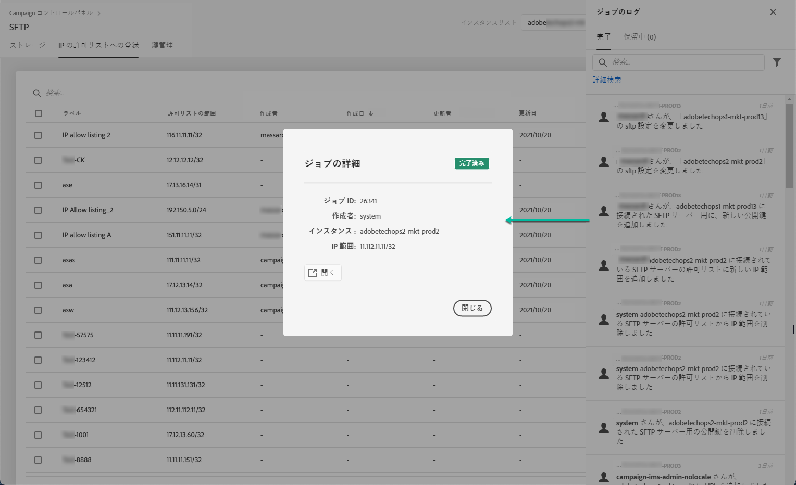

# IP 範囲許可リストへの登録 {#ip-range-allow-listing}

>[!CONTEXTUALHELP]
>id="cp_ip_whitelist"
>title="IP 許可リストへの登録について"
>abstract="このタブでは、SFTP サーバーへの接続を確立するために、IP 範囲を許可リストに追加できます。アクセス権のある SFTP サーバーのみがここに表示されます。他の SFTP サーバーへのアクセス権をリクエストするには、管理者にお問い合わせください。"
>additional-url="https://images-tv.adobe.com/mpcv3/8a977e03-d76c-44d3-853c-95d0b799c870_1560205338.1920x1080at3000_h264.mp4#t=98" text="デモビデオを見る"

SFTP サーバーは保護されています。ファイルを表示したり新しいファイルを書き込んだりするために SFTP サーバーにアクセスするには、サーバーにアクセスするシステムまたはクライアントのパブリック IP アドレスを許可リストに追加する必要があります。

 [Campaign Classic](https://experienceleague.adobe.com/docs/campaign-classic-learn/control-panel/sftp-management/adding-ip-range-to-allow-list.html?lang=ja#sftp-management) または [Campaign Standard ](https://experienceleague.adobe.com/docs/campaign-standard-learn/control-panel/sftp-management/adding-ip-range-to-allow-list.html?lang=ja#sftp-management) を使用してこの機能をビデオで確認する

## CIDR 形式について{#about-cidr-format}

CIDR（Classless Inter-Domain Routing）は、コントロールパネルのインターフェイスで IP 範囲を追加する際にサポートされる形式です。

構文は、IP アドレスとそれに続く「/」（スラッシュ記号）および 10 進数で構成されます。形式とその構文について詳しくは、[この記事](https://whatismyipaddress.com/cidr)を参照してください。

管理している IP 範囲を CIDR 形式に変換するのに役立つ無料のオンラインツールをインターネットで検索できます。

## ベストプラクティス{#best-practices}

コントロールパネルで IP アドレスを許可リストに登録する場合は、必ず以下の推奨事項と制限に従ってください。

* 単一の IP アドレスではなく&#x200B;**IP 範囲を許可リストに追加**&#x200B;してください。単一の IP アドレスを許可リストに追加するには、その範囲が単一の IP のみを含むことを示すために「/32」を追加します。
* **許可リストにはあまり広い範囲を追加しないようにします**。例えば、265 個を超える IP アドレスなどです。コントロールパネルは、/0 ～ /23 の間の CIDR 形式の範囲を拒否します。
* 許可リストに追加できるのは&#x200B;**パブリック IP アドレス**&#x200B;のみです。
* 許可リストから不要になった&#x200B;**IP アドレスを定期的に削除**&#x200B;してください。

## 許可リストへの IP アドレスの追加 {#adding-ip-addresses-allow-list}

>[!CONTEXTUALHELP]
>id="cp_sftp_iprange_add"
>title="新しい IP 範囲の追加"
>abstract="SFTP サーバーに接続するための許可リストに追加する IP 範囲を定義します。"

許可リストに IP 範囲を追加するには、次の手順に従います。

1. 「**[!UICONTROL SFTP]**」カードを開き、「**[!UICONTROL IP の許可リストへの登録]**」タブを選択します。
1. 許可リストに載っている IP アドレスのリストが各インスタンスごとに表示されます。左側のリストから目的のインスタンスを選択して、「**[!UICONTROL 新しい IP 範囲を追加]**」ボタンをクリックします。

   

1. 許可リストに追加する IP 範囲を CIDR 形式で定義してから、リストに表示されるラベルを定義します。

   >[!NOTE]
   >
   >「ラベル」フィールドでは、以下の特殊文字を使用できます。
   > `. _ - : / ( ) # , @ [ ] + = & ; { } ! $`

   

   >[!IMPORTANT]
   >
   >IP 範囲は、許可リスト上の既存の範囲と重複することはできません。重複する場合は、まず、重複している IP を含む範囲を削除してください。
   >
   >複数のインスタンスの許可リストに同じ範囲を追加できます。それには、下向き矢印キーを押すか目的のインスタンスの最初の文字を入力して、候補リストから選択します。

   

1. 「**[!UICONTROL 保存]**」ボタンをクリックします。登録要請の処理が完了するまで、許可リストへの IP 追加は 「保留」と表示されます。これにかかるのは、わずか数秒です。

許可リストから IP 範囲を削除するには、IP 範囲を選択して、**[!UICONTROL 「IP 範囲を削除]**」ボタンをクリックします。

>[!NOTE]
>
>現在、許可リストに登録された範囲の編集はできません。IP 範囲を変更するには、不要な IP 範囲を削除してから、必要な IP 範囲を新しく作成します。

## 変更の監視{#monitoring-changes}

Campaign コントロールパネルホームページの&#x200B;**[!UICONTROL ジョブのログ]**&#x200B;を使用すると、許可リストの IP アドレスに加えられたすべての変更を監視できます。

コントロールパネルのインターフェイスについて詳しくは、[この節](../../discover/using/discovering-the-interface.md)を参照してください。

