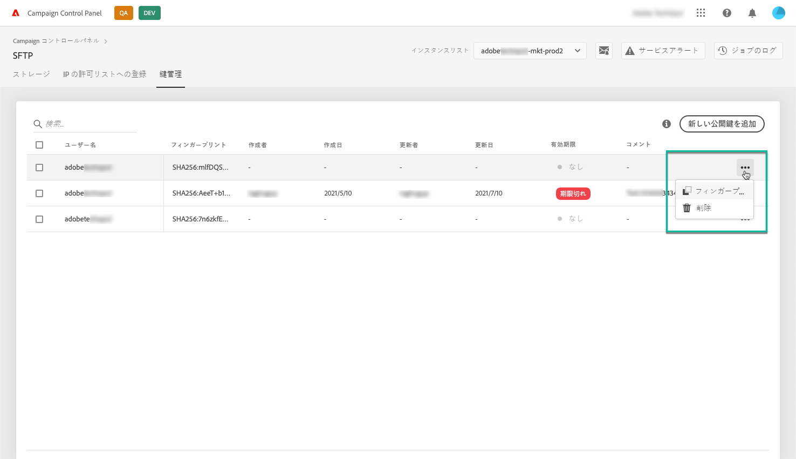

# 鍵の管理 {#key-management}

アドビでは、すべてのお客様が&#x200B;**公開鍵と秘密鍵**&#x200B;のペアを使用して SFTP サーバーへの接続を確立することを推奨します。

公開SSHキーを生成し、SFTPサーバーにアクセスするために追加する手順を以下に示します。また、認証に関する推奨事項も示します。

Once access to the server is set up, remember to **whitelist the IP addresses** that will require access to the server so that you can connect to it. 詳しくは、[この節](../../instances-settings/using/ip-whitelisting-instance-access.md)を参照してください。

>[!NOTE]
>
>現在のところ、SSH 公開キーを削除することはできません。

## ベストプラクティス {#best-practices}

**公開キーについて**

常に同じ認証を使用してサーバーに接続していることと、サポートされている形式のキーを使用していることを確認してください。

**ユーザー名とパスワードによる API 統合**

ごくまれに、一部の SFTP サーバーでパスワードベースの認証が有効になっていることがあります。より効率的で安全な、キーベースの認証を使用することをお勧めします。カスタマーケアに問い合わせて、キーベースの認証に切り替えることをリクエストしてください。

>[!CAUTION]
>
>パスワードが期限切れになると、システムにキーがインストールされていても、SFTP アカウントにログインできなくなります。

## SSH キーのインストール {#installing-ssh-key}

>[!CAUTION]
>
>以下に、SSH キーの作成手順の一例を示します。SSH キーに関しては組織のガイドラインに従ってください。以下の例は、この方法の一例であり、チームや社内のネットワークグループに要件を伝える際の参考として役立ちます。

1. 「**[!UICONTROL キー管理]**」タブに移動し、「**[!UICONTROL 公開鍵を追加]**」ボタンをクリックします。

   

1. 開いたダイアログボックスで、公開鍵を作成するユーザー名と、鍵をアクティブにするサーバーを選択します。

   >[!NOTE]
   >
   >特定のユーザー名が特定のインスタンス上で有効であるかどうかの確認がおこなわれます。また、1 つまたは複数のインスタンス上でキーを有効にするためのオプションが提供されます。
   >
   >各ユーザーには 1 つ以上の SSH 公開キーを追加できます。

   

1. SSH 公開キーをコピーして貼り付けます。公開鍵を生成するには、オペレーティングシステムに対応する以下の手順に従います。

   >[!NOTE]
   >
   >The public SSH key size should be **2048 bits**.

   **Linux および Mac の場合：**

   ターミナルを使用して公開鍵と秘密鍵のペアを生成します。
   1. 次のコマンドを入力します。 `ssh-keygen -t rsa -C <your_email@example.com>`.
   1. プロンプトが表示されたら、キーに名前を付けます。.sshディレクトリが存在しない場合は、システムによって作成されます。
   1. プロンプトが表示されたら、パスフレーズを入力し、もう一度入力します。空欄のままにすることもできます。
   1. キー「name」および「name.pub」のペアがシステムによって作成されます。「name.pub」ファイルを検索し、開きます。 指定した電子メールアドレスで終わる英数字の文字列が含まれているはずです。
   **Windows の場合：**

   秘密鍵と公開鍵のペアを同じ「name.pub」形式で生成するのを支援するサードパーティツールをインストールする必要に迫られる場合があります。

1. .pub ファイルを開き、「ssh...」で始まる文字列全体をコントロールパネルにコピー＆ペーストします。

   

1. 「**[!UICONTROL 保存]」ボタンをクリックして、キーを作成します。**&#x200B;コントロールパネルは、SHA256 形式で暗号化された公開鍵とそれに関連するフィンガープリントを保存します。

フィンガープリントを使用して、コンピューターに保存されている秘密鍵と、コントロールパネルに保存されている対応する公開鍵を照合できます。

The "**...**" button allows you to delete an existing key, or to copy its associated fingerprint into your clipboard.

