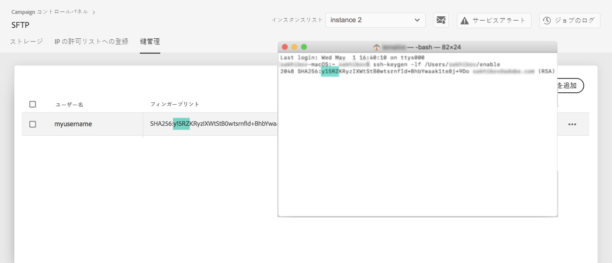

# 鍵の管理 {#key-management}

>[!CONTEXTUALHELP]
>id="cp_key_management"
>title="公開鍵の管理について"
>abstract="このタブでは、公開鍵を作成、管理および編集します。"
>additional-url="https://images-tv.adobe.com/mpcv3/8a977e03-d76c-44d3-853c-95d0b799c870_1560205338.1920x1080at3000_h264.mp4#t=166" text="デモビデオを見る"

アドビでは、すべての顧客が&#x200B;**公開鍵と秘密鍵のペア**&#x200B;を使用して SFTP サーバーへの接続を確立することを推奨します。

SFTP サーバーにアクセスするために SSH 公開鍵を生成して追加する手順および認証に関する推奨事項を以下に説明します。

サーバーへのアクセスを設定したら、忘れずにサーバーにアクセスする必要がある **** IP アドレスを許可リストに登録して、サーバーに接続できるようにしてください。詳しくは、[この節](../../instances-settings/using/ip-allow-listing-instance-access.md)を参照してください。

[Campaign v7／v8](https://experienceleague.adobe.com/docs/campaign-classic-learn/control-panel/sftp-management/generate-ssh-key.html?lang=ja#sftp-management) または [Campaign Standard](https://experienceleague.adobe.com/docs/campaign-standard-learn/control-panel/sftp-management/generate-ssh-key.html?lang=ja#sftp-management) を使用して、ビデオでこの機能を確認

## ベストプラクティス {#best-practices}

**SSH 公開鍵について**

必ず、常に同じ認証を使用してサーバーに接続し、対応する形式の鍵を使用してください。

**ユーザー名とパスワードによる API 統合**

ごくまれに、一部の SFTP サーバーでパスワードベースの認証が有効になっていることがあります。アドビでは、より効率的で安全な、キーベースの認証の使用をお勧めしています。カスタマーケアに連絡して、キーベースの認証に切り替えるように依頼できます。

>[!IMPORTANT]
>
>パスワードの期限が切れると、システムにキーがインストールされていても、SFTP アカウントにログインできなくなります。

## SSH キーのインストール {#installing-ssh-key}

>[!CONTEXTUALHELP]
>id="cp_sftp_publickey_add"
>title="公開鍵の追加"
>abstract="インスタンスの SSH 公開鍵を生成し、コントロールパネルに追加して、SFTP サーバーにアクセスできるようにします。"

>[!IMPORTANT]
>
>所属する組織が定める SSH キーに関するガイドラインに必ず従う必要があります。 以下の手順は、SSH キーの作成方法を示す一例にすぎません。必要事項をチームまたは組織内ネットワークグループに伝える際の参考として役立ててください。

1. 「**[!UICONTROL 鍵管理]**」タブに移動し、「**[!UICONTROL 新しい公開鍵を追加]**」ボタンをクリックします。

   

1. ダイアログボックスが開くので、作成する公開鍵のユーザー名と、公開鍵を有効にするサーバーを選択します。

   

   >[!NOTE]
   >
   >指定された名前のユーザーが指定のインスタンスでアクティブかどうかがコントロールパネルで確認され、1 つ以上のインスタンスで鍵を有効化できるようになります。
   >
   >ユーザーごとに 1 つ以上の SSH 公開鍵を追加できます。

1. 公開鍵を管理しやすくするために、鍵ごとに有効期間を設定することができます。 それには、「**[!UICONTROL タイプ]**」ドロップダウンリストで単位を選択し、該当するフィールドで期間を指定します。公開鍵の有効期限について詳しくは、[この節](#expiry)を参照してください。

   

   >[!NOTE]
   >
   >デフォルトでは、「**[!UICONTROL タイプ]**」フィールドは「**[!UICONTROL 無制限]**」に設定されています。これは、公開鍵の有効期限がないことを意味します。

1. 「**[!UICONTROL コメント]**」フィールドに、この公開鍵を追加する理由や対象ユーザーなどを入力できます。

1. 「**[!UICONTROL 公開鍵]**」フィールドに入力するには、SSH 公開鍵を生成する必要があります。 使用しているオペレーティングシステムに応じて、それぞれ以下の手順に従います。

   **Linux および Mac の場合：**

   ターミナルを使用して公開鍵と秘密鍵のペアを生成します。
   1. コマンド `ssh-keygen -m pem -t rsa -b 2048 -C "your_email@example.com"` を入力します。
   1. プロンプトが表示されたら、鍵に名前を付けます。.ssh ディレクトリが存在しない場合は、システムによって作成されます。
   1. プロンプトが表示されたら、パスフレーズを入力し、もう一度入力します。空欄のままにすることもできます。
   1. 「name」および「name.pub」の鍵のペアがシステムによって作成されます。「name.pub」ファイルを検索して開きます。指定した電子メールアドレスで終わる英数字の文字列が含まれているはずです。

   **Windows の場合：**

   秘密鍵と公開鍵のペアを同じ「name.pub」形式で生成するのに役立つサードパーティツールをインストールしなければならない場合があります。

1. .pub ファイルを開き、「ssh...」で始まる文字列全体をコピーしてコントロールパネルに貼り付けます。

   

   >[!NOTE]
   >
   >「**[!UICONTROL 公開鍵]**」フィールドに入力できるのは、OpenSSH 形式のみです。 SSH 公開鍵のサイズは **2048 ビット**&#x200B;にする必要があります。

1. 「**[!UICONTROL 保存]**」ボタンをクリックして、鍵を作成します。コントロールパネルでは、公開鍵とそれに関連付けられたフィンガープリントが、SHA256 形式で暗号化されて保存されます。

>[!IMPORTANT]
>
>作成した鍵を使用して、選択した SFTP サーバーにこれまで接続したことがないシステムとの接続を確立する場合、そのシステムで SFTP サーバーを使用するには、そのシステムのパブリック IP を許可リストに追加しておく必要があります。詳しくは、[この節](ip-range-allow-listing.md)を参照してください。

フィンガープリントを使用して、コンピューターに保存されている秘密鍵を、コントロールパネルに保存されている対応する公開鍵と照合できます。

「**...**」ボタンをクリックすると、既存の鍵を削除したり、関連付けられているフィンガープリントをクリップボードにコピーしたりできます。

## 公開鍵の管理 {#managing-public-keys}

作成した公開鍵は「**[!UICONTROL 鍵管理]**」タブに表示されます。

作成日、編集日、作成者、編集者および IP 範囲の有効期限に基づいて、項目を並べ替えることができます。 

また、名前またはコメントを入力して公開鍵を検索することもできます。

1 つ以上の IP 範囲を編集するには、[この節](#editing-public-keys)を参照してください。

リストから 1 つ以上の公開鍵を削除するには、対象の公開鍵を選択してから「**[!UICONTROL 公開鍵を削除]**」ボタンをクリックします。

### 有効期限 {#expiry}

「**[!UICONTROL 有効期限]**」列には、公開鍵の有効期限が切れるまでの残り日数が表示されます。

[メールアラート](../../performance-monitoring/using/email-alerting.md)を購読すると、公開鍵の有効期限が切れる 10 日前、5 日前および当日にメールで通知が届きます。 アラートを受け取ったら、[公開鍵を編集](#editing-public-keys)して、必要に応じて有効期間を延長できます。

有効期限が切れた公開鍵は、7 日後に自動的に削除されます。その場合、「**[!UICONTROL 有効期限]**」列に「**[!UICONTROL 期限切れ]**」と表示されます。この 7 日間では、

* 期限切れの公開鍵は、SFTP サーバーへの接続には使用できません。

* 期限切れの公開鍵を[編集](#editing-public-keys)し、有効期間を更新して、再び使用できるようにすることが可能です。

* リストから削除することができます。

## 公開鍵の編集 {#editing-public-keys}

>[!CONTEXTUALHELP]
>id="cp_sftp_publickey_update"
>title="公開鍵の編集"
>abstract="選択した公開鍵を更新して、SFTP サーバーにアクセスできるようにします。"

公開鍵を編集するには、次の手順に従います。

>[!NOTE]
>
>編集できる公開鍵は、コントロールパネル 2021年10月リリース以降に作成したものだけです。

1. 「**[!UICONTROL 鍵管理]**」リストから 1 つ以上の項目を選択します。
1. 「**[!UICONTROL 公開鍵を更新]**」ボタンをクリックします。

   

1. 可能な操作は、公開鍵の有効期限の編集や新しいコメントの追加のみです。

   >[!NOTE]
   >
   >ユーザー名、インスタンスおよび OpenSSH 形式の公開鍵を変更するには、その公開鍵を削除してから、必要に応じて新しい公開鍵を作成します。

1. 変更内容を保存します。
