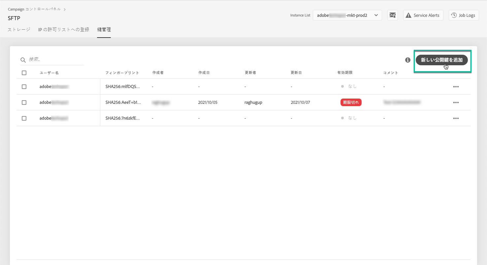
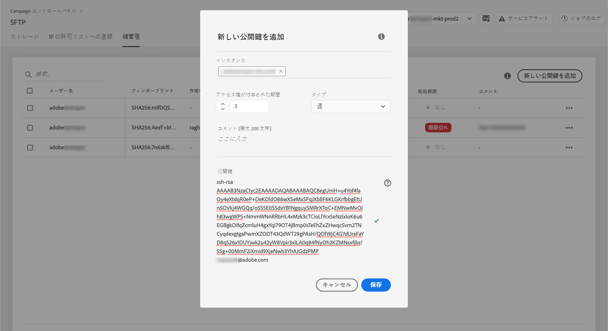

# 鍵の管理 {#key-management}

>[!CONTEXTUALHELP]
>id="cp_key_management"
>title="鍵の管理について"
>abstract="このタブで、公開鍵を管理できます。"
>additional-url="https://images-tv.adobe.com/mpcv3/8a977e03-d76c-44d3-853c-95d0b799c870_1560205338.1920x1080at3000_h264.mp4#t=166" text="デモビデオを見る"

アドビでは、すべての顧客が&#x200B;**公開鍵と秘密鍵のペア**&#x200B;を使用して SFTP サーバーへの接続を確立することを推奨します。

SFTP サーバーにアクセスするために SSH 公開鍵を生成して追加する手順および認証に関する推奨事項を以下に説明します。

サーバーへのアクセスを設定したら、忘れずにサーバーにアクセスする必要がある **** IP アドレスを許可リストに登録して、サーバーに接続できるようにしてください。詳しくは、[この節](../../instances-settings/using/ip-allow-listing-instance-access.md)を参照してください。

>[!NOTE]
>
>現在のところ、SSH 公開鍵を削除することはできません。

 [Campaign Classic](https://experienceleague.adobe.com/docs/campaign-classic-learn/control-panel/sftp-management/generate-ssh-key.html?lang=ja#sftp-management) または [Campaign Standard ](https://experienceleague.adobe.com/docs/campaign-standard-learn/control-panel/sftp-management/generate-ssh-key.html?lang=ja#sftp-management) を使用してこの機能をビデオで確認する

## ベストプラクティス{#best-practices}

**SSH 公開鍵について**

常に同じ認証を使用してサーバーに接続していることと、サポートされている形式の鍵を使用していることを確認してください。

**ユーザー名とパスワードによる API 統合**

ごくまれに、一部の SFTP サーバーでパスワードベースの認証が有効になっていることがあります。より効率的で安全な、鍵ベースの認証を使用することをお勧めします。カスタマーケアに問い合わせ、鍵ベースの認証への切り替えをリクエストしてください。

>[!IMPORTANT]
>
>パスワードの期限が切れると、システムに鍵がインストールされていても、SFTP アカウントにログインできなくなります。

## SSH 鍵のインストール{#installing-ssh-key}

>[!CONTEXTUALHELP]
>id="cp_sftp_publickey_add"
>title="新しい公開鍵の追加"
>abstract="インスタンスの新しい公開鍵を追加します。"

>[!IMPORTANT]
>
>以下に、SSH 鍵の作成手順の一例を示します。SSH 鍵に関しては組織のガイドラインに従ってください。以下の例は、実行方法のほんの一例です。要件をチームまたは内部ネットワークグループに伝える際の基準として役立ててください。

1. 「**[!UICONTROL 鍵管理]**」タブに移動し、「**[!UICONTROL 新しい公開鍵を追加]**」ボタンをクリックします。

   

1. 開いたダイアログボックスで、公開鍵を作成するユーザー名および鍵を有効にするサーバーを選択します。

   >[!NOTE]
   >
   >特定のユーザー名が特定のインスタンス上で有効であるかどうかの確認がおこなわれます。また、1 つまたは複数のインスタンス上で鍵を有効にするためのオプションが提供されます。
   >
   >各ユーザーには 1 つ以上の SSH 公開鍵を追加できます。

   

1. SSH 公開鍵をコピーして貼り付けます。公開鍵を生成するには、オペレーティングシステムに対応する以下の手順に従います。

   >[!NOTE]
   >
   >SSH 公開鍵のサイズは、**2048 ビット**&#x200B;である必要があります。

   **Linux および Mac の場合：**

   ターミナルを使用して公開鍵と秘密鍵のペアを生成します。
   1. コマンド `ssh-keygen -m pem -t rsa -b 2048 -C "your_email@example.com"` を入力します。
   1. プロンプトが表示されたら、鍵に名前を付けます。.ssh ディレクトリが存在しない場合は、システムによって作成されます。
   1. プロンプトが表示されたら、パスフレーズを入力し、もう一度入力します。空欄のままにすることもできます。
   1. 「name」および「name.pub」の鍵のペアがシステムによって作成されます。「name.pub」ファイルを検索して開きます。指定した電子メールアドレスで終わる英数字の文字列が含まれているはずです。

   **Windows の場合：**

   秘密鍵と公開鍵のペアを同じ「name.pub」形式で生成するのを支援するサードパーティツールをインストールする必要に迫られる場合があります。

1. .pub ファイルを開き、「ssh...」で始まる文字列全体をコントロールパネルにコピー＆ペーストします。

   

1. 「**[!UICONTROL 保存]**」ボタンをクリックして、鍵を作成します。コントロールパネルは、SHA256 形式で暗号化された公開鍵とそれに関連するフィンガープリントを保存します。

フィンガープリントを使用して、コンピューターに保存されている秘密鍵と、コントロールパネルに保存されている対応する公開鍵を照合できます。

「**...**」ボタンをクリックすると、既存の鍵を削除したり、関連するフィンガープリントをクリップボードにコピーできます。

