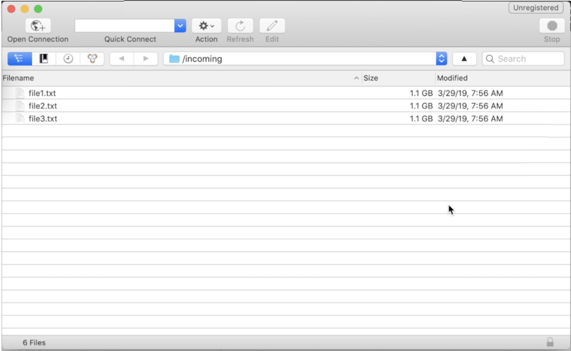

# SFTP サーバーへのログイン {#logging-into-sft-server}

以下の手順では、SFTP クライアントアプリケーションを使用した SFTP サーバーへの接続方法について説明します。

サーバーにログインする前に、以下のことを確認してください。

* Your SFTP server is **hosted by Adobe**.
* **ユーザー名**&#x200B;は、サーバー用に設定されています。You can check this information directly in the Control Panel, in the **Key management** tab from the SFTP Card.
* SFTP サーバーにログインするための&#x200B;**秘密鍵と公開鍵のペア**&#x200B;がある。Refer to [this section](../../sftp/using/key-management.md) for more on how to add the SSH key.
* SFTP サーバー上で&#x200B;**パブリック IP アドレスがホワイトリストに登録されている**。If not, refer to [this section](../../sftp/using/ip-range-whitelisting.md) for more on how to whitelist your IP range.
* You have an access to a **SFTP client software**. SFTPクライアントアプリケーションに関しては、IT部門にお問い合わせいただくか、会社のポリシーで許可されている場合はインターネット上で検索してください。

SFTPサーバーに接続するには、次の手順に従います。

1. Launch the Control Panel, then select the **[!UICONTROL Key Management]** tab from the **[!UICONTROL SFTP]** card.

   

1. SFTPクライアントアプリケーションを起動し、コントロールパネルからサーバーアドレスをコピー&amp;ペーストし、続けて「campaign.adobe.com」と入力し、ユーザー名を入力します。

   

1. 「**[!UICONTROL SSH 秘密鍵]」フィールドで、コンピューターに保存されている秘密鍵ファイルを選択します。**&#x200B;このファイルは、公開鍵と同じ名前（「.pub」拡張子を除く）を持つテキストファイルに対応します（例：「enable」）。

   

   「**[!UICONTROL パスワード]」フィールドには、ファイルの秘密鍵が自動的に入力されます。**

   

   使用しようとしているキーがコントロールパネルに保存されているかどうかは、秘密鍵または公開鍵の指紋と、SFTPカードの[キー管理]タブに表示されているキーの指紋とを比較することで確認できます。

   

   >[!NOTE]
   >
   >Macコンピューターを使用している場合は、次のコマンドを実行して、コンピューターに保存されている秘密キーの指紋を表示できます。
   >
   >`ssh-keygen -lf <path of the privatekey>`

1. すべての情報を入力したら、「**[!UICONTROL 接続]」をクリックして、SFTP サーバーにログインします。**

   
