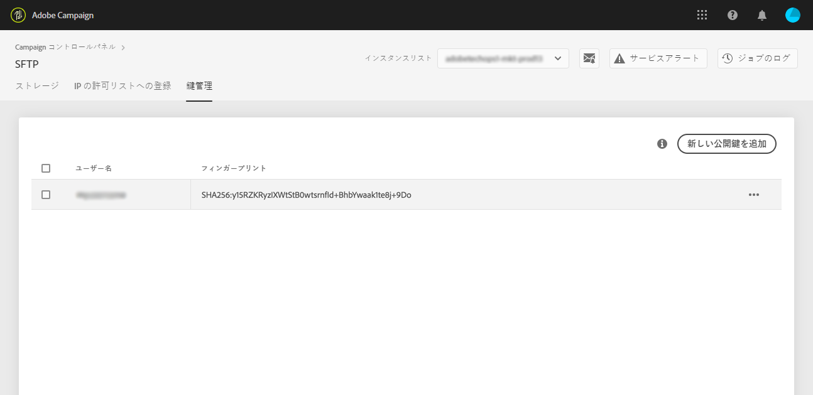
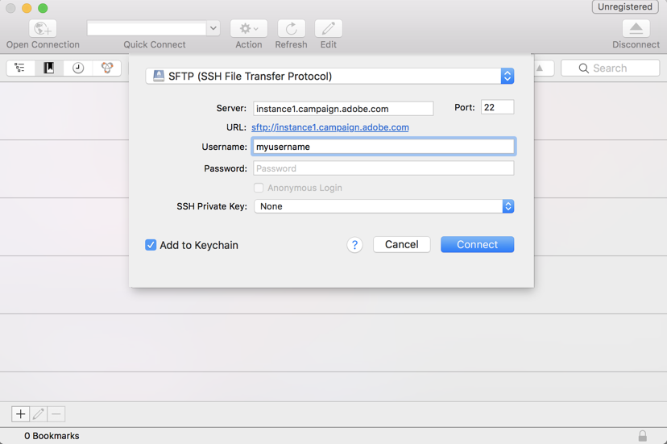

# SFTP サーバーへのログイン {#logging-into-sft-server}

以下の手順では、SFTP クライアントアプリケーションから SFTP サーバーに接続する方法について説明します。

[ ビデオでこの機能を確認する](https://video.tv.adobe.com/v/35057?quality=12&captions=jpn)

サーバーにログインする前に、以下のことを確認してください。

* SFTP サーバーが&#x200B;**アドビによってホストされている**。
* **ユーザー名**&#x200B;は、サーバー用に設定されている。この情報は、SFTP カードの「**鍵管理**」タブのコントロールパネルで、直接確認できます。
* SFTP サーバーにログインするための&#x200B;**秘密鍵と公開鍵のペア**&#x200B;がある。SSH 鍵の追加方法について詳しくは、[この節](../../sftp/using/key-management.md)を参照してください。
* SFTP サーバー上の&#x200B;**許可リストにパブリック IP アドレスが追加されている**。追加されていない場合は、IP 範囲を許可リストに追加する方法の詳細について[この節](../../sftp/using/ip-range-allow-listing.md)を参照してください。
* **SFTP クライアントソフトウェア**&#x200B;へのアクセス権がある。使用が推奨される SFTP クライアントアプリケーションについて IT 部門に相談したり、会社のポリシーによって許可されている場合はインターネットで検索したりできます。

SFTP サーバーに接続するには、次の手順に従います。

1. コントロールパネルを起動して、**[!UICONTROL SFTP]** カードから「**[!UICONTROL 鍵管理]**」タブを選択します。

   

1. SFTP クライアントアプリケーションを起動し、コントロールパネルからサーバーのアドレス（末尾に「campaign.adobe.com」があるアドレス）をコピー＆ペーストして、ユーザー名を入力します。

   

1. 「**[!UICONTROL SSH 秘密鍵]**」フィールドで、コンピューターに保存されている秘密鍵ファイルを選択します。これは、公開鍵と同じ名前（「.pub」拡張子を除く）を持つテキストファイルです（例：「enable」）。

   

   「**[!UICONTROL パスワード]**」フィールドには、ファイルの秘密鍵が自動的に入力されます。

   

   秘密鍵または公開鍵のフィンガープリントを SFTP カードの「鍵管理」タブに表示される鍵のフィンガープリントと比較することで、使用しようとしている鍵がコントロールパネルに保存されていることを確認できます。

   

   >[!NOTE]
   >
   >Mac コンピューターを使用している場合は次のコマンドを実行することで、コンピューターに保存されている秘密鍵のフィンガープリントを表示できます。
   >
   >`ssh-keygen -lf <path of the privatekey>`

1. すべての情報を入力したら、「**[!UICONTROL 接続]**」をクリックして、SFTP サーバーにログインします。

   
