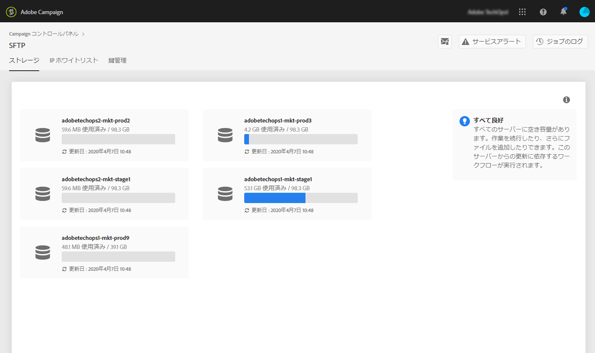

# SFTP ストレージ管理{#sftp-storage-management}

>[!CONTEXTUALHELP]
>id="cp_storage"
>title="ストレージ容量について"
>abstract="このタブでは、SFTP サーバーのストレージ容量および使用状況情報を表示できます.アクセス権のある SFTP サーバーのみがここに表示されます。他の SFTP サーバーへのアクセス権をリクエストするには、管理者にお問い合わせください。"
>additional-url="https://images-tv.adobe.com/mpcv3/8a977e03-d76c-44d3-853c-95d0b799c870_1560205338.1920x1080at3000_h264.mp4" text="デモビデオを見る"

契約条項によっては、異なるストレージ容量を SFTP サーバーでプロビジョニングしている可能性があります。

各 SFTP サーバーの使用可能容量を定期的に監視することが重要です。そうしないと、サーバーに追加のファイルを保存できなくなったり、このサーバーからの更新に依存するワークフローを正常に実行できなくなったりする可能性があります。

**関連トピック：**

* [Campaign Standard チュートリアルビデオ](https://docs.adobe.com/content/help/en/campaign-standard-learn/tutorials/administrating/control-panel/monitoring-server-capacity-allow-listing-adding-ssh-key.html)
* [Campaign Classic チュートリアルビデオ](https://docs.adobe.com/content/help/en/campaign-learn/campaign-classic-tutorials/administrating/control-panel-acc/monitoring-server-capacity-allow-listing-adding-ssh-key.html)

## ストレージ容量情報へのアクセス{#accessing-storage-capacity-information}

アクセス権のあるすべてのインスタンスで使用される容量に関する情報は、SFTP カードの「**[!UICONTROL ストレージ]**」タブにあります。ページが更新されるたびに、このタブも更新されます。

各インスタンスについて、視覚的なアラートにより、ストレージがいつ容量を超えるかを把握できます。

* **オレンジ**：インスタンスが容量の 80％を超えています。
* **赤**：インスタンスが容量の 90％を超えています。

ストレージが容量に近づいた場合の処理方法を知るのに役立つヒントもあります。

## ストレージ容量がなくなった場合のベストプラクティス{#best-practices-when-capacity-runs-out}

1. **古いファイルや不要なファイルを削除して SFTP サーバーをクリーンアップする。** SFTP サーバーフォルダーへのアクセス方法については、[この節](../../sftp/using/logging-into-sftp-server.md)を参照してください。
1. SFTP サーバーをクリーンアップする&#x200B;**ワークフロー**&#x200B;が正常に実行されていることを確認する。Adobe Campaign のテクニカルワークフローについて詳しくは、[Campaign Classic](https://docs.campaign.adobe.com/doc/AC/en/WKF__General_operation_Building_a_workflow.html#Technical_workflows) および [Campaign Standard](https://helpx.adobe.com/jp/campaign/standard/administration/using/technical-workflows.html) 用の各ドキュメントを参照してください。
1. アカウントチームに問い合わせて、**追加ストレージをリクエスト**&#x200B;する（追加料金が発生する場合があります）。
1. 問題があると思われる場合は、**カスタマーケア**&#x200B;にお問い合わせください。
