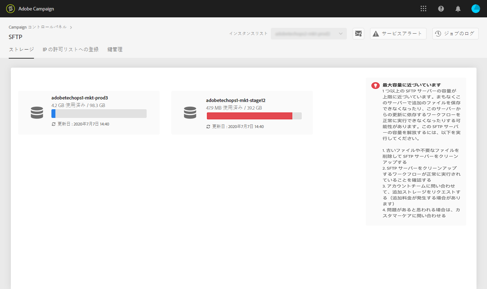

# SFTP ストレージの管理 {#sftp-storage-management}

>[!CONTEXTUALHELP]
>id="cp_storage"
>title="ストレージ容量について"
>abstract="このタブでは、SFTP サーバーのストレージ容量および使用状況情報を表示できます。また、SFTP サーバー上で最も容量を消費している上位 10 個のファイルの名前をクリックして、そのファイルのリストを表示できます。 アクセス権のある SFTP サーバーのみがここに表示されます。他の SFTP サーバーへのアクセス権をリクエストするには、管理者にお問い合わせください。"
>additional-url="https://images-tv.adobe.com/mpcv3/8a977e03-d76c-44d3-853c-95d0b799c870_1560205338.1920x1080at3000_h264.mp4" text="デモビデオを見る"

契約条項によっては、異なるストレージ容量を SFTP サーバーでプロビジョニングしている可能性があります。

各 SFTP サーバーの使用可能容量を定期的に監視することが重要です。そうしないと、サーバーに追加のファイルを保存できなくなったり、このサーバーからの更新に依存するワークフローを正常に実行できなくなったりする可能性があります。

[Campaign v7／v8](https://experienceleague.adobe.com/docs/campaign-classic-learn/control-panel/sftp-management/monitoring-server-capacity.html?lang=ja#sftp-management) または [Campaign Standard](https://experienceleague.adobe.com/docs/campaign-standard-learn/control-panel/sftp-management/monitoring-server-capacity.html?lang=ja#sftp-management) を使用して、ビデオでこの機能を確認

## ストレージ容量に関する情報へのアクセス {#accessing-storage-capacity-information}

アクセス権のあるすべてのインスタンスで使用される容量に関する情報は、SFTP カードの「**[!UICONTROL ストレージ]**」タブにあります。ページが更新されるたびに、このタブも更新されます。

各インスタンスについて、視覚的なアラートにより、ストレージがいつ容量を超えるかを把握できます。

* **オレンジ**：インスタンスが容量の 80％を超えています。
* **赤**：インスタンスが容量の 90％を超えています。

また、SFTP サーバー上で最も容量を消費している上位 10 個のファイルを、その名前をクリックすることで識別できます。

ストレージが容量上限に近づいた場合の処理方法に関する役立つヒントも表示されます。

## ストレージ容量がなくなった場合のベストプラクティス {#best-practices-when-capacity-runs-out}

1. **古いファイルや不要なファイルを削除して SFTP サーバーをクリーンアップする。** SFTP サーバーフォルダーへのアクセス方法については、[この節](../../sftp/using/logging-into-sftp-server.md)を参照してください。
1. SFTP サーバーをクリーンアップする&#x200B;**ワークフロー**&#x200B;が正常に実行されていることを確認する。Adobe Campaign のテクニカルワークフローについて詳しくは、[Campaign v7／v8](https://experienceleague.adobe.com/docs/campaign-classic/using/automating-with-workflows/advanced-management/about-technical-workflows.html?lang=ja) および [Campaign Standard](https://experienceleague.adobe.com/docs/campaign-standard/using/administrating/application-settings/technical-workflows.html?lang=ja) 用の各ドキュメントを参照してください。
1. アカウントチームに問い合わせて、**追加ストレージをリクエスト**&#x200B;する（追加料金が発生する場合があります）。
1. 問題があると思われる場合は、**カスタマーケア**&#x200B;にお問い合わせください。
