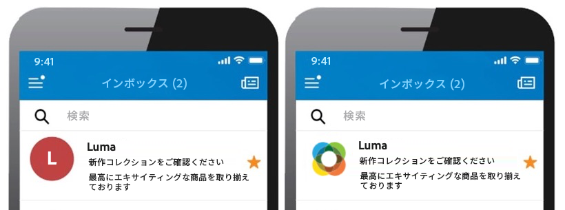

# BIMI レコードを追加 {#dmarc}

## BIMI レコードについて {#about}

メッセージ識別（BIMI）のブランドインジケーターは、メールボックスプロバイダーの受信ボックスにある送信者のメールの横に承認済みのロゴを表示して、ブランドの認知度と信頼性を高める業界標準です。DMARC 認証を通じて送信者の身元を確認することで、メールのスプーフィングやフィッシングを防ぐのに役立ち、悪意のある攻撃者がメールの正当なブランドとして偽装するのがより難しくなります。

BIMI の実装について詳しくは、[アドビの配信品質のベストプラクティスガイド](https://experienceleague.adobe.com/docs/deliverability-learn/deliverability-best-practice-guide/additional-resources/technotes/implement-bimi.html?lang=ja)を参照してください。

{width="70%" align="center"}

## 制限事項と前提条件 {#limitations}

* SPF、DKIM および DMARC レコードは、BIMI レコードを作成するための前提条件です。
* BIMI レコードは、完全なサブドメインデリゲーションを使用してサブドメインに対してのみ追加できます。[サブドメイン設定メソッドの詳細を学ぶ](subdomains-branding.md#subdomain-delegation-methods)
* DMARC レコードの前提条件：

   * サブドメインのレコードポリシータイプは、「強制隔離」または「却下」に設定する必要があります。DMARC ポリシータイプが「なし」に設定されている BIMI レコードの作成は利用できません。
   * DMARC ポリシーが適用されるメールの割合は 100%である必要があります。BIMI は、この割合が 100％未満に設定された DMARC ポリシーをサポートしていません。

[DMARC レコードの設定方法を説明します](dmarc.md)

## サブドメインに BIMI レコードを追加する {#add}

サブドメインに BIMI レコードを追加するには、次の手順に従います。

1. サブドメインリストで、目的のサブドメインの横にある省略記号ボタンをクリックし、**[!UICONTROL サブドメインの詳細]**&#x200B;を選択します。

1. 「**[!UICONTROL TXT レコードを追加]**」ボタンをクリックし、**[!UICONTROL レコードタイプ]**&#x200B;ドロップダウンリストから「**[!UICONTROL BIMI]**」を選択できます。

   

1. **[!UICONTROL 会社のロゴ URL]** 内で、ロゴを含む SVG ファイルの URL を指定します。

1. **[!UICONTROL 証明書 URL]** はオプションですが、メールボックス市場の 80%をカバーする Gmail や Apple など、一部のメールボックスプロバイダーには必要です。したがって、BIMI を本当に活用するために、検証済みマーク証明書（VMC）を取得することをお勧めします。

   +++VMC を入手するにはどうすればよいですか？

   VMC を取得する主な手順は次のとおりです。

   1. VMC の発行者が認識する知的財産権局に商標としてブランドロゴを登録します。法務チームがいる場合は、ロゴの商標を取得するため、または既に商標が存在することを確認するために、法務チームと協力することをお勧めします。

   1. ロゴが商標であることを確認したら、DigiCert または Entrust 認証局（CA）に連絡して、VMC をリクエストしてください。

   1. VMC が承認されると、エンティティ証明書のプライバシー拡張メール（PEM）ファイルが届きます。CA から取得した他の中間証明書をこの PEM ファイルに追加します。PEM ファイル（追加ファイルと共に）をパブリック web サーバーにアップロードし、PEM ファイルの URL をメモします。BIMI TXT レコードに URL を使用します。

   1. 特定のサブドメインのサブドメインの詳細ページに BIMI レコードが表示されたら、使用可能な BIMI インスペクタを使用できます。[ここ](https://bimigroup.org/bimi-generator/)をクリックして、BIMI レコードが正しく機能しているかどうかを確認します。

   BIMI の実装に関する詳細は、[BIMI 標準ドキュメント](https://bimigroup.org/implementation-guide/)を参照してください。
+++

1. 「**[!UICONTROL 追加]**」をクリックして、BIMI レコードの作成を確認します。

BIMI レコードの作成が処理されると（約 5 分）、サブドメインの詳細画面に表示されます。[サブドメインの TXT レコードの監視方法を学ぶ](gs-txt-records.md#monitor)
