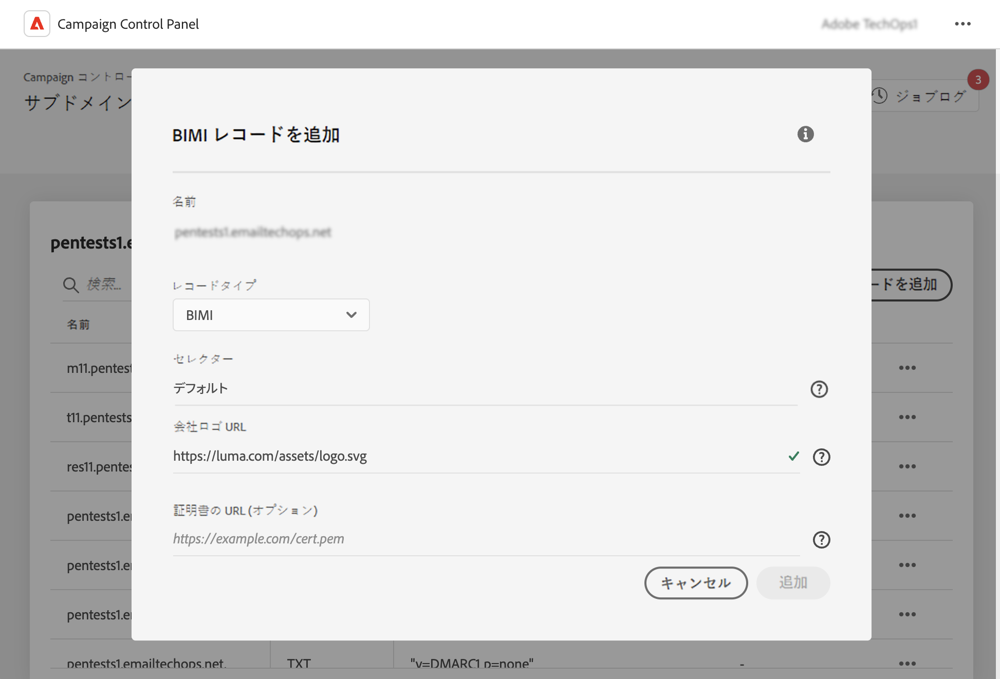

# BIMI レコードを追加 {#dmarc}

## BIMI レコードについて {#about}

メッセージ識別 (BIMI) のブランドインジケーターは、送信者の E メールの横に承認済みのロゴをメールボックスプロバイダーの受信ボックスに表示して、ブランドの認知度と信頼性を高める業界標準です。 DMARC 認証を通じて送信者の身元を確認することで、E メールのスプーフィングやフィッシングを防ぐのに役立ち、悪意のある関係者が E メールの正当なブランドとして偽装するのがより難しくなります。 BIMI の実装について詳しくは、 [Adobe配信品質のベストプラクティスガイド](https://experienceleague.adobe.com/docs/deliverability-learn/deliverability-best-practice-guide/additional-resources/technotes/implement-bimi.html)

{width="70%" align="center"}

## 制限事項と前提条件 {#limitations}

* SPF、DKIM、DMARC レコードは、BIMI レコードを作成するための前提条件です。
* BIMI レコードは、完全なサブドメインデリゲーションを使用してサブドメインに対してのみ追加できます。 [サブドメイン設定メソッドの詳細を説明します](subdomains-branding.md#subdomain-delegation-methods)
* DMARC レコードの前提条件：

   * サブドメインのレコードポリシータイプは、「強制隔離」または「却下」に設定する必要があります。 DMARC ポリシーの種類が「なし」に設定されている BIMI レコードの作成は利用できません。
   * DMARC ポリシーが適用される電子メールの割合は 100%である必要があります。 BIMI は、この割合が 100%未満に設定された DMARC ポリシーをサポートしていません。

[DMARC レコードの設定方法を説明します](dmarc.md)

## サブドメインに BIMI レコードを追加する {#add}

サブドメインに BIMI レコードを追加するには、次の手順に従います。

1. サブドメインリストで、目的のサブドメインの横にある省略記号ボタンをクリックし、「 」を選択します。 **[!UICONTROL サブドメインの詳細]**.

1. 次をクリック： **[!UICONTROL TXT レコードを追加]** 」ボタンをクリックし、「 **[!UICONTROL BIMI]** から **[!UICONTROL レコードタイプ]** 」ドロップダウンリストから選択できます。

   

1. Adobe Analytics の **[!UICONTROL 会社のロゴ URL]**」で、ロゴを含むSVGファイルの URL を指定します。

1. The **[!UICONTROL 証明書 URL]** フィールドはオプションです。 検証済みマーク証明書 (VMC) の URL を追加して、スパム送信者や他の悪意のあるユーザーが所有していないブランドロゴを使用するのを防ぐために、組織がロゴの法的所有者であることを証明できます。

   +++VMC を入手するにはどうすればよいですか？

   VMC を取得する主な手順は次のとおりです。

   1. VMC の発行者が認識する知的財産権局に商標としてブランドロゴを登録します。 法務チームがいる場合は、ロゴの商標を取得するか、既に商標が存在することを確認するために協力することをお勧めします。

   1. ロゴが商標であることを確認したら、DigiCert または Entrust 認証局 (CA) に連絡して、VMC をリクエストしてください。

   1. VMC が承認されると、エンティティ証明書のプライバシー拡張メール (PEM) ファイルが届きます。 CA から取得した他の中間証明書をこの PEM ファイルに追加します。 PEM ファイル（追加ファイルと共に）をパブリック Web サーバーにアップロードし、PEM ファイルの URL をメモします。 BIMI TXT レコードに URL を使用します。

   BIMI の実装に関する詳細は、 [BIMI 標準ドキュメント](https://bimigroup.org/implementation-guide/)
+++

1. クリック **[!UICONTROL 追加]** :BIMI レコードの作成を確認します。

BIMI レコードの作成が処理されると（約 5 分）、サブドメインの詳細画面に表示されます。 [サブドメインの TXT レコードの監視方法の詳細](gs-txt-records.md#monitor)
