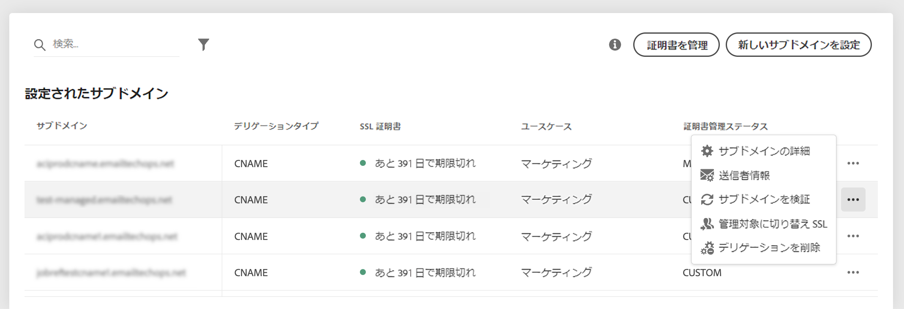
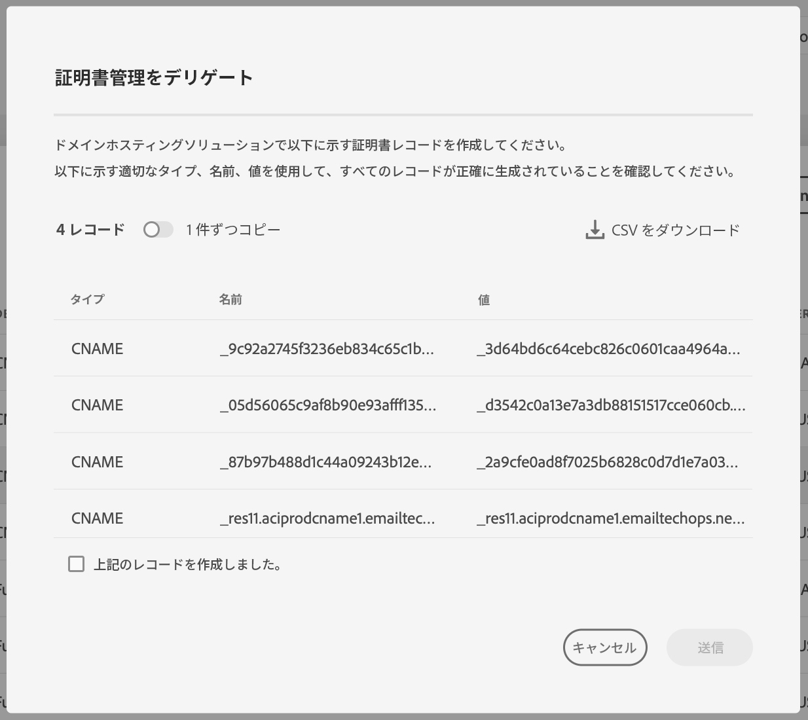

# アドビへのサブドメインの SSL 証明書のデリゲート {#delegate-ssl-certificates}

>[!CONTEXTUALHELP]
>id="cp_managed_ssl"
>title="アドビへのサブドメインの SSL 証明書のデリゲート"
>abstract="コントロールパネルでは、サブドメインの SSL 証明書をアドビで管理できます。CNAME を使用してサブドメインを設定している場合、ドメインホスティングソリューションに証明書を生成するために、証明書レコードが自動的に生成および提供されます。"

アドビで証明書を自動的に作成し、証明書の有効期限が切れる前に毎年更新するので、アドビへのサブドメインの SSL 証明書の管理のデリゲートを強くお勧めします。

CNAME を使用してサブドメインデリゲーションを設定している場合、アドビでは、証明書を生成するためにドメインホスティングソリューションに使用する証明書レコードを提供します。

アドビへの SSL 証明書のデリゲーションは、新しいサブドメインを設定する際や、既にデリゲートされたサブドメインに対して実行できます。

>[!NOTE]
>
>アドビ管理の SSL は、ユーザーが無料で使用できる機能です。アドビへのサブドメインの証明書のデリゲートは透過的であり、キャンペーンや配信品質に影響はありません。[詳しくは、SSL 証明書の管理を参照してください](monitoring-ssl-certificates.md#management)

## 新しいサブドメインの SSL 証明書のデリゲート {#new}

新しいサブドメインを設定する際に SSL 証明書をデリゲートするには、サブドメイン設定ウィザードの「**[!UICONTROL サブドメインのアドビ管理の SSL を選択]**」オプションを有効にします。ホスティングソリューションにコピーする証明書レコードは、後の設定ウィザードで提供されます。詳細な手順については、[この節](setting-up-new-subdomain.md)を参照してください。

{width="70%" align="left"}

## 既にデリゲートされたサブドメインに対する SSL 証明書のデリゲート {#delegated}

既にデリゲートされたサブドメインに対して SSL 証明書をデリゲートするには、目的のサブドメインの横にある省略記号ボタンをクリックし、「**[!UICONTROL 管理 SSL に切り替え]**」をクリックします。

{width="70%" align="left"}

アドビで自動生成された証明書レコードがダイアログボックスに表示されます。これらのレコードを 1 つずつコピーするか、CSV ファイルをダウンロードしてから、ドメインホスティングソリューションに移動して、一致する証明書を生成します。

すべての証明書レコードがドメインホスティングソリューションに生成されていることを確認します。すべてが正しく設定されている場合は、レコードの作成を確認し、「**[!UICONTROL 送信]**」をクリックします。

{width="70%" align="left"}
