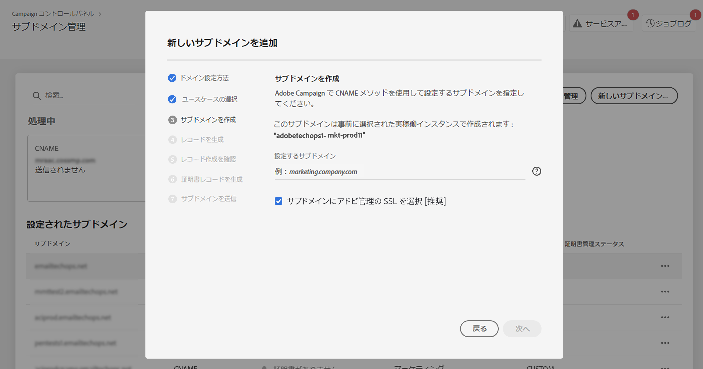

# アドビへのサブドメインの SSL 証明書のデリゲート {#delegate-ssl-certificates}

>[!CONTEXTUALHELP]
>id="cp_managed_ssl"
>title="アドビへのサブドメインの SSL 証明書のデリゲート"
>abstract="コントロールパネルでは、サブドメインの SSL 証明書をアドビで管理できます。CNAME を使用してサブドメインを設定している場合、ドメインホスティングソリューションに証明書を生成するために、証明書レコードが自動的に生成および提供されます。"

アドビで証明書を自動的に作成し、証明書の有効期限が切れる前に毎年更新するので、アドビへのサブドメインの SSL 証明書の管理のデリゲートを強くお勧めします。

CNAME を使用してサブドメインデリゲーションを設定している場合、アドビでは、証明書を生成するためにドメインホスティングソリューションに使用する証明書レコードを提供します。

アドビへの SSL 証明書のデリゲーションは、新しいサブドメインを設定する際や、既にデリゲートされたサブドメインに対して実行できます。

>[!NOTE]
>
>アドビ管理の SSL は、ユーザーが無料で使用できる機能です。アドビへのサブドメインの証明書のデリゲートは透過的であり、キャンペーンや配信品質に影響はありません。[詳しくは、SSL 証明書の管理を参照してください](monitoring-ssl-certificates.md#management)

## 新しいサブドメインの SSL 証明書のデリゲート {#new}

新しいサブドメインを設定する際に SSL 証明書をデリゲートするには、サブドメイン設定ウィザードの「**[!UICONTROL サブドメインのアドビ管理の SSL を選択]**」オプションを有効にします。証明書生成プロセスは、サブドメインのデリゲーション方法によって異なります。

* **完全なサブドメインデリゲーション**:SSL 証明書は、Adobeから自動的にリクエストされ、インストールされます。ユーザーからの操作は必要ありません。 サブドメイン設定を送信すると、証明書のインストールリクエストは、サブドメイン設定ワークフローの一部として直ちに処理されます。 [&#x200B; 完全なサブドメインデリゲーションの詳細情報 &#x200B;](setting-up-new-subdomain.md#full-subdomain-delegation)

* **CNAME デリゲーション**：ホスティングソリューションにコピーする証明書レコードは、後の設定ウィザードで提供されます。 サブドメイン設定を送信する前に、ドメインホストソリューションでこれらの証明書レコードを生成する必要があります。 [CNAME 委任の詳細情報 &#x200B;](setting-up-new-subdomain.md#use-cnames)

{width="70%" align="left"}

## 既にデリゲートされたサブドメインに対する SSL 証明書のデリゲート {#delegated}

既にデリゲートされたサブドメインに対して SSL 証明書をデリゲートするには、目的のサブドメインの横にある省略記号ボタンをクリックし、「**[!UICONTROL 管理 SSL に切り替え]**」をクリックします。

{width="70%" align="left"}

証明書の生成プロセスは、サブドメインが最初にどのように設定されたかによって異なります。

### 完全にデリゲートされたサブドメイン

（Adobeのネームサーバーを使用して）完全なサブドメインデリゲーションを使用して設定されたサブドメインの場合、SSL 証明書が自動的に要求され、Adobeによってインストールされます。 「**[!UICONTROL 管理 SSL に切り替え]**」をクリックして確認すると、証明書のインストールリクエストが直ちに送信されるので、追加のアクションは必要ありません。

### CNAME のデリゲートされたサブドメイン

CNAME デリゲーションを使用して設定されたサブドメインの場合は、Adobeによって自動生成された証明書レコードがダイアログボックスに表示されます。 これらのレコードを 1 つずつコピーするか、CSV ファイルをダウンロードしてから、ドメインホスティングソリューションに移動して、一致する証明書を生成します。

すべての証明書レコードがドメインホスティングソリューションに生成されていることを確認します。すべてが正しく設定されている場合は、レコードの作成を確認し、「**[!UICONTROL 送信]**」をクリックします。

{width="70%" align="left"}
