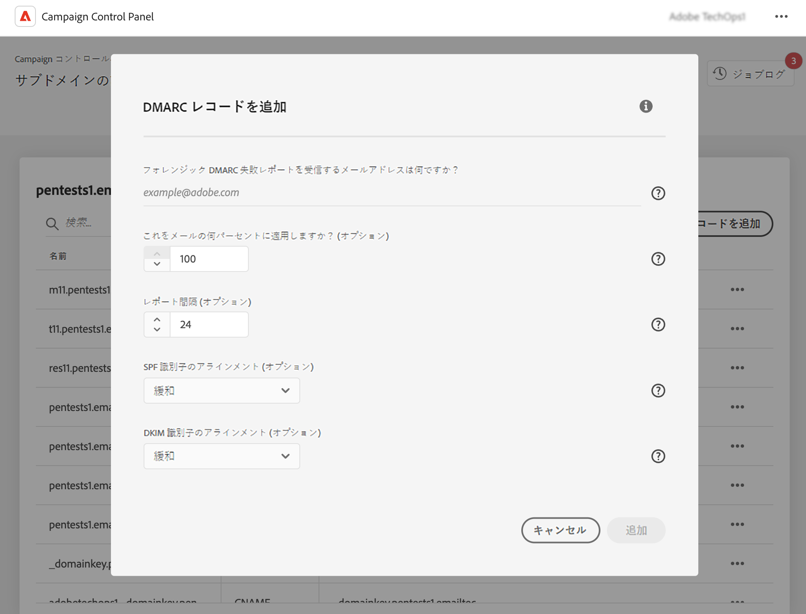

# DMARC レコードの追加 {#dmarc}

## DMARC レコードについて {#about}

DMARC（Domain-based Message Authentication, Reporting and Conformance）は、組織がメールドメインをフィッシング攻撃やスプーフィング攻撃から保護するのに役立つ、メール認証プロトコル標準です。SPF および DKIM チェックに失敗したメールをメールボックスプロバイダーがどのように処理するかを決定でき、送信者のドメインを認証し、悪意のある目的でドメインが不正に使用されるのを防ぐ方法を提供できます。

DMARC の実装に関する詳細は、 [アドビの配信品質のベストプラクティスガイド](https://experienceleague.adobe.com/docs/deliverability-learn/deliverability-best-practice-guide/additional-resources/technotes/implement-dmarc.html?lang=ja)を参照してください。

## 制限事項と前提条件 {#limitations}

* SPF および DKIM レコードは、DMARC レコードを作成するための前提条件です.
* DMARC レコードは、完全なサブドメインデリゲーションを使用してサブドメインに対してのみ追加できます。[サブドメイン設定メソッドの詳細を学ぶ](subdomains-branding.md#subdomain-delegation-methods)
* サブドメインに DMARC と BIMI の両方のレコードが存在する場合：
   * DMARC レコードは削除できません。 DMARC レコードを削除する場合は、まず BIMI レコードを削除します。
   * DMARC レコードは編集できますが、DMARC ポリシーを「なし」にダウングレードすることはできません。また、割合 (%) を「100」に設定する必要があります。

## サブドメインの DMARC レコードを追加 {#add}

サブドメインに DMARC レコードを追加するには、次の手順に従います。

1. サブドメインリストで、目的のサブドメインの横にある省略記号ボタンをクリックし、**[!UICONTROL サブドメインの詳細]**&#x200B;を選択します。

1. **[!UICONTROL TXT レコードを追加]**&#x200B;ボタンをクリックし、**[!UICONTROL レコードタイプ]**&#x200B;ドロップダウンリストから&#x200B;**[!UICONTROL DMARC]**&#x200B;を選択します。

   

1. 電子メールの 1 つに失敗した場合に受信者サーバーが従う&#x200B;**[!UICONTROL ポリシータイプ]**&#x200B;を選択します。使用可能なポリシーの種類は次のとおりです。

   * **[!UICONTROL なし]**,
   * **[!UICONTROL 強制隔離]**（スパムフォルダーの配置）、
   * **[!UICONTROL 拒否]**（メールをブロック）。

   ベストプラクティスとして、DMARC の潜在的な影響を DMARC が把握できるように、DMARC ポリシーを p=none から p=quarantine にエスカレートし、p=reject にエスカレートすることで、DMARC の実装を徐々に展開することをお勧めします。

   * **手順 1：** 受け取り、使用したフィードバックを分析します（p=none）。これは、認証に失敗したメッセージに対して何のアクションも実行せず、送信者にメールレポートを送信するよう受信者に指示します。また、正当なメッセージが認証に失敗する場合は、SPF／DKIM の問題を確認および修正します。

   * **手順 2：** SPF と DKIM が連携し、すべての正当なメールの認証を渡しているかどうかを確認し、ポリシーを （p=quarantine）に移動します。これは、受信側のメールサーバーに、認証に失敗した メールを強制隔離するよう指示します（通常は、スパムフォルダーにメッセージを配置します）。ポリシーが強制隔離に設定されている場合は、メールのごく一部から開始することを推奨します。

   * **手順 3：** ポリシーを（p=reject）に調整します。注意：このポリシーは慎重に使用し、お客様の組織に適しているかどうかを判断してください。p= reject ポリシーは、認証に失敗したドメインのメールを完全に拒否（バウンス）するよう受信者に指示します。このポリシーを有効にすると、ドメインで 100％認証された電子メールのみがインボックスにも配置される可能性があります。

   >[!NOTE]
   >
   > DMARC レコードポリシーの種類が「なし」に設定されている場合、BIMI レコードの作成は利用できません。

1. DMARC レポートを受信するメールアドレスを入力します。複数の電子メールアドレスを追加する場合は、コンマで区切ります。 メールの 1 つが失敗した場合、DMARC レポートは選択したメールアドレスに自動送信されます。

   * 集計 DMARC レポートは、例えば、特定の期間に失敗した電子メールの数など、高レベルの情報を提供します。
   * フォレンジック DMARC の失敗レポートには、例えば、失敗したメールの送信元 IP アドレスなどの詳細情報が表示されます。

1. DMARC ポリシーが「なし」に設定されている場合は、100％のメールに適用される割合を入力します。

   ポリシーが「拒否」または「強制隔離」に設定されている場合は、メールのごく一部から開始することをお勧めします。ドメインからのメールが受信サーバーで認証を渡すのが増えるので、より高い割合でレコードを徐々に更新してください。

   >[!NOTE]
   >
   >ドメインで BIMI を使用している場合、DMARC ポリシーの割合は 100％にする必要があります。BIMI は、この値が 100％未満に設定された DMARC ポリシーをサポートしていません。

   

1. DMARC レポートは 24 時間ごとに送信されます。レポートの送信頻度は、**[!UICONTROL レポート間隔]**&#x200B;フィールドで変更できます。許可された最小間隔は 1 時間で、許可された最大値は 2190 時間（3 か月）です。

1. **SPF** および **[!UICONTROL DKIM 識別子の整列]** フィールドで、メールの SPF および DKIM 認証を確認する際の受信者サーバーの厳格度を指定します。

   * **[!UICONTROL 緩和]**&#x200B;モード：メールがサブドメインから送信された場合でもサーバーが認証を受け入れます
   * **[!UICONTROL 厳密]**&#x200B;モードは、送信者ドメインが SPF および DKIM ドメインと完全に一致する場合にのみ認証を受け入れます

   例えば、`http://www.luma.com` ドメインの場合、「緩和」モードで、`marketing.luma.com` サブドメインはサーバーによって許可されますが、「厳密」モードでは拒否されます。

1. 「**[!UICONTROL 追加]**」をクリックして、DMARC レコードの作成を確定します。

DMARC レコードの作成が処理され（約 5 分）、サブドメインの詳細画面に表示されます。[サブドメインの TXT レコードの監視方法の詳細](gs-txt-records.md#monitor)
