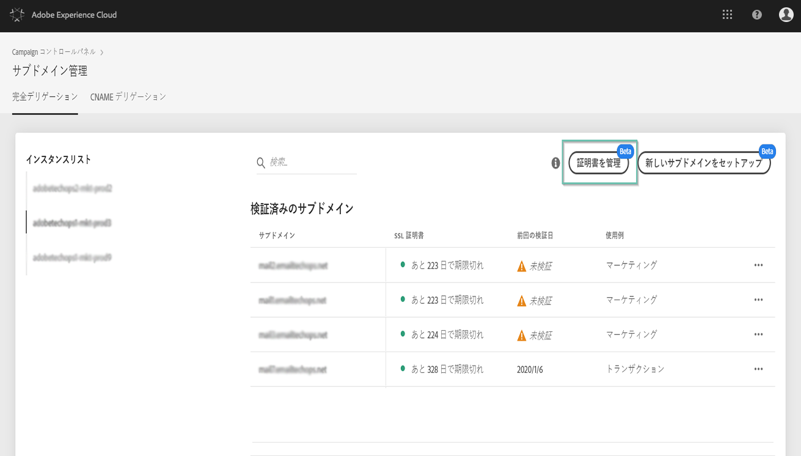
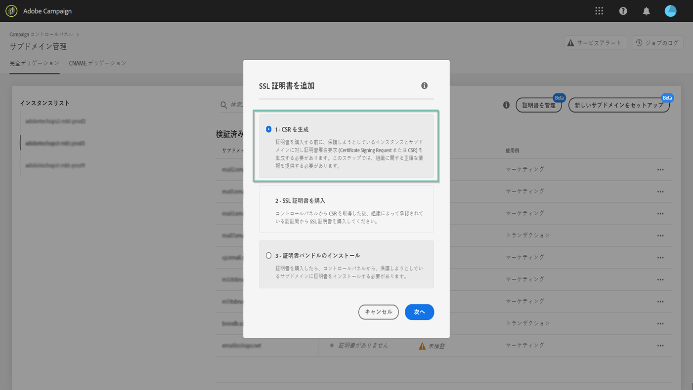
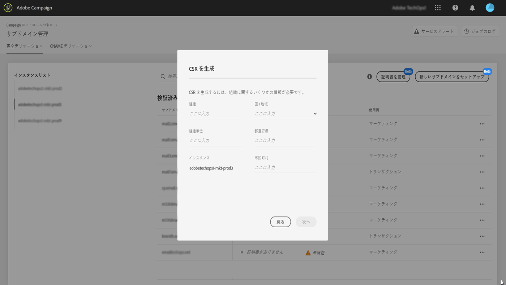
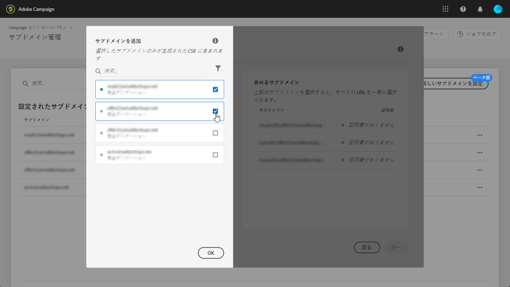
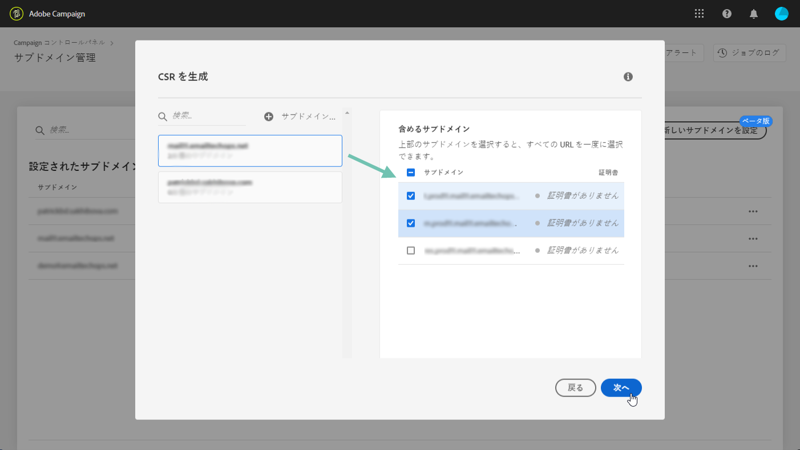
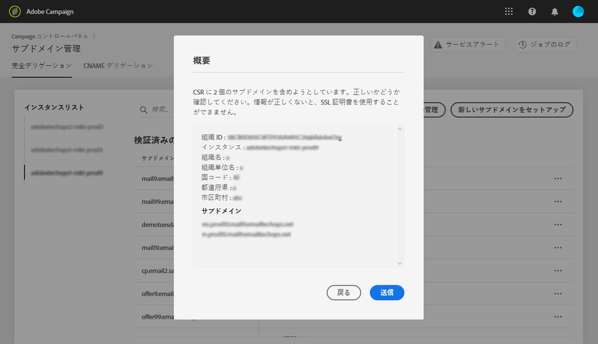
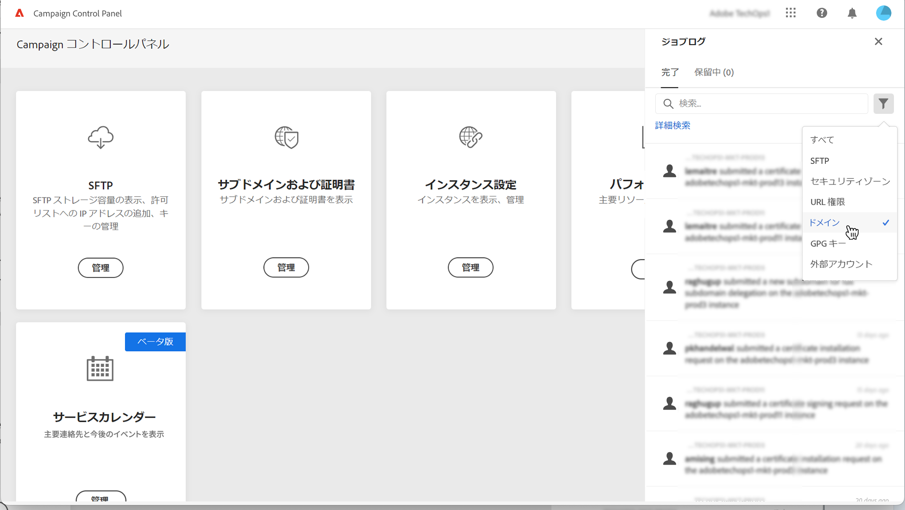
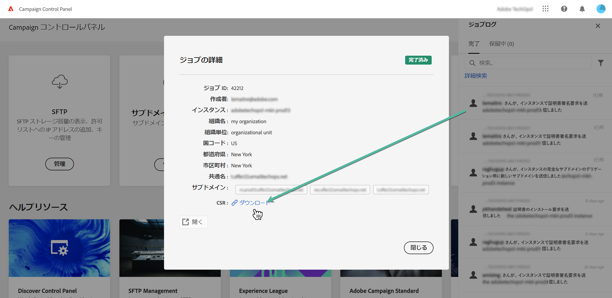

# CSR の生成 {#generating-csr}

>[!CONTEXTUALHELP]
>id="cp_generate_csr"
>title="CSR の生成"
>abstract="証明書署名要求は、証明書を購入する前に、保護する予定のインスタンスおよびサブドメイン用に生成する必要があります。"

>[!CONTEXTUALHELP]
>id="cp_select_subdomains"
>title="CSR のサブドメインの選択"
>abstract="証明書署名要求に、すべてのサブドメインまたは特定のサブドメインのみを含めるよう選択できます。選択したサブドメインのみが、購入した SSL 証明書を通じて認証されます。"
>additional-url="https://experienceleague.adobe.com/docs/control-panel/using/subdomains-and-certificates/subdomains-branding.html?lang=ja" text="サブドメインのブランディングについて"

## CSR の生成 {#generate}

証明書署名要求（CSR）を生成するには、次の手順に従います。

1. 「**[!UICONTROL サブドメインおよび証明書]**」カードで、目的のインスタンスを選択してから、「**[!UICONTROL 証明書を管理]**」ボタンをクリックします。

   

1. 「**[!UICONTROL 1 - CSR を生成]**」を選択してから、「**[!UICONTROL 次へ]**」をクリックし、CSR 生成プロセスの手順を示すウィザードを起動します。

   

1. CSR を生成するために必要なすべての詳細と共に、フォームが表示されます。

   証明書を確実に更新するため、要求された情報を必ずすべて正確に入力して（必要に応じて、社内チーム、セキュリティおよび IT チームに確認）、「**[!UICONTROL 次へ]**」をクリックします。

   * **[!UICONTROL 組織]**：正式な組織名。
   * **[!UICONTROL 組織単位]**：サブドメインにリンクされた単位（例：マーケティング、IT）。
   * **[!UICONTROL インスタンス]**（事前入力済み）：サブドメインに関連付けられた Campaign インスタンスの URL。
   * **[!UICONTROL 共通名]**：デフォルトでは共通名が選択されています。必要に応じて、いずれかのサブドメインを選択できます。

   

1. CSR に含めるサブドメインを選択し、「**[!UICONTROL OK]**」をクリックします。

   

1. 選択したサブドメインがリストに表示されます。それぞれに対して、含めるサブドメインを選択し、「**[!UICONTROL 次へ]**」をクリックします。

   

1. CSR に含めるサブドメインの概要が表示されたら、「**[!UICONTROL 送信]**」をクリックしてリクエストを確定します。

   

   >[!NOTE]
   >
   >「**[!UICONTROL CSR コンテンツをコピー]**」ボタンを使用すると、CSR に関連するすべての情報（組織 ID、インスタンス、組織名、共通名、含まれるサブドメインなど）をコピーできます。

1. 選択した項目に対応する .csr ファイルが自動的に生成され、ダウンロードされます。これを使用して、会社が承認した認証局から SSL 証明書を購入できるようになりました。CSR を再度ダウンロードする必要がある場合は、[この節](#download)で説明している手順に従ってください。

CSR が生成されてダウンロードされたら、それを使用して、組織が承認した認証局から SSL 証明書を購入できます。

SSL 証明書を購入したら、それをインスタンスにインストールして、サブドメインを保護できます。[詳細情報](install-ssl-certificate.md)

## CSR のダウンロード {#download}

SSL 証明書を購入するには、まず証明書署名要求をダウンロードする必要があります。CSR は、生成されると自動的にダウンロードされます。また、ジョブのログからいつでも再度ダウンロードできます。

1. 「**[!UICONTROL ジョブのログ]**」で「**[!UICONTROL 完了]** 」タブを選択し、リストをフィルタリングして、サブドメイン管理に関連するジョブを表示します。

   

1. CSR の生成に対応するジョブを開き、「**[!UICONTROL ダウンロード]**」リンクをクリックして .csr ファイルを取得します。

   
