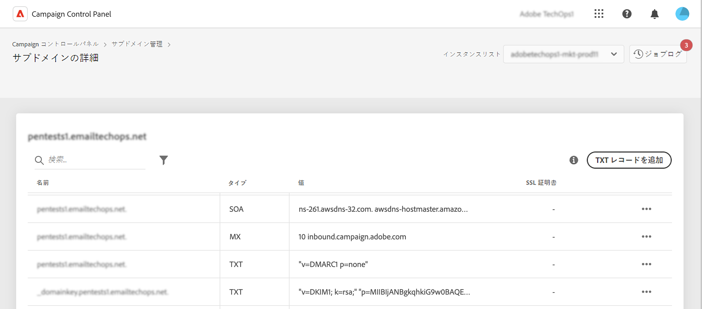

# TXT レコードの基本を学ぶ {#managing-txt-records}

>[!CONTEXTUALHELP]
>id="cp_siteverification_add"
>title="TXT レコードの管理"
>abstract="TXT レコードは、ドメインに関するテキスト情報を提供するための一種の DNS レコードで、外部ソースから読み取ることができます。コントロールパネルを使用すると、Googleサイト検証、DMARC、BIMI の各レコードをサブドメインに追加できます。"

## TXT レコードについて {#about}

TXT レコードは、ドメインに関するテキスト情報を提供するための一種の DNS レコードで、外部ソースから読み取ることができます。コントロールパネルでは、次の 3 種類のレコードをサブドメインに追加できます。

* **Google TXT レコード**&#x200B;を使用すると、ドメインを所有していることを証明できるため、メールの受信トレイ率が高くなり、スパム率が低くなります。[Google TXT レコードの追加方法を学ぶ](managing-txt-records.md)
* **DMARC レコード**&#x200B;は、送信者のドメインを認証し、悪意のある目的でのドメインの不正使用を防ぐ方法を提供します。[DMARC レコードの追加方法を学ぶ](dmarc.md)
* **BIMI レコード**&#x200B;は、メールボックスプロバイダーの受信ボックスで、メールの横に承認済みのロゴを表示して、ブランドの認知度と信頼性を高めることができます。[BIMI レコードの追加方法を学ぶ](bimi.md)

## サブドメインのレコードを監視 {#monitor}

サブドメインの詳細にアクセスして、各サブドメインに追加されたすべての TXT レコードを監視できます。

この画面には、選択したサブドメインのすべての TXT タイプのレコードが表示され、設定の「値」列に情報が表示されます。Google TXT、DMARC または BIMI のレコードを削除するには、省略記号ボタンをクリックし、「削除」を選択します。必要に応じて、DMARC および BIMI レコードを編集することもできます。

