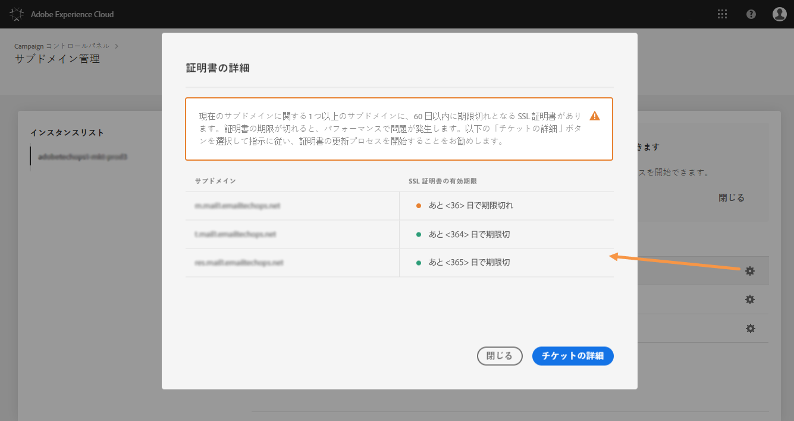

# サブドメインの SSL 証明書の管理 {#managing-subdomains-ssl-certificates}

**[!UICONTROL サブドメインおよび証明書]カードを使用すると、SSL 証明書がインストールされたランディングページおよびリソースをホストしているサブドメインや関連するサブドメインを確認できます。**&#x200B;また、証明書の期限が近づいているサブドメインを簡単に確認できるので、期限切れを未然に防ぐことができます。

証明書の期限が切れそうな場合は、証明書を更新し、インスタンスを適切に機能させるために必要なすべての情報と共にカスタマーケアリクエストを開始できます。

>[!NOTE]
>
>**有効期限が近い場合**&#x200B;は、関連するサブドメインの SSL 証明書を更新することをお勧めします。組織によっては、証明書の更新に数日かかる場合があります。このプロセスに適した時間を割り当てることをお勧めします。

## SSL 証明書の監視 {#monitoring-ssl-certificates}

各インスタンスのサブドメインのリストには、**[!UICONTROL サブドメインおよび証明書]カードを選択する際に、直接アクセスできます。**

サブドメインは、有効期限（日数）のビジュアル情報と共に、SSL 証明書の有効期限が近い順に表示されます。

* **緑**：サブドメインには、今後 60 日以内に期限が切れる証明書はありません。
* **オレンジ**：1 つ以上のサブドメインに、今後 60 日以内に期限が切れる証明書があります。
* **赤**:1つ以上のサブドメインに、次の30日以内に期限切れになる証明書があります。

サブドメインの証明書の詳細を取得するには、「**[!UICONTROL 証明書の詳細]**」ボタンをクリックします。

関連するすべてのサブドメインのリストは、その証明書に表示されます。通常、ランディングページやリソースページなどのサブドメインが含まれます。

必要に応じて、このウィンドウから、証明書の更新リクエストを開始できます。詳しくは、以下の節を参照してください。

## SSL証明書の更新の開始 {#initiating-ssl-certificate-renewal}

>[!NOTE]
>
>コントロールパネルは、証明書の更新を自動的には管理しません。It only allows you to **initiate the renewal process** by preparing the request to be sent to Adobe Campaign Customer Care.

SSL 証明書の更新プロセスには、以下の 3 ステップがあります。

1. **証明書署名リクエスト（CSR）の生成**&#x200B;カスタマーケアポータルで作成されたリクエストに基づいて、アドビカスタマーケアが CSR を生成します。CSR を生成するために必要な情報（共通名、組織名およびアドレスなど）を提供する必要があります。コントロールパネルでは、更新プロセスを開始する際に必要な項目のリストを確認できます。詳しくは、以下の節を参照してください。
1. **SSL 証明書の購入**&#x200B;カスタマーケアが CSR を生成すると、CSR をダウンロードして会社が承認している認証機関から SSL 証明書を購入できます。
1. **SSL 証明書のインストール** SSL 証明書を購入したら、アドビカスタマーケアに提供する必要があります。証明書がインストールされ、更新された証明書の有効期限がコントロールパネルに表示されます。

コントロールパネルでSSL証明書の更新を開始するには、次の手順に従います。

1. 「**[!UICONTROL サブドメインと証明書]**」カードを開き、証明書の期限が切れているサブドメインの「**[!UICONTROL 証明書の詳細]**」アイコンをクリックします。

   

1. 関連するサブドメインのリストが表示されます。通常、ランディングページやリソースページなどのサブドメインが含まれます。「**[!UICONTROL チケットの詳細]**」ボタンをクリックして、証明書の更新プロセスを開始します。

   

1. SSL 証明書を更新するために必要なすべての詳細と共に、フォームが表示されます。要求された情報をすべて正確に入力します（必要に応じて、社内チーム、セキュリティおyび IT チームに問い合わせます）。そうしないと、証明書署名要求を生成できず、証明書を更新できなくなります。

   * **[!UICONTROL IMS Org]**：組織の ID。
   * **[!UICONTROL インスタンス]**：サブドメインに関連付けられた Campaign インスタンスの URL。
   * **[!UICONTROL 共通名]**:通常は、期限切れの証明書を持つサブドメインに関連付けられた、追跡サブドメインURLです。
   * **[!UICONTROL サブドメイン]**:有効期限が切れる証明書を持つサブドメインにリンクされているサブドメイン。 1 つの SSL 証明書を他のサブドメインに適用したい場合、サブドメインをこのリストに追加できます。この場合、これらのサブドメインが同じ IMS Org およびインスタンス URL に関連付けられるようにしてください。
   >[!CAUTION]
   >
   >「**[!UICONTROL IMS Org]**」および「**インスタンス[!UICONTROL 」フィールドは、コントロールパネルによって自動的に入力され、変更する必要はありません。]**

   

1. Once the form is completed, click the **[!UICONTROL Copy Details]** button to save the information to your Clipboard.

   >[!NOTE]
   >
   >ブラウザの履歴をクリアしない場合は、入力した情報が保存され、後で証明書を更新するためにその情報を使用できます。

1. Click the **[!UICONTROL Log new ticket]** button. Adobe Campaign カスタマーケアログインページに自動的にリダイレクトされます。

   

1. ログインしてから、「SSL 証明書 CSR リクエスト」という件名で新しいサポートチケットを作成します。前にコピーしたすべての情報をチケットの本文に貼り付けて、「送信」をクリックします。

   >[!NOTE]
   >
   >組織のサポートケースをファイルする権限がない場合は、クリップボードにコピーしたすべての情報をサポート担当者に渡して、新しいカスタマーケアチケットを開くことを依頼してください。

**関連トピック：**

* [Campaign Standard チュートリアルビデオ](https://docs.adobe.com/content/help/en/campaign-learn/campaign-standard-tutorials/administrating/control-panel/managing-ssl-certificates.html)
* [Campaign Classic チュートリアルビデオ](https://docs.adobe.com/content/help/en/campaign-learn/campaign-classic-tutorials/administrating/control-panel-acc/managing-ssl-certificates.html)
