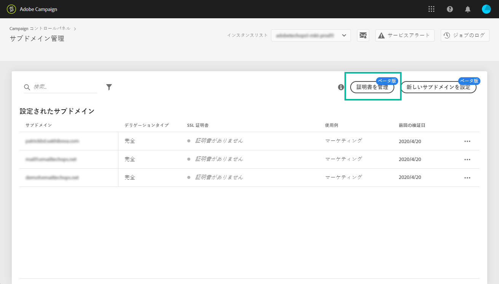

# サブドメインのSSL証明書の管理 {#managing-subdomains-ssl-certificates}

サブドメ **[!UICONTROL インと証明書カードを使用すると]**、ランディングページとリソースをホストするサブドメインと関連するサブドメイン、およびSSL証明書がインストールされているサブドメインを確認できます。 また、有効期限が切れる証明書を持つサブドメインを簡単に確認できるので、そのサブドメインの有効期限を予測できます。

証明書の有効期限が間もなく切れる場合は、必要なすべての情報を含むカスタマーケアリクエストを開始して、証明書を更新し、インスタンスが正しく機能することを確認できます。

>[!NOTE]
>
>**有効期限が近い場合**&#x200B;は、関連するサブドメインの SSL 証明書を更新することをお勧めします。組織によっては、証明書の更新に数日かかる場合があります。このプロセスに適した時間を割り当てることをお勧めします。

## SSL証明書の監視 {#monitoring-ssl-certificates}

サブドメインと証明書カードを選択すると、各インスタンスのサブドメインのリストに直接ア **[!UICONTROL クセスできます]**。

サブドメインは、SSL証明書の最も近い有効期限日と、有効期限に関する視覚的な情報（日単位）で並べられます。

* **緑**:サブドメインには、次の60日以内に証明書の有効期限が切れていません。
* **オレンジ**:1つ以上のサブドメインに、次の60日以内に期限切れになる証明書があります。
* **赤**:1つ以上のサブドメインに、次の30日以内に期限切れになる証明書があります。

サブドメインの証明書の詳細を取得するには、「**[!UICONTROL 証明書の詳細]**」ボタンをクリックします。

関連するすべてのサブドメインのリストが証明書に表示されます。 通常、ランディングページ、リソースページなどのサブドメインが含まれます。

必要に応じて、このウィンドウから証明書の更新要求を開始できます。 詳しくは、以下の節を参照してください。

## SSL証明書の更新の開始 {#initiating-ssl-certificate-renewal}

>[!NOTE]
>
>コントロールパネルでは、証明書の更新は自動的に管理されません。 Adobe Campaignカスタマーケアに送信す **るリクエストを準備することで** 、更新プロセスを開始することのみが可能です。

SSL証明書の更新プロセスには、次の3つの手順が含まれます。

1. **証明書署名要求(CSR)の生成アドビカス**&#x200B;タマーケアは、カスタマーケアポータルを介して行われた要求に応じて、CSRを生成します。 CSRの生成に必要な情報（共通名、組織名、住所など）を入力する必要があります。 コントロールパネルで、更新プロセスを開始する際に必要な項目のリストを確認できます。 詳しくは、以下の節を参照してください。
1. **SSL証明書の購入カスタマ**&#x200B;ーケアがCSRを生成したら、ダウンロードして、会社が承認した認証局からSSL証明書を購入できます。
1. **SSL証明書のインストール** SSL証明書を購入したら、アドビのカスタマーケアに提供する必要があります。 証明書がインストールされ、コントロールパネルに証明書の更新された有効期限が表示されます。

コントロールパネルでSSL証明書の更新を開始するには、次の手順に従います。

1. 「**[!UICONTROL サブドメインと証明書]**」カードを開き、証明書の期限が切れているサブドメインの「**[!UICONTROL &#x200B;証明書の詳細]**」アイコンをクリックします。

   

1. 関連するサブドメインのリストが表示されます。通常、ランディングページやリソースページなどのサブドメインが含まれます。「**[!UICONTROL チケットの詳細]**」ボタンをクリックして、証明書の更新プロセスを開始します。

   

1. フォームが表示され、SSL証明書の更新に必要なすべての詳細が表示されます。 必要な情報を完全かつ正確に入力してください（必要に応じて、社内チーム、セキュリティチーム、ITチームに問い合わせてください）。 そうしないと、証明書署名要求を生成できず、証明書を更新できなくなります。

   * **[!UICONTROL IMS組織]**:組織のID。
   * **[!UICONTROL インスタンス]**:サブドメインに関連付けられているCampaignインスタンスのURL。
   * **[!UICONTROL 共通名]**:通常は、期限切れの証明書を持つサブドメインに関連付けられた、追跡サブドメインURLです。
   * **[!UICONTROL サブドメイン]**:有効期限が切れる証明書を持つサブドメインにリンクされているサブドメイン。 単一のSSL証明書を他のサブドメインに適用する場合は、このリストに追加できます。 その場合は、これらのサブドメインが同じIMS組織URLとインスタンスURLに関連付けられていることを確認します。
   >[!CAUTION]
   >
   >The **[!UICONTROL IMS Org]**and**[!UICONTROL  Instance]** fields are filled in automatically by the Control Panel and should not be modified.

   

1. フォームが完成したら、「詳細をコピー」ボタン **[!UICONTROL をクリックし]**、情報をクリップボードに保存します。

   >[!NOTE]
   >
   >ブラウザの履歴をクリアしない場合は、入力した情報が保存され、後で証明書を更新するためにその情報を使用できます。

1. [新しいチケット **[!UICONTROL をログに記録]**]ボタンをクリックします。 Adobe Campaignカスタマーケアのサインインページに自動的にリダイレクトされます。

   

1. サインインし、「SSL証明書CSR要求」サブジェクトを持つ新しいサポートチケットを作成します。
以前にコピーしたすべての情報をチケットの本文に貼り付け、「送信」をクリックします。

   >[!NOTE]
   >
   >貴社のサポートケースをファイルする権限がない場合は、クリップボードにコピーしたすべての情報をサポート担当者に渡し、新しいカスタマーケアチケットを開くように依頼してください。

**関連トピック：**

* [Campaign Standardチュートリアルビデオ](https://docs.adobe.com/content/help/en/campaign-learn/campaign-standard-tutorials/administrating/control-panel/managing-ssl-certificates.html)
* [Campaign Classicチュートリアルビデオ](https://docs.adobe.com/content/help/en/campaign-learn/campaign-classic-tutorials/administrating/control-panel-acc/managing-ssl-certificates.html)
