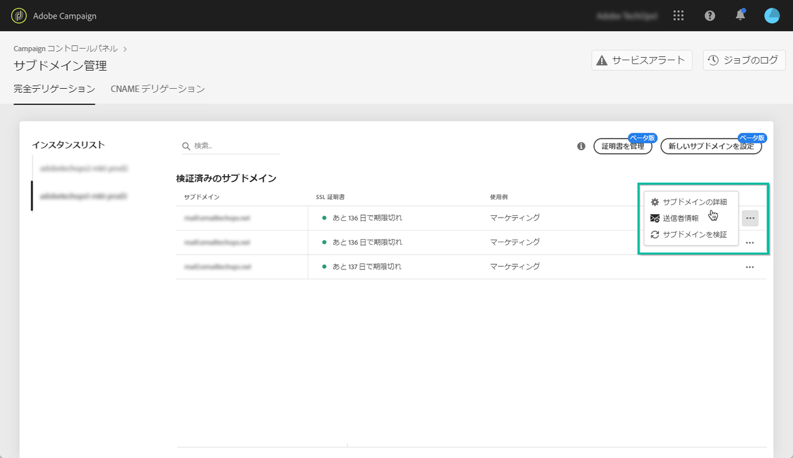
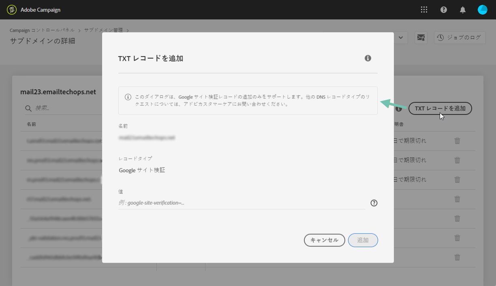
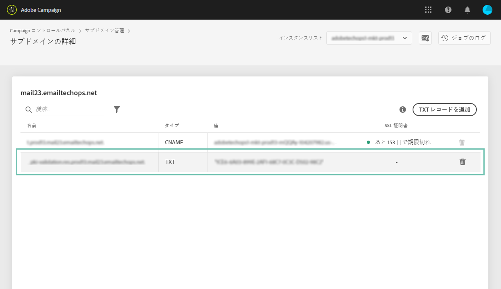

# TXT レコードの管理 {#managing-txt-records}

>[!CONTEXTUALHELP]
>id="cp_siteverification_add"
>title="TXT レコードの管理"
>abstract="Google などの一部のサービスでは、ドメインを所有していることを検証するために、ドメイン設定に TXT レコードを追加する必要があります。"

## TXT レコードについて {#about-txt-records}

TXT レコードは、ドメインに関するテキスト情報を提供するために使用される DNS レコードの一種で、外部ソースから読み取ることができます。

高い受信ボックス率および低いスパム率を確保するために、Google などの一部のサービスでは、ドメインを所有していることを検証するために、ドメイン設定に TXT レコードを追加する必要があります。

現在、Gmail は最も人気のある E メールアドレスプロバイダーの 1 つです。Adobe Campaign では、Gmail アドレス宛ての E メールの配信品質を確保して確実な配信をおこなうために、サブドメインに Google サイト検証用の特別な TXT レコードを追加して、サブドメインを確実に検証できます。

 [Campaign Classic](https://experienceleague.adobe.com/docs/campaign-classic-learn/control-panel/subdomains-and-certificates/google-txt-record-management.html?lang=en#subdomains-and-certificates) または [Campaign Standardを使用したビデオでこの機能を見つける](https://experienceleague.adobe.com/docs/campaign-standard-learn/control-panel/subdomains-and-certificates/google-txt-record-management.html?lang=en#subdomains-and-certificates)

## サブドメイン用の Google TXT レコードの追加 {#adding-a-google-txt-record}

Gmail アドレス宛ての E メール送信に使用するサブドメインに Google TXT レコードを追加するには、次の手順に従います。

1. 「**[!UICONTROL サブドメインおよび証明書]**」カードに移動します。

1. インスタンスを選択し、DNS レコードを追加するサブドメインの詳細を開きます。

   

1. 「**[!UICONTROL TXT レコードを追加]**」ボタンをクリックし、G Suite 管理ツールで生成した値を入力します。詳しくは、[G Suite 管理ヘルプ](https://support.google.com/a/answer/183895)を参照してください。

   

1. 「**[!UICONTROL 追加]**」ボタンをクリックして、確定します。

   

TXT レコードを追加したら、Google で検証する必要があります。それには、G Suite 管理ツールに移動し、検証手順を実行します（[G Suite 管理ヘルプ](https://support.google.com/a/answer/183895)を参照）。

レコードを削除するには、レコードリストからレコードを選択し、「削除」ボタンをクリックします。

>[!NOTE]
>
>DNS レコードリストから削除できるのは、以前に追加したレコードのみです（この例では Google TXT レコード）。
